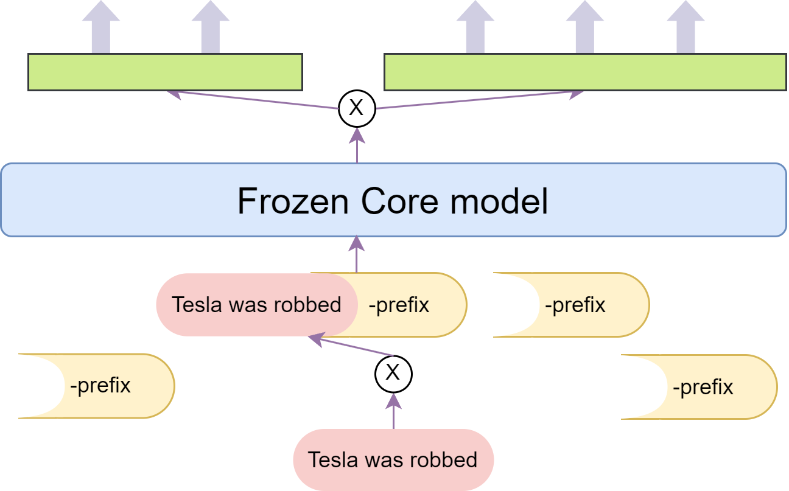
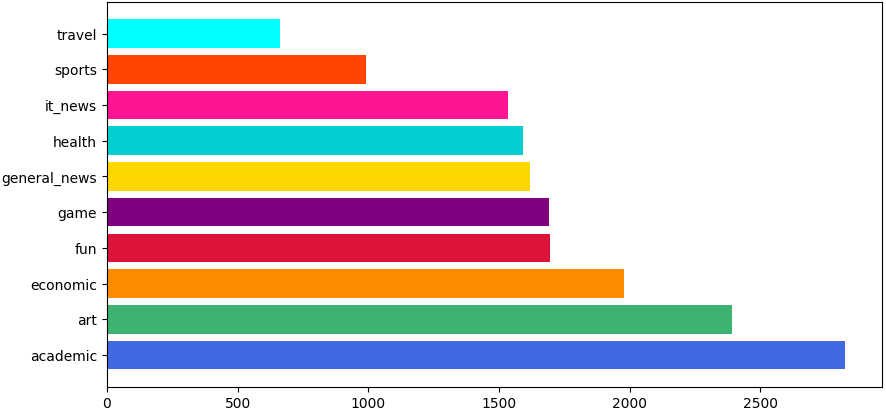
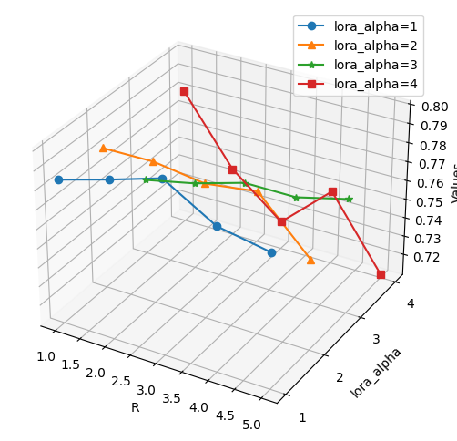
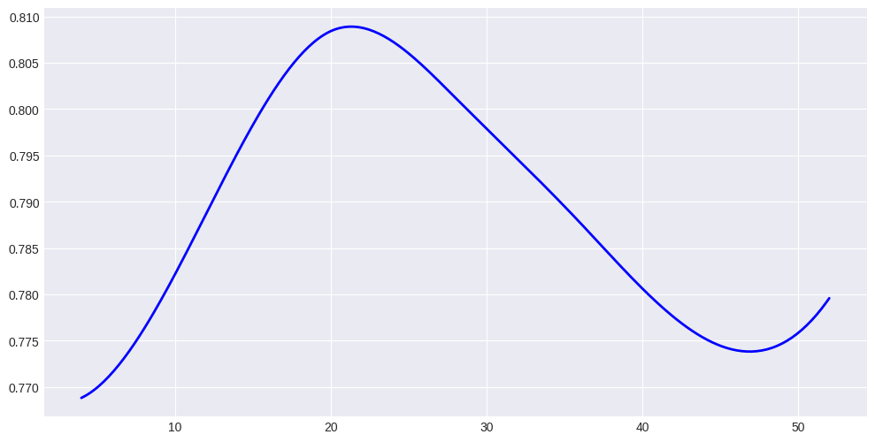
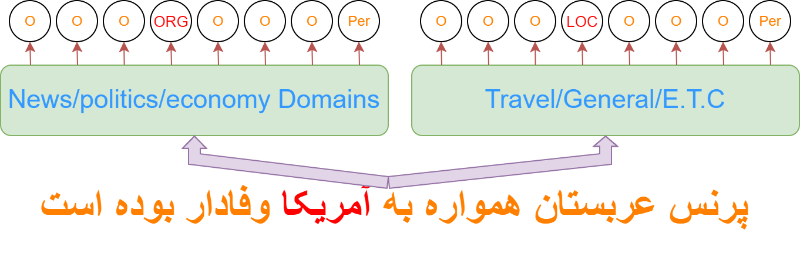
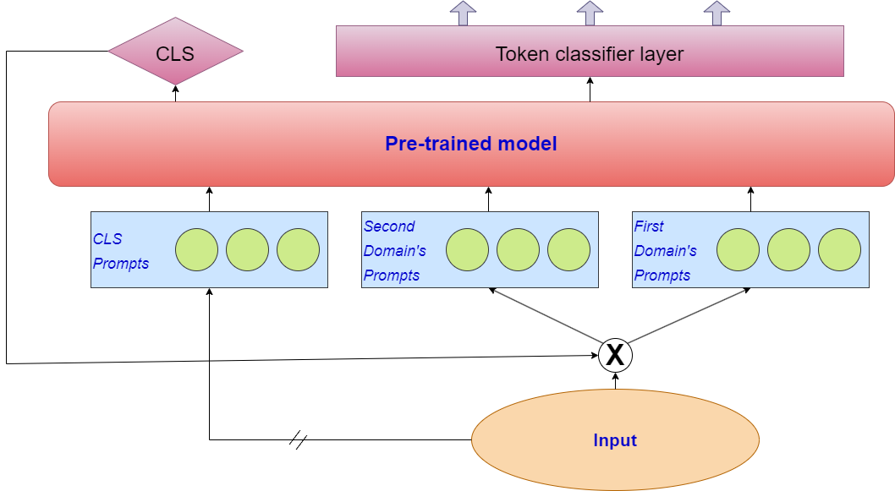

# Multi-BERT：借助适配器与提示调优，实现低资源条件下的多领域适配。

发布时间：2024年04月02日

`RAG` `波斯语处理`

> Multi-BERT: Leveraging Adapters and Prompt Tuning for Low-Resource Multi-Domain Adaptation

# 摘要

> 随着文本数量和类型的激增，多领域环境下的挑战日益严峻，波斯语命名实体识别（NER）领域亦不例外。传统方法，无论是采用一个统一模型应对多个领域，还是为每个领域定制单独模型，都存在显著局限。单一模型往往难以准确捕捉领域的细微差异，而多个大型模型的使用又可能导致资源紧张，使得为每个领域单独训练模型变得不太现实。因此，本研究提出了一种创新方案，核心模型搭配多组针对不同领域的特定参数。通过使用提示调整、适配器等技术，并增加额外层级，我们为特定领域定制了可训练的参数。这使得模型在性能上能够与针对每个领域的独立模型相媲美。实验结果显示，在不同的正式和非正式数据集上，通过这些新增参数，新提出的模型在性能上显著超越了现有的实用模型。令人瞩目的是，该模型仅需一次训练和存储实例，便能在各个领域取得卓越成效，某些方面甚至超越了当前的最先进技术。我们还深入分析了每种适应策略，明确指出了它们的优势、局限以及在波斯语NER任务中的最佳超参数设置。最后，针对未知文本领域的应用场景，我们引入了一种基于文档的领域检测流程，进一步提升了本研究在现实世界应用中的适应性和实用性。

> The rapid expansion of texts' volume and diversity presents formidable challenges in multi-domain settings. These challenges are also visible in the Persian name entity recognition (NER) settings. Traditional approaches, either employing a unified model for multiple domains or individual models for each domain, frequently pose significant limitations. Single models often struggle to capture the nuances of diverse domains, while utilizing multiple large models can lead to resource constraints, rendering the training of a model for each domain virtually impractical. Therefore, this paper introduces a novel approach composed of one core model with multiple sets of domain-specific parameters. We utilize techniques such as prompt tuning and adapters, combined with the incorporation of additional layers, to add parameters that we can train for the specific domains. This enables the model to perform comparably to individual models for each domain. Experimental results on different formal and informal datasets show that by employing these added parameters, the proposed model significantly surpasses existing practical models in performance. Remarkably, the proposed model requires only one instance for training and storage, yet achieves outstanding results across all domains, even surpassing the state-of-the-art in some. Moreover, we analyze each adaptation strategy, delineating its strengths, weaknesses, and optimal hyper-parameters for the Persian NER settings. Finally, we introduce a document-based domain detection pipeline tailored for scenarios with unknown text domains, enhancing the adaptability and practicality of this paper in real-world applications.

[Arxiv](https://arxiv.org/abs/2404.02335)