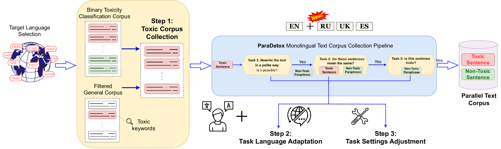
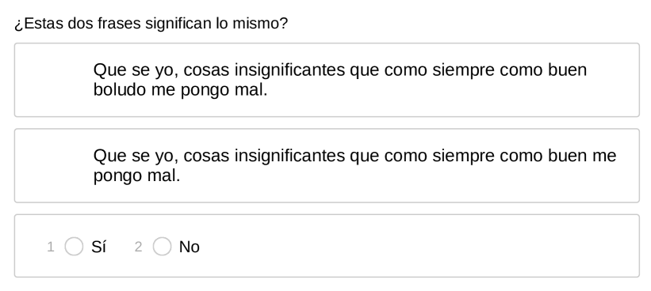
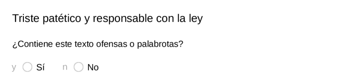

# MultiParaDetox：利用并行文本数据，将文本净化技术推广至更多语言。

发布时间：2024年04月02日

`LLM应用` `社交媒体`

> MultiParaDetox: Extending Text Detoxification with Parallel Data to New Languages

# 摘要

> 文本净化任务通过将含有粗俗词汇的文本转换为中立表达，实现文本风格转换。近期，文本净化技术在多个领域得到应用，包括净化大型语言模型（LLMs）和社交网络中对抗恶劣言论，这对维护现代数字空间的安全交流至关重要。尽管以往的并行文本净化语料库收集工作如ParaDetox和APPADIA仅限于单语言环境，但我们旨在通过MultiParaDetox项目，将此流程扩展至多语言，实现自动化的并行语料库收集。我们对各种文本净化模型进行了实验，从无监督学习基线到基于并行语料库的LLMs和微调模型，结果表明并行语料库对于开发先进的文本净化模型具有显著优势。

> Text detoxification is a textual style transfer (TST) task where a text is paraphrased from a toxic surface form, e.g. featuring rude words, to the neutral register. Recently, text detoxification methods found their applications in various task such as detoxification of Large Language Models (LLMs) (Leong et al., 2023; He et al., 2024; Tang et al., 2023) and toxic speech combating in social networks (Deng et al., 2023; Mun et al., 2023; Agarwal et al., 2023). All these applications are extremely important to ensure safe communication in modern digital worlds. However, the previous approaches for parallel text detoxification corpora collection -- ParaDetox (Logacheva et al., 2022) and APPADIA (Atwell et al., 2022) -- were explored only in monolingual setup. In this work, we aim to extend ParaDetox pipeline to multiple languages presenting MultiParaDetox to automate parallel detoxification corpus collection for potentially any language. Then, we experiment with different text detoxification models -- from unsupervised baselines to LLMs and fine-tuned models on the presented parallel corpora -- showing the great benefit of parallel corpus presence to obtain state-of-the-art text detoxification models for any language.

[Arxiv](https://arxiv.org/abs/2404.02037)