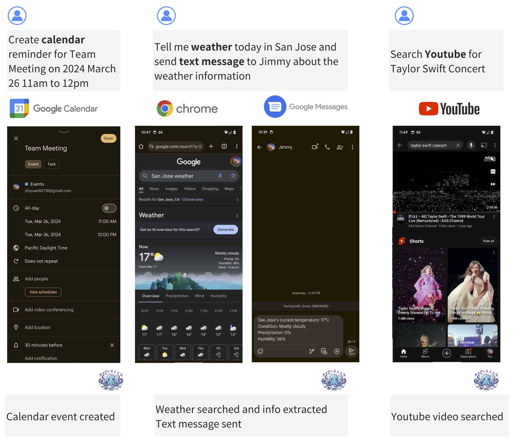
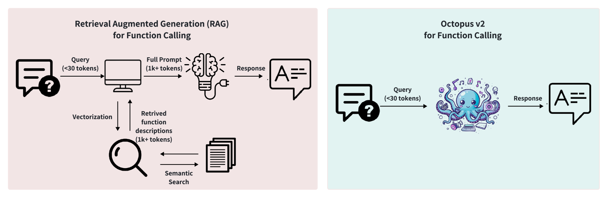
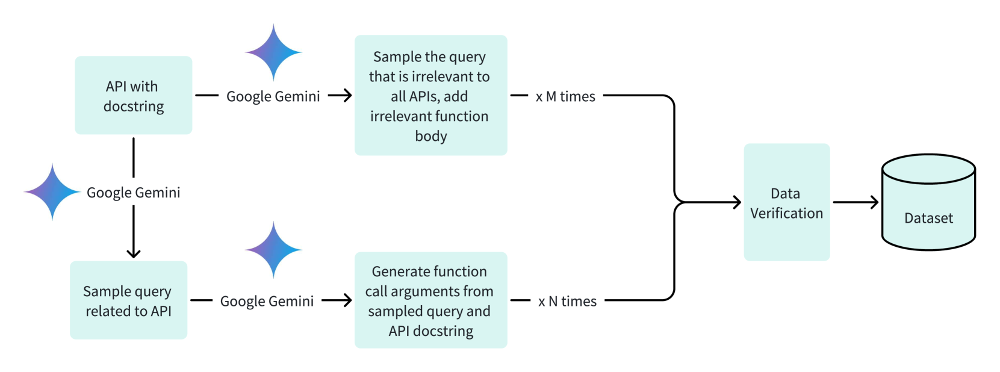
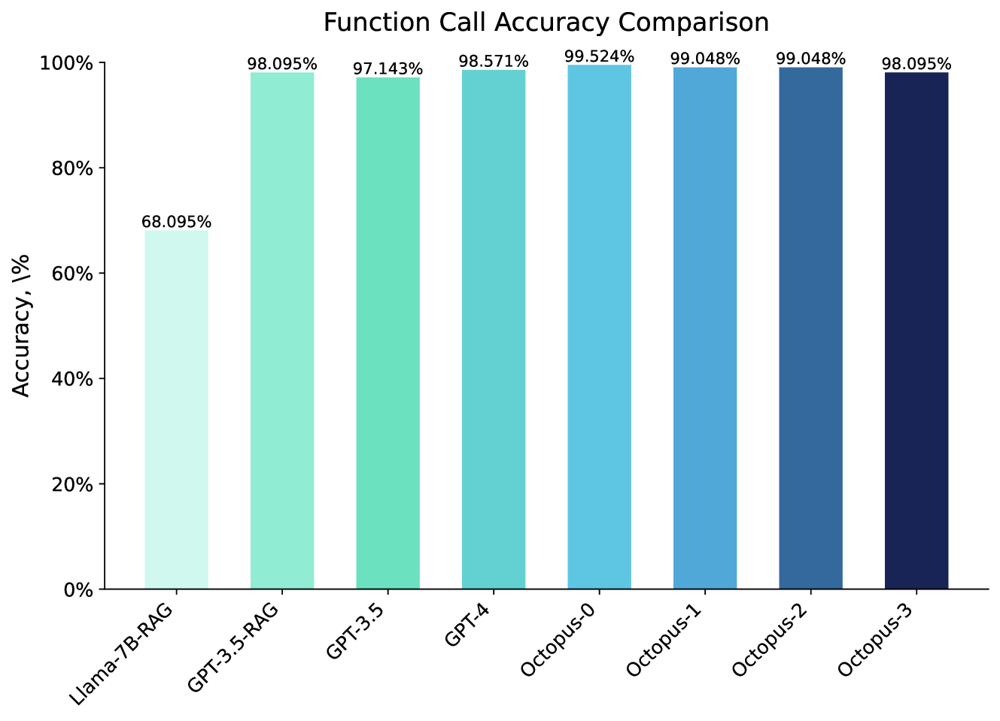
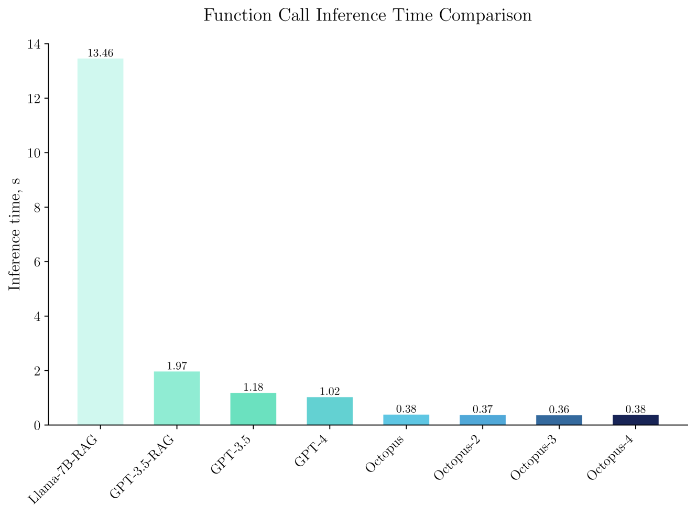
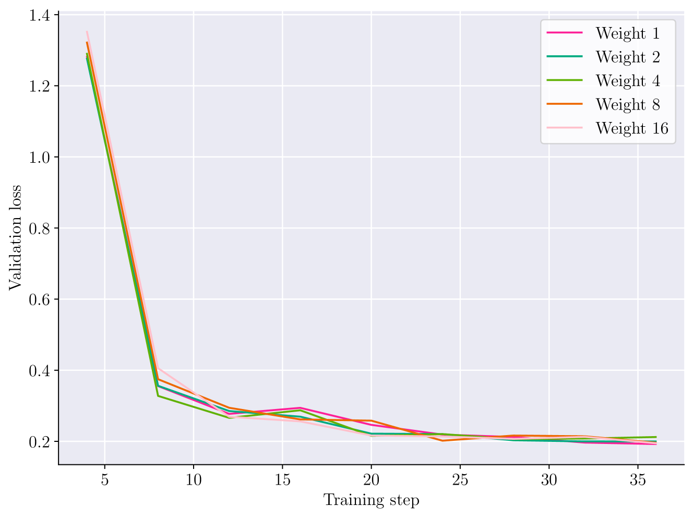

# 章鱼 v2：超级智能代理的移动设备语言模型

发布时间：2024年04月02日

`LLM应用` `软件工程` `边缘计算`

> Octopus v2: On-device language model for super agent

# 摘要

> 语言模型在众多软件应用中大放异彩，尤其是在自动化工作流程的任务上表现卓越。它们的核心能力——调用函数功能，对于打造智能代理至关重要。然而，尽管大规模语言模型在云端环境中展现出了强大的性能，它们仍难逃隐私和成本的双重困扰。目前，设备端的函数调用模型在延迟和准确性上仍面临挑战。我们的最新研究提出了一种创新方法，赋予了一个拥有20亿参数的设备端模型以超越GPT-4的性能，并大幅缩减了95%的上下文长度。相较于采用RAG机制的Llama-7B模型，我们的方案在延迟上提升了35倍。这一突破性进展，将延迟降至适宜在多种生产环境下边缘设备部署的标准，满足了现实世界应用的性能需求。

> Language models have shown effectiveness in a variety of software applications, particularly in tasks related to automatic workflow. These models possess the crucial ability to call functions, which is essential in creating AI agents. Despite the high performance of large-scale language models in cloud environments, they are often associated with concerns over privacy and cost. Current on-device models for function calling face issues with latency and accuracy. Our research presents a new method that empowers an on-device model with 2 billion parameters to surpass the performance of GPT-4 in both accuracy and latency, and decrease the context length by 95\%. When compared to Llama-7B with a RAG-based function calling mechanism, our method enhances latency by 35-fold. This method reduces the latency to levels deemed suitable for deployment across a variety of edge devices in production environments, aligning with the performance requisites for real-world applications.

[Arxiv](https://arxiv.org/abs/2404.01744)