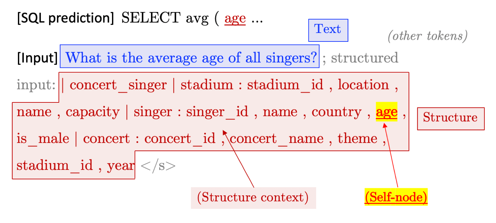
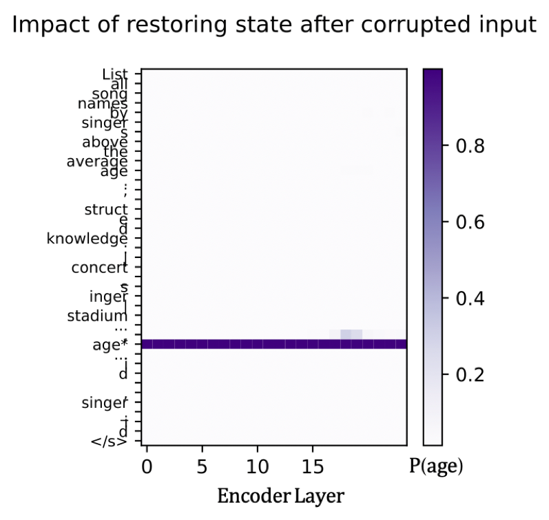
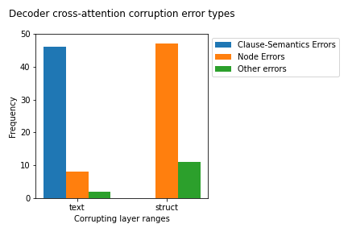
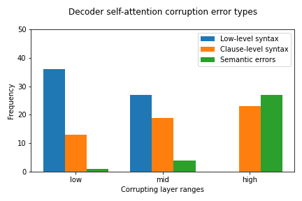
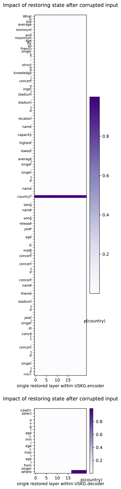
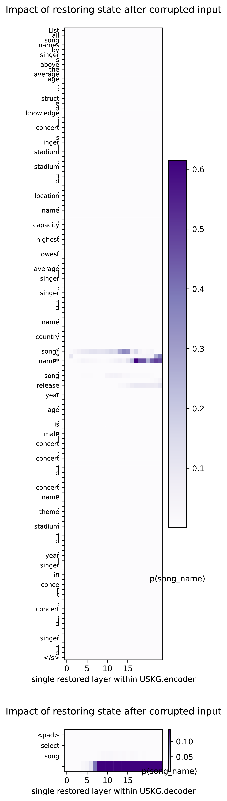
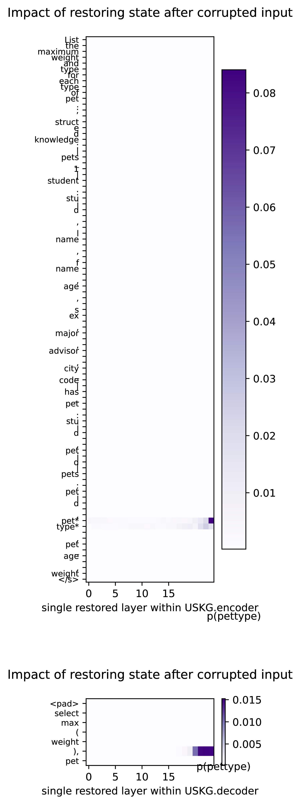
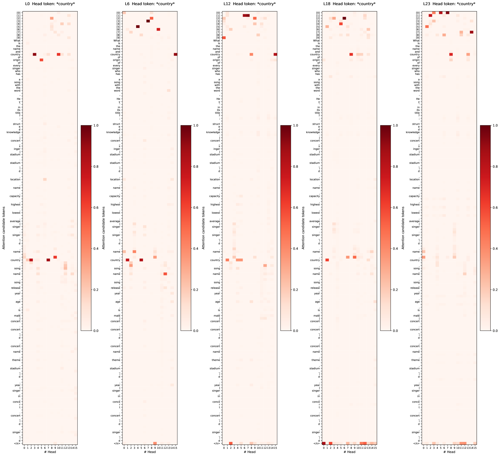
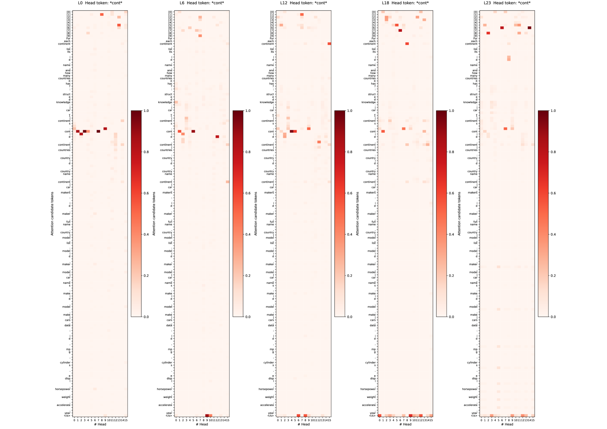
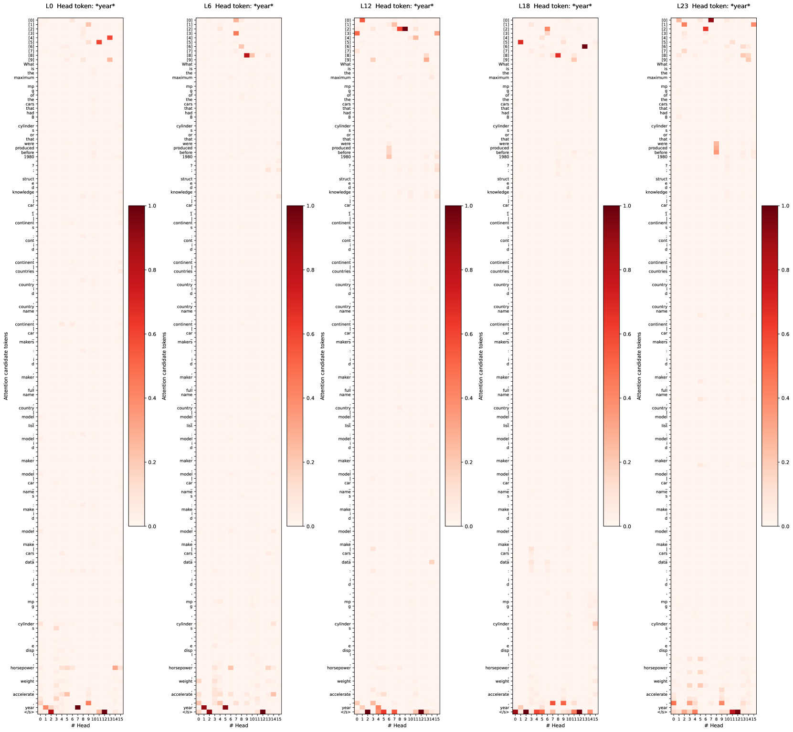

# 探究编码器-解码器语言模型中结构化数据的线性化处理：文本转换为SQL的洞见。

发布时间：2024年04月02日

`LLM理论` `数据管理` `结构化数据处理`

> On Linearizing Structured Data in Encoder-Decoder Language Models: Insights from Text-to-SQL

# 摘要

> 表格、数据库和知识图等形式的结构化数据，其表现方式一直是个难题。大型语言模型（LLMs）的兴起，引领了一种新的处理方式——将结构化数据线性化为连续的标记流，这与传统的显式结构建模方法，如图形表示法，形成了鲜明对比。关键的是，我们对这些线性化处理方法如何应对结构化数据的非线性特性，尚缺乏足够理解。本研究深入探讨了编码器-解码器语言模型，尤其是T5模型，对结构化数据的线性处理方式。研究发现，该模型能够模仿人类设计的诸如模式链接和语法预测等过程，显示出对结构的深刻理解，超越了单纯的标记序列。此外，我们还发现了模型内部机制的一些特点，比如结构节点编码的自我中心性，以及由于模态融合导致的冗余可能带来的模型压缩机会。总的来说，这项研究让我们对基于线性化的方法的内部运作有了更清晰的认识，并可能为未来的研究指明方向。

> Structured data, prevalent in tables, databases, and knowledge graphs, poses a significant challenge in its representation. With the advent of large language models (LLMs), there has been a shift towards linearization-based methods, which process structured data as sequential token streams, diverging from approaches that explicitly model structure, often as a graph. Crucially, there remains a gap in our understanding of how these linearization-based methods handle structured data, which is inherently non-linear. This work investigates the linear handling of structured data in encoder-decoder language models, specifically T5. Our findings reveal the model's ability to mimic human-designed processes such as schema linking and syntax prediction, indicating a deep, meaningful learning of structure beyond simple token sequencing. We also uncover insights into the model's internal mechanisms, including the ego-centric nature of structure node encodings and the potential for model compression due to modality fusion redundancy. Overall, this work sheds light on the inner workings of linearization-based methods and could potentially provide guidance for future research.

[Arxiv](https://arxiv.org/abs/2404.02389)