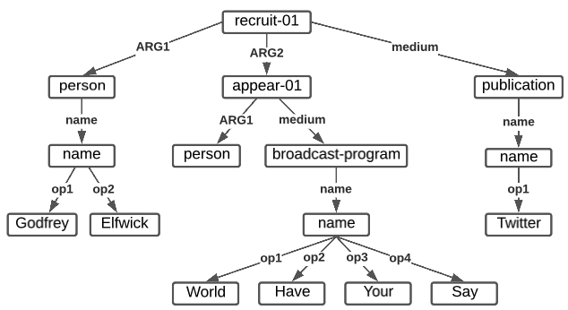
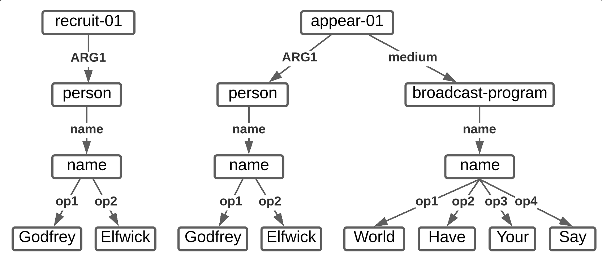
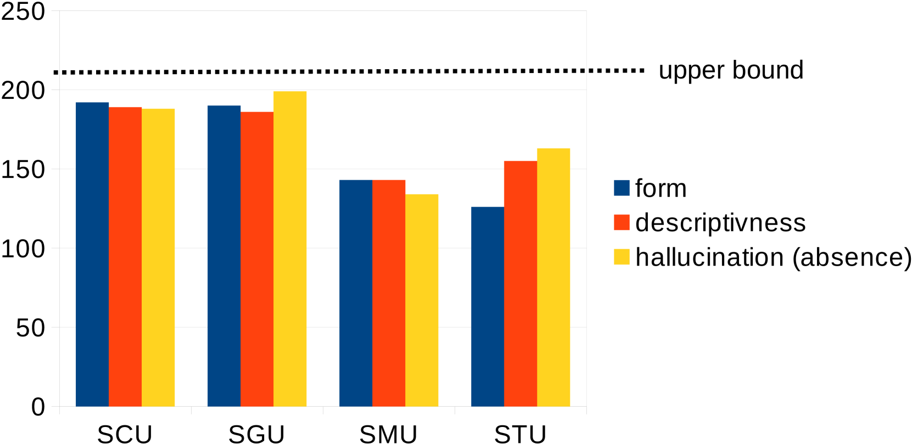

# 文本摘要评估中，摘要内容单元的重要性。

发布时间：2024年04月02日

`LLM应用` `自动文摘`

> On the Role of Summary Content Units in Text Summarization Evaluation

# 摘要

> 金字塔文本摘要评估法的核心在于人类撰写的摘要内容单元（SCUs），它们以简洁的句子形式，将摘要细化为具体事实。这些SCUs助力于评估候选摘要的品质，且可能通过自然语言推理（NLI）系统实现部分自动化。张与Bansal（2021年）的研究更进一步，提出SCUs可通过自动生成的语义角色三元组（STUs）来近似，为全自动化评估铺路。然而，仍有诸多疑问待解，尤其是：i) 是否存在更优的SCUs近似方法？ii) 在何种情境下，SCUs（或其近似）能发挥最大效用？本研究探索了两种创新的SCUs近似策略：利用AMR意义表示（SMUs）和大型语言模型（SGUs）生成近似。研究发现，尽管STUs和SMUs表现不俗，SGUs却提供了最佳的近似品质。此外，通过一个简单的句子分解基线（SSUs）的验证，我们发现SCUs（及其近似）在对简短摘要进行排序时最具价值，但在系统排名或较长摘要的排序中，其助益有限。

> At the heart of the Pyramid evaluation method for text summarization lie human written summary content units (SCUs). These SCUs are concise sentences that decompose a summary into small facts. Such SCUs can be used to judge the quality of a candidate summary, possibly partially automated via natural language inference (NLI) systems. Interestingly, with the aim to fully automate the Pyramid evaluation, Zhang and Bansal (2021) show that SCUs can be approximated by automatically generated semantic role triplets (STUs). However, several questions currently lack answers, in particular: i) Are there other ways of approximating SCUs that can offer advantages? ii) Under which conditions are SCUs (or their approximations) offering the most value? In this work, we examine two novel strategies to approximate SCUs: generating SCU approximations from AMR meaning representations (SMUs) and from large language models (SGUs), respectively. We find that while STUs and SMUs are competitive, the best approximation quality is achieved by SGUs. We also show through a simple sentence-decomposition baseline (SSUs) that SCUs (and their approximations) offer the most value when ranking short summaries, but may not help as much when ranking systems or longer summaries.

[Arxiv](https://arxiv.org/abs/2404.01701)