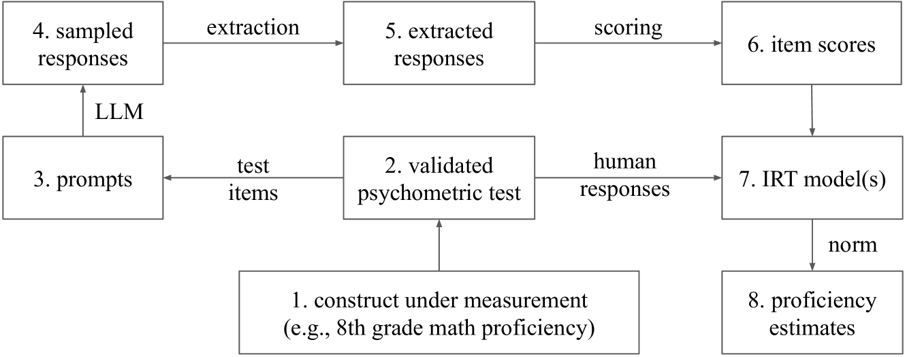
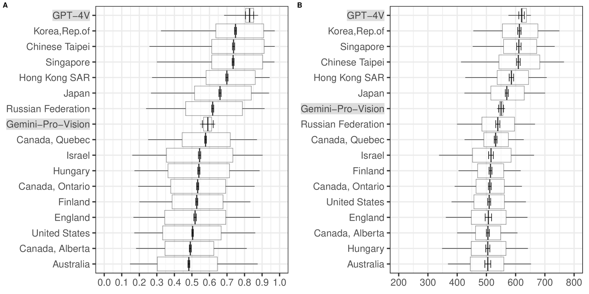

# PATCH——通过心理测量技术辅助的大规模语言模型性能基准测试：以数学能力为例的深入案例分析

发布时间：2024年04月02日

`LLM应用` `心理学`

> PATCH -- Psychometrics-AssisTed benCHmarking of Large Language Models: A Case Study of Mathematics Proficiency

# 摘要

> 现有的大型语言模型基准测试往往关注模型的学术能力，并常与人类测试者的表现进行比较。然而，这些测试存在诸多局限，如测量质量的可靠性、项目层面的评估缺失，以及人类参照群体的不明确性。为应对这些问题，我们提出将心理学测量学的知识应用于LLM的基准测试中。我们首先推出了PATCH框架，这是一种创新的心理学辅助基准测试方法，旨在克服上述限制，为LLM基准研究开辟新路径。其次，我们运用PATCH框架对GPT-4和Gemini-Pro-Vision在八年级数学科目上的熟练度进行了评估，并与56个人类群体进行了比较。我们的研究显示，基于心理学测量学的方法能够得出与现有基准测试不同的评估结果。最后，我们发布了4个数据集，旨在支持对LLM在中小学数学和科学领域的熟练度进行衡量和与人类群体的比较。

> Many existing benchmarks of large (multimodal) language models (LLMs) focus on measuring LLMs' academic proficiency, often with also an interest in comparing model performance with human test takers. While these benchmarks have proven key to the development of LLMs, they suffer from several limitations, including questionable measurement quality (e.g., Do they measure what they are supposed to in a reliable way?), lack of quality assessment on the item level (e.g., Are some items more important or difficult than others?) and unclear human population reference (e.g., To whom can the model be compared?). In response to these challenges, we propose leveraging knowledge from psychometrics - a field dedicated to the measurement of latent variables like academic proficiency - into LLM benchmarking. We make three primary contributions. First, we introduce PATCH: a novel framework for Psychometrics-AssisTed benCHmarking of LLMs. PATCH addresses the aforementioned limitations, presenting a new direction for LLM benchmark research. Second, we implement PATCH by measuring GPT-4 and Gemini-Pro-Vision's proficiency in 8th grade mathematics against 56 human populations. We show that adopting a psychometrics-based approach yields evaluation outcomes that diverge from those based on existing benchmarking practices. Third, we release 4 datasets to support measuring and comparing LLM proficiency in grade school mathematics and science against human populations.

[Arxiv](https://arxiv.org/abs/2404.01799)