# 同伴辅助修复器：赋予大型语言模型修复高级学生作业的能力，旨在提升模型对复杂任务的处理能力。

发布时间：2024年04月02日

`LLM应用` `编程教育` `自动程序修复`

> Peer-aided Repairer: Empowering Large Language Models to Repair Advanced Student Assignments

# 摘要

> 自动为编程作业提供反馈，在提升编程教育质量方面尤为关键，尤其是在处理复杂高级任务时。自动程序修复技术，特别是那些依托大型语言模型的策略，已因其在修复基础编程作业方面的能力而备受瞩目。然而，评估所用的程序往往过于简单，对于高级课程中的程序修复效果尚不明了。为填补这一空白，我们精心编制了一个名为Defects4DS的高级学生作业数据集。接着，我们分析并确定了在解决高级作业中的错误时所面临的挑战。基于这些分析，我们构建了一个名为PaR的框架，该框架由大型语言模型提供动力，分为三个阶段运作：同伴解决方案筛选、多源提示创作和程序修正。同伴解决方案筛选阶段通过词汇、语义和句法标准找出相关的同伴程序。多源提示创作阶段则巧妙地融合了多种信息源，为最终的程序修正阶段打造了一个全面且信息丰富的提示。在Defects4DS和另一个经过深入研究的ITSP数据集上的测试结果显示，PaR达到了前所未有的性能水平，与之前的最先进大型语言模型和基于符号的方法相比，修复率分别提升了19.94%和15.2%，成效显著。

> Automated generation of feedback on programming assignments holds significant benefits for programming education, especially when it comes to advanced assignments. Automated Program Repair techniques, especially Large Language Model based approaches, have gained notable recognition for their potential to fix introductory assignments. However, the programs used for evaluation are relatively simple. It remains unclear how existing approaches perform in repairing programs from higher-level programming courses. To address these limitations, we curate a new advanced student assignment dataset named Defects4DS from a higher-level programming course. Subsequently, we identify the challenges related to fixing bugs in advanced assignments. Based on the analysis, we develop a framework called PaR that is powered by the LLM. PaR works in three phases: Peer Solution Selection, Multi-Source Prompt Generation, and Program Repair. Peer Solution Selection identifies the closely related peer programs based on lexical, semantic, and syntactic criteria. Then Multi-Source Prompt Generation adeptly combines multiple sources of information to create a comprehensive and informative prompt for the last Program Repair stage. The evaluation on Defects4DS and another well-investigated ITSP dataset reveals that PaR achieves a new state-of-the-art performance, demonstrating impressive improvements of 19.94% and 15.2% in repair rate compared to prior state-of-the-art LLM- and symbolic-based approaches, respectively

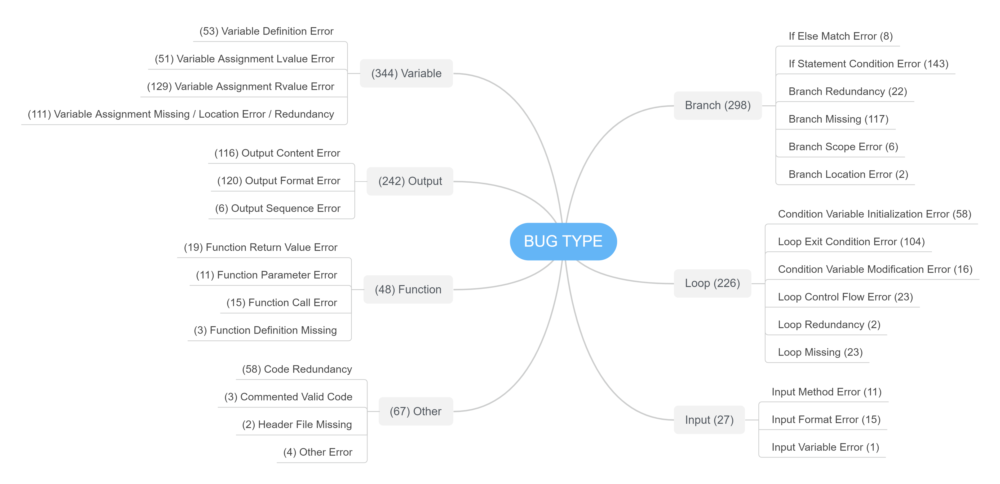

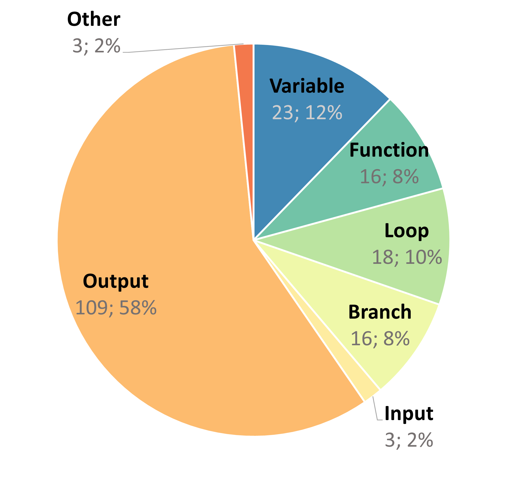

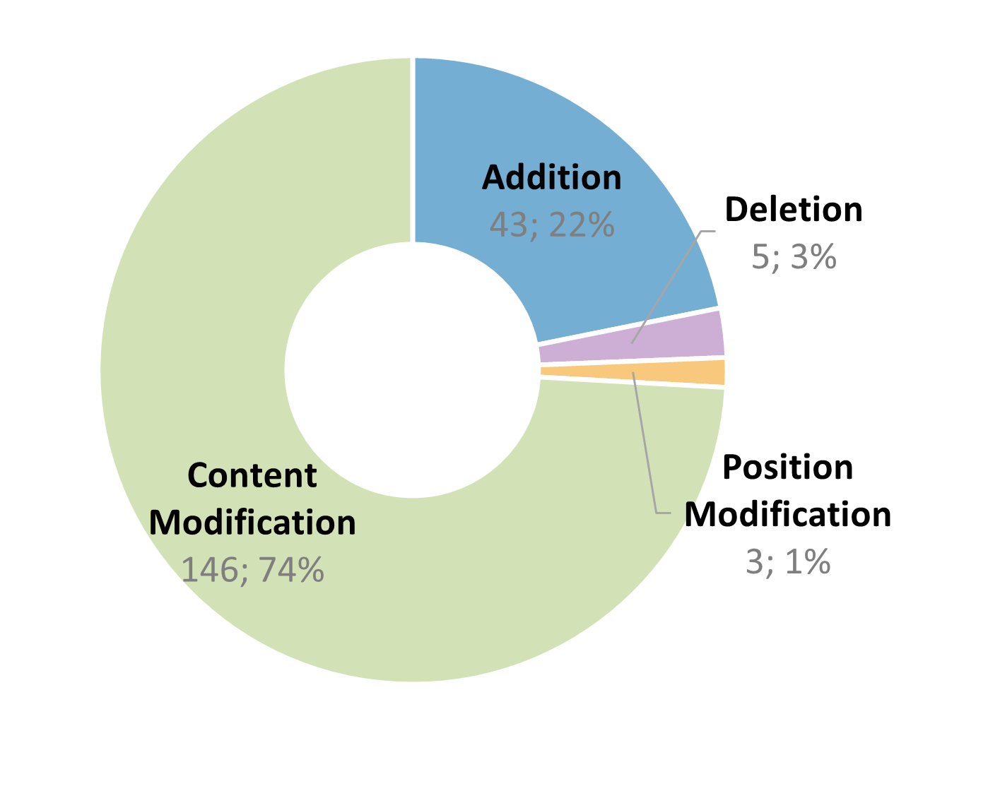

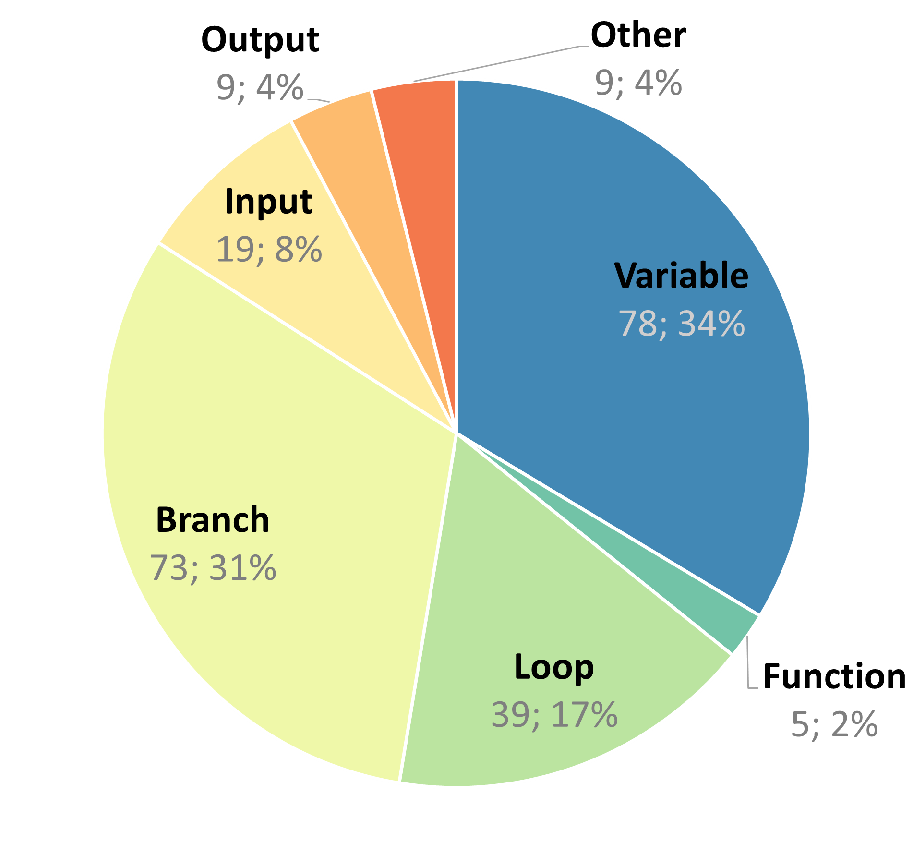

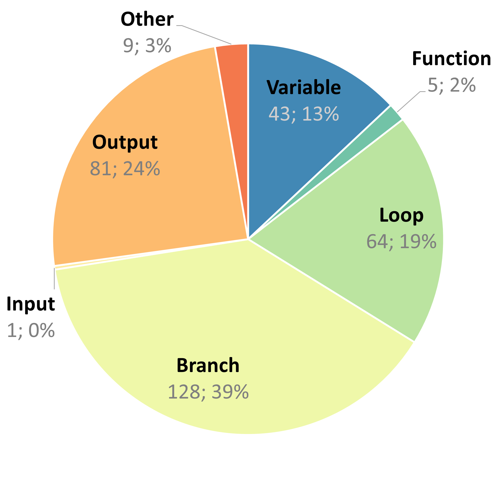

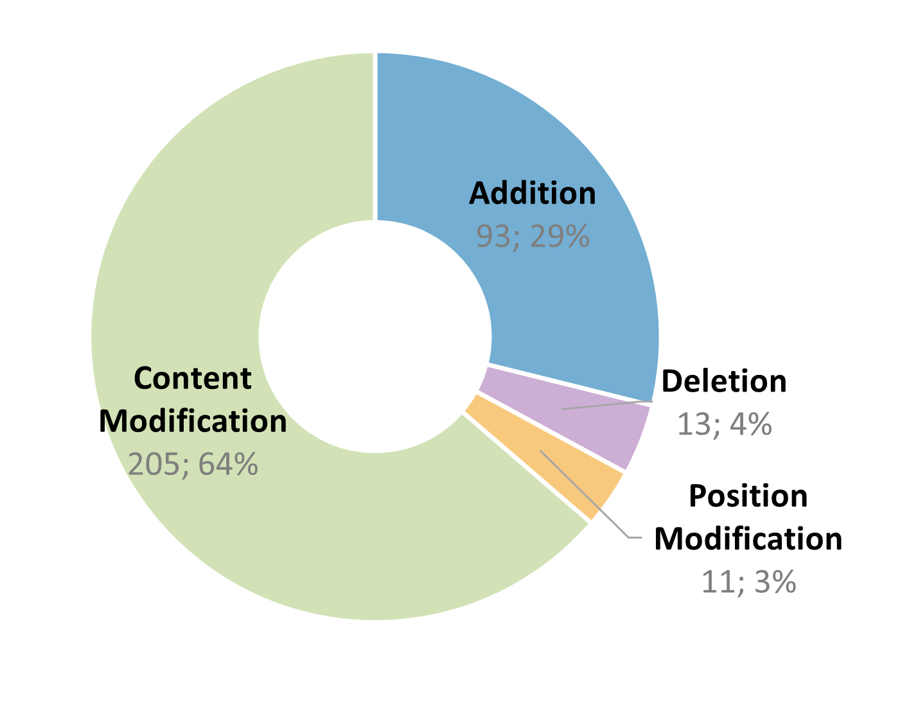

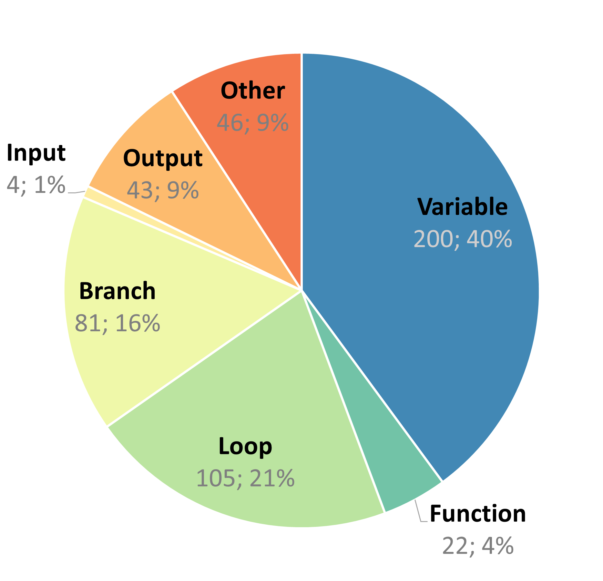

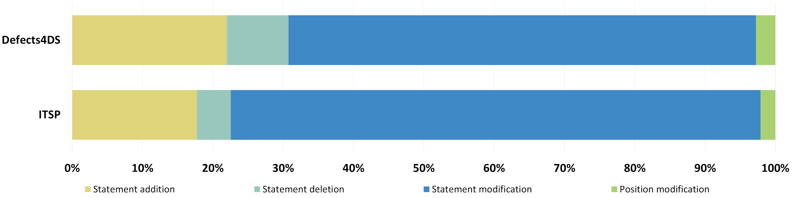

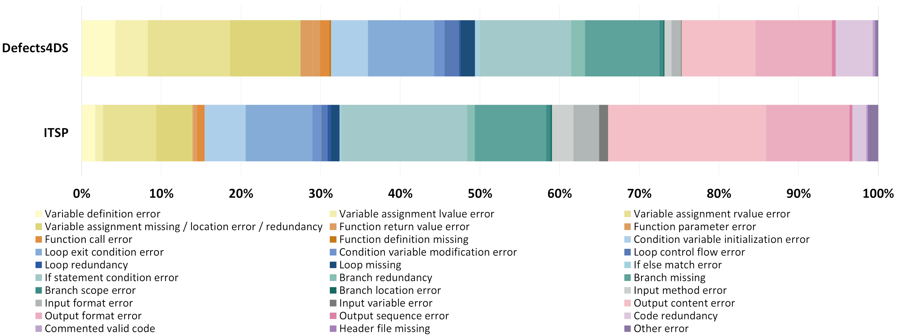

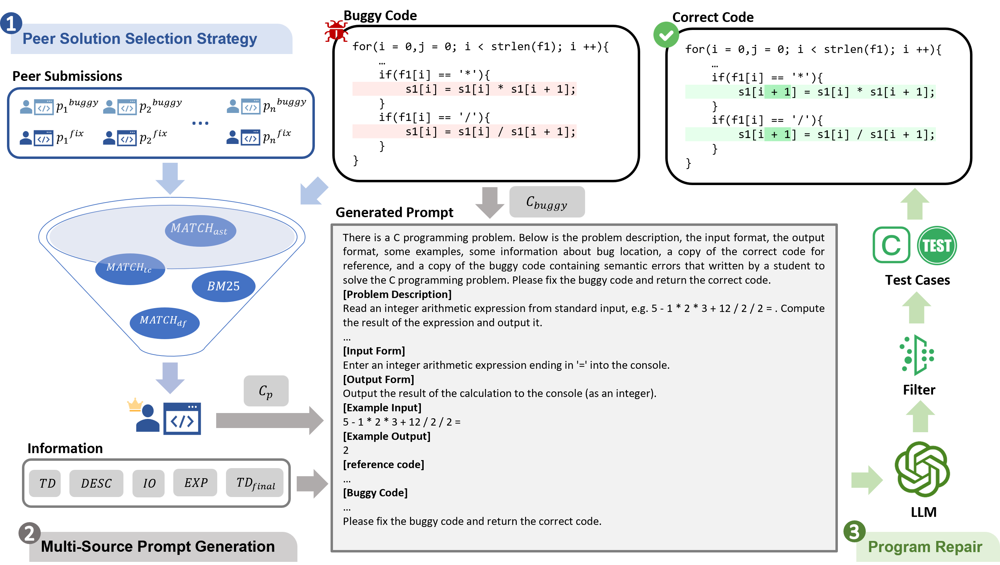

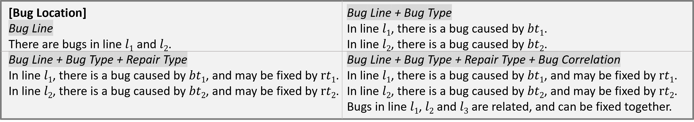

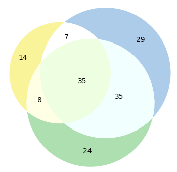

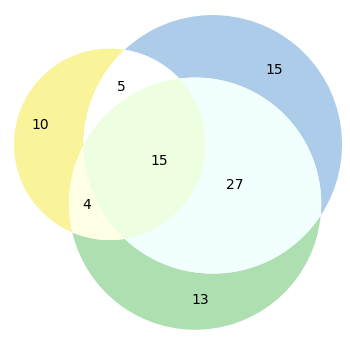

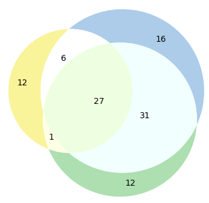

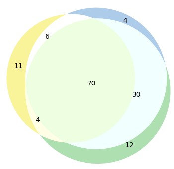

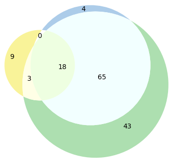

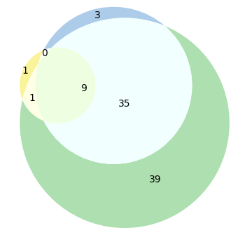

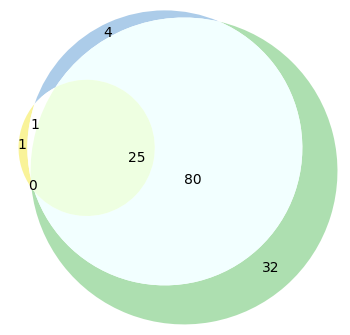

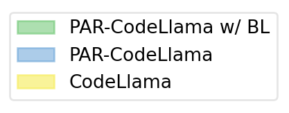

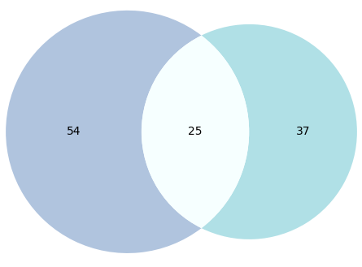

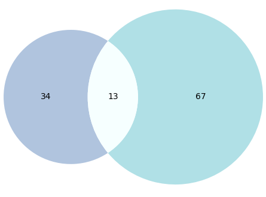

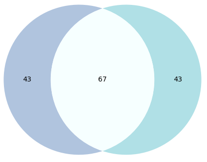

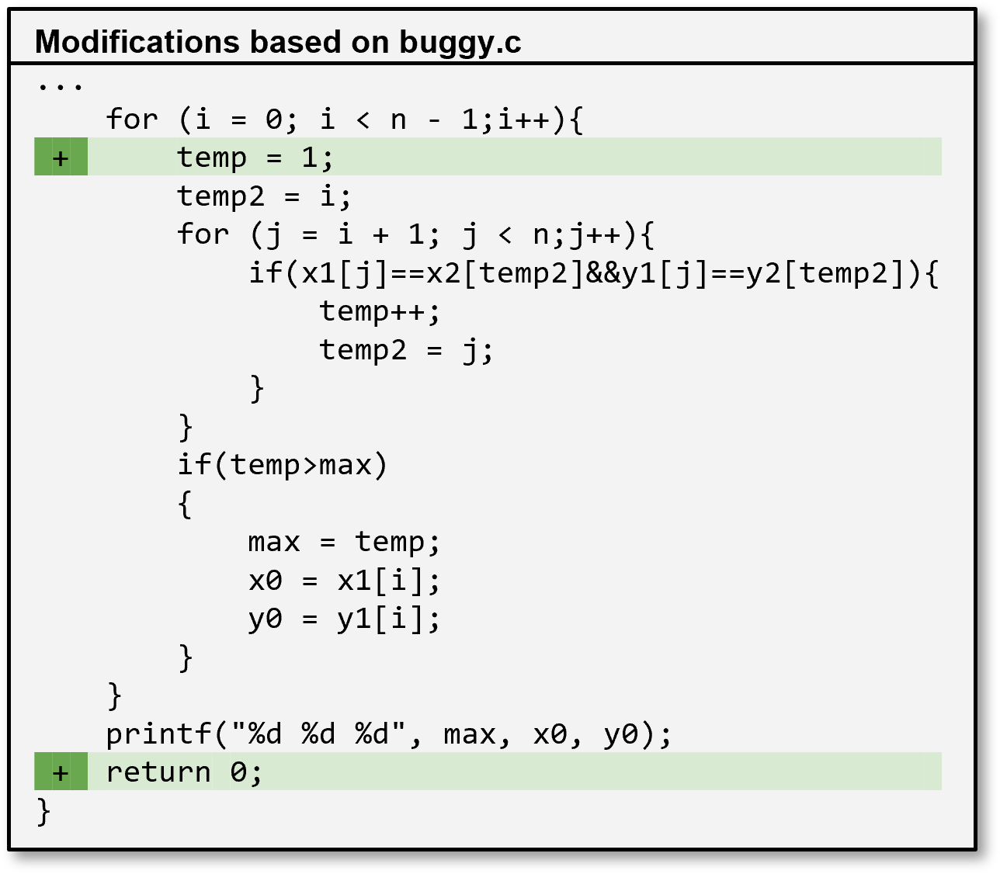

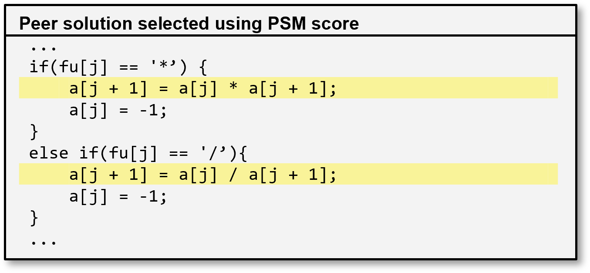

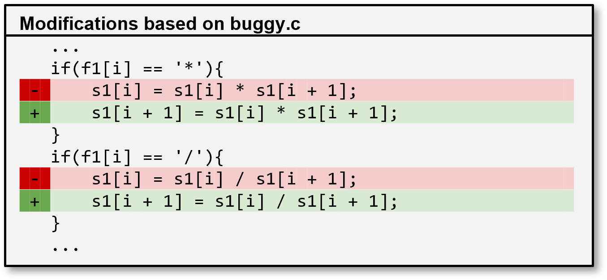

[Arxiv](https://arxiv.org/abs/2404.01754)