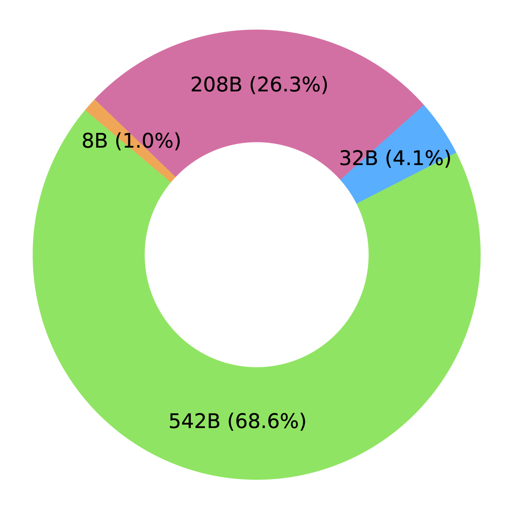
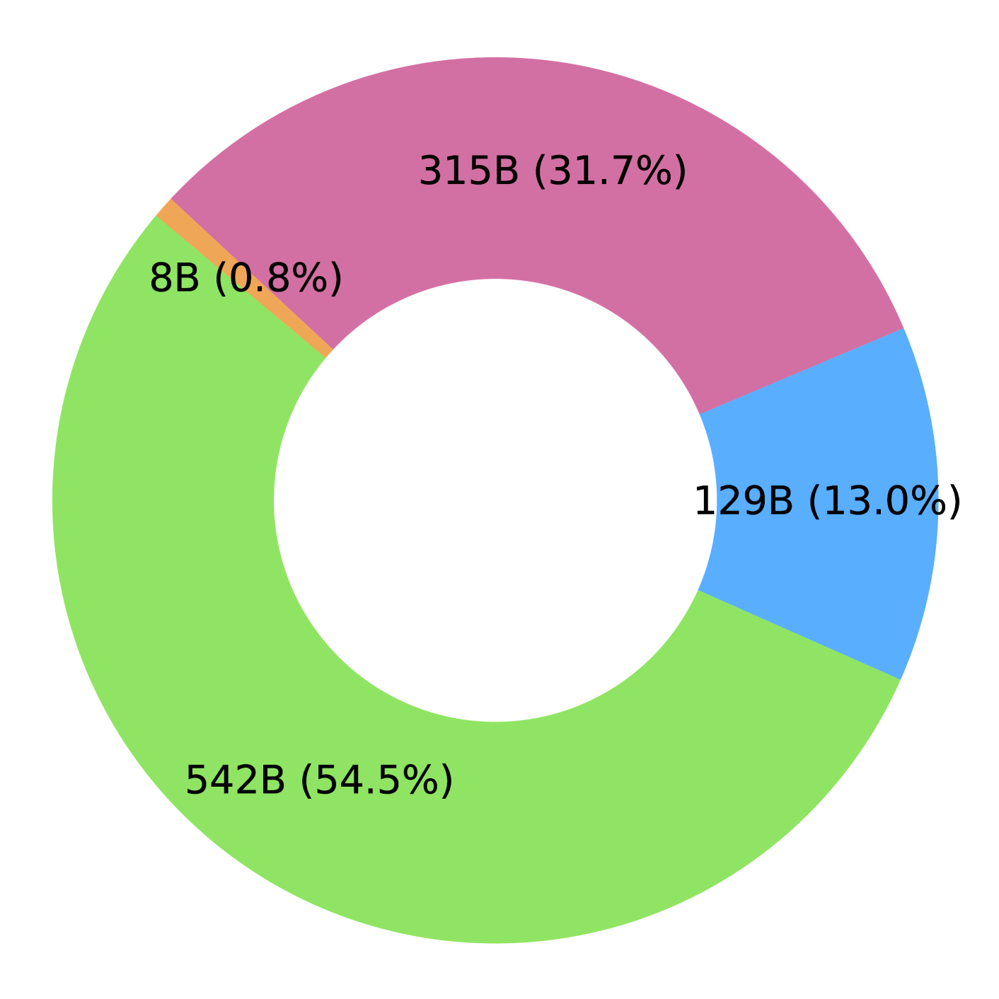
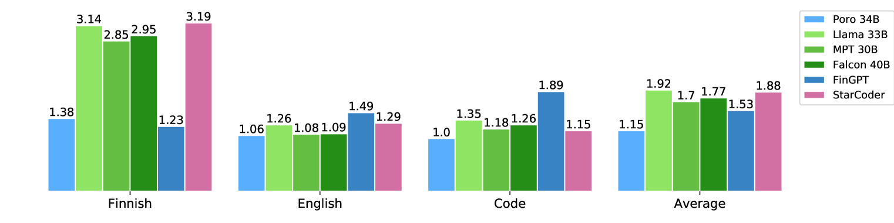
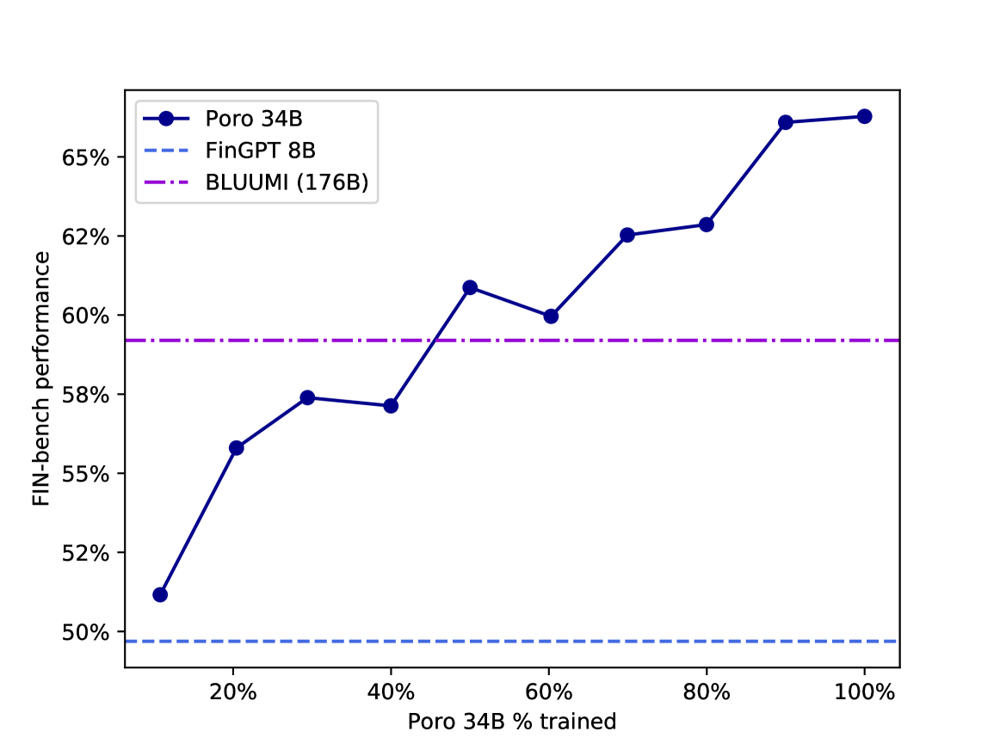

# 探索 Poro 34B：多语言能力的优势与挑战

发布时间：2024年04月02日

`LLM理论` `多语言处理` `机器翻译`

> Poro 34B and the Blessing of Multilinguality

# 摘要

> 如今，顶级大型语言模型的预训练需借助数万亿词量的文本，远超大多数语言所具备的数据量。尽管将多种语言文本纳入训练似乎是扩充数据的明智之举，但多语言性往往被视作难题，主流模型训练依然主要针对单一的大型语言。我们认为多语言性实则是天赐良机，通过多语言训练，有望显著提升小语种单语模型的性能。本研究带来了Poro 34B，这是一款拥有34亿参数的模型，经过1万亿个包括芬兰语、英语及编程语言的文本标记训练而成，证实了多语言训练策略能够孕育出不仅在芬兰语处理能力上大幅领先现有模型，同时在翻译任务上表现卓越，以及在英语和编程语言生成上具有竞争力的模型。模型参数、脚本及数据已在https://huggingface.co/LumiOpen/Poro-34B以开源许可发布。

> The pretraining of state-of-the-art large language models now requires trillions of words of text, which is orders of magnitude more than available for the vast majority of languages. While including text in more than one language is an obvious way to acquire more pretraining data, multilinguality is often seen as a curse, and most model training efforts continue to focus near-exclusively on individual large languages. We believe that multilinguality can be a blessing and that it should be possible to substantially improve over the capabilities of monolingual models for small languages through multilingual training. In this study, we introduce Poro 34B, a 34 billion parameter model trained for 1 trillion tokens of Finnish, English, and programming languages, and demonstrate that a multilingual training approach can produce a model that not only substantially advances over the capabilities of existing models for Finnish, but also excels in translation and is competitive in its class in generating English and programming languages. We release the model parameters, scripts, and data under open licenses at https://huggingface.co/LumiOpen/Poro-34B.

[Arxiv](https://arxiv.org/abs/2404.01856)