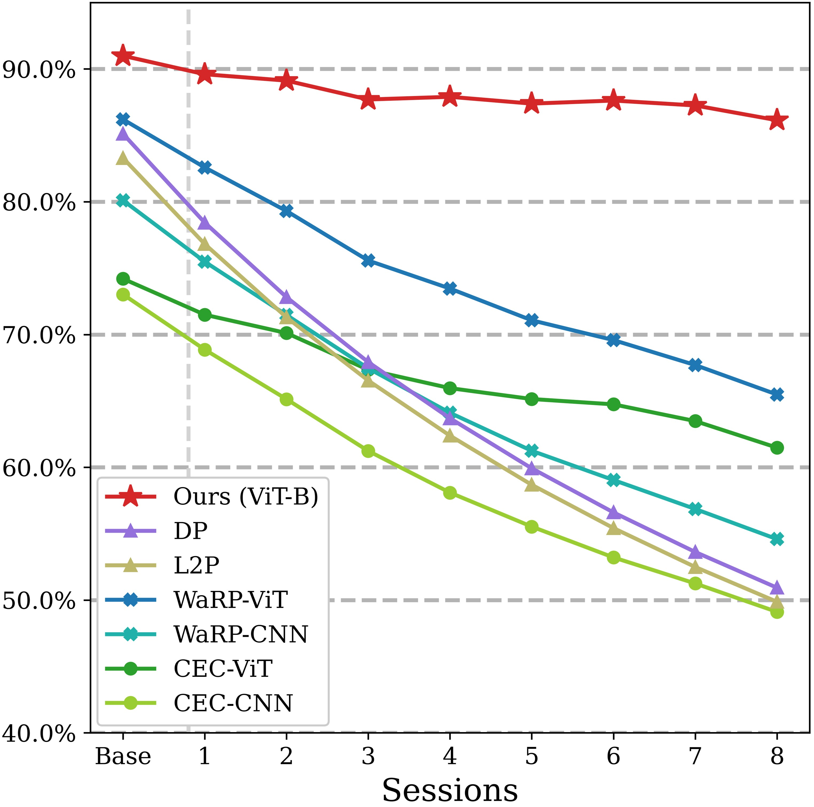
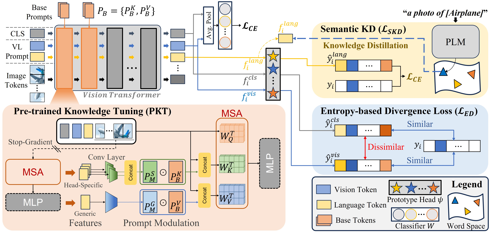
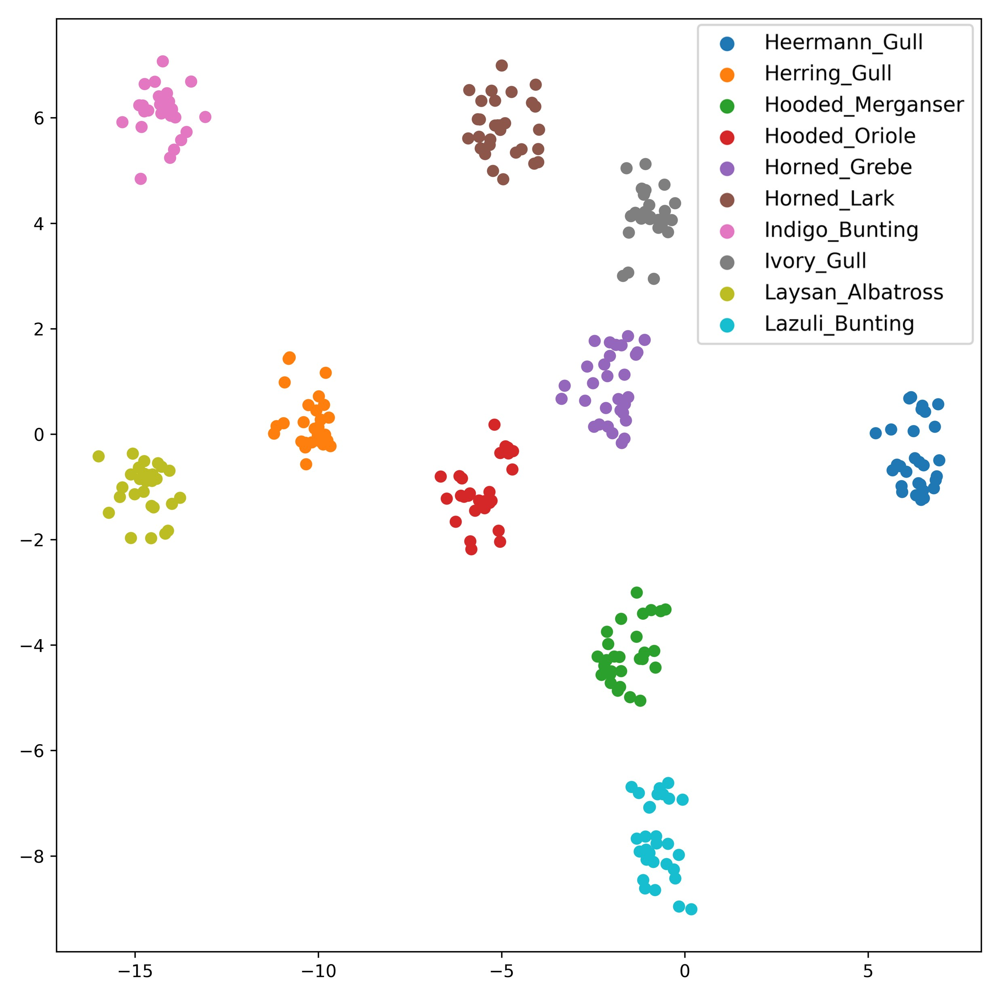
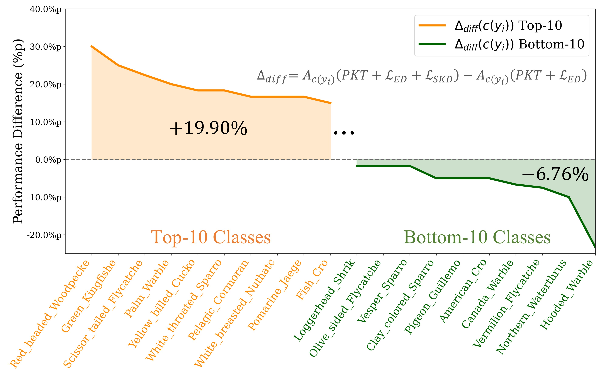
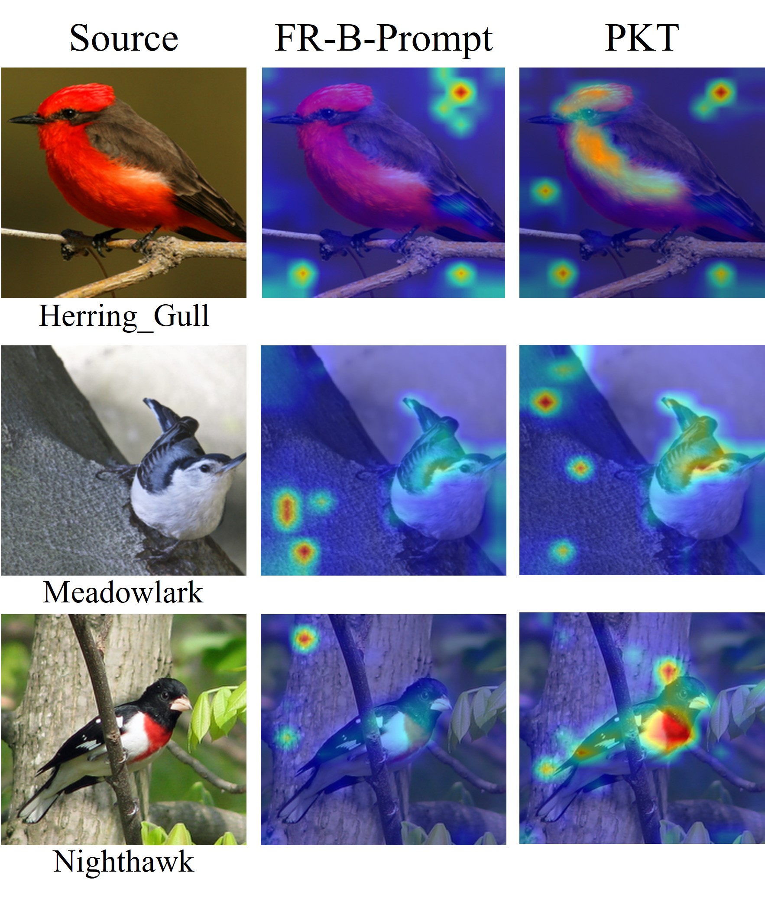
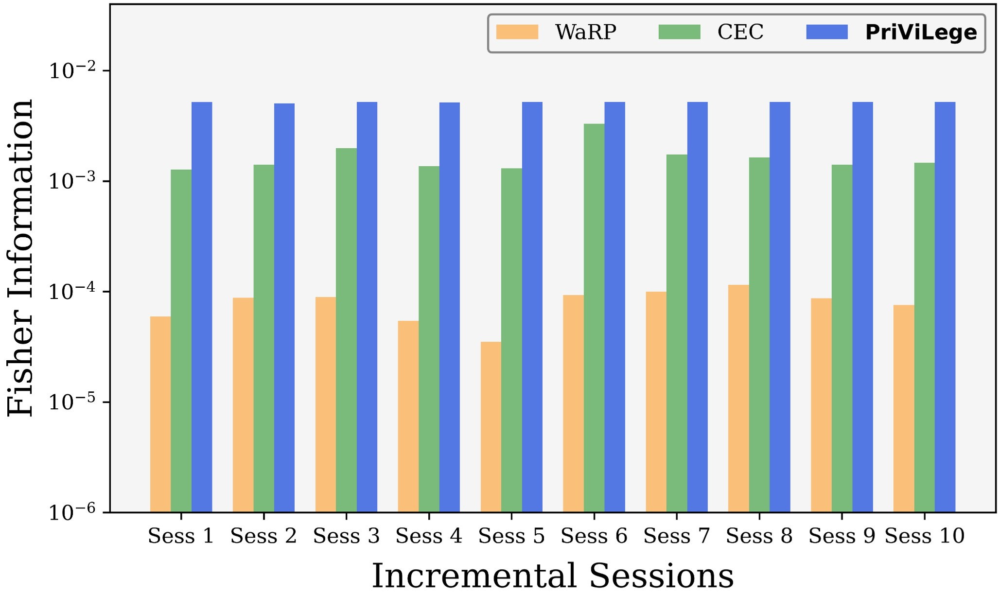
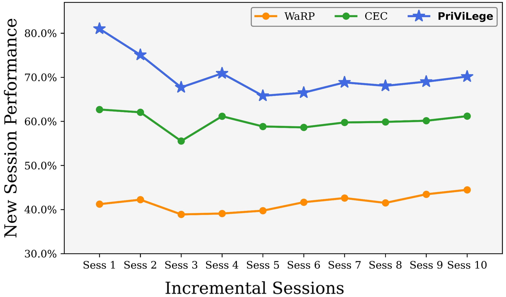
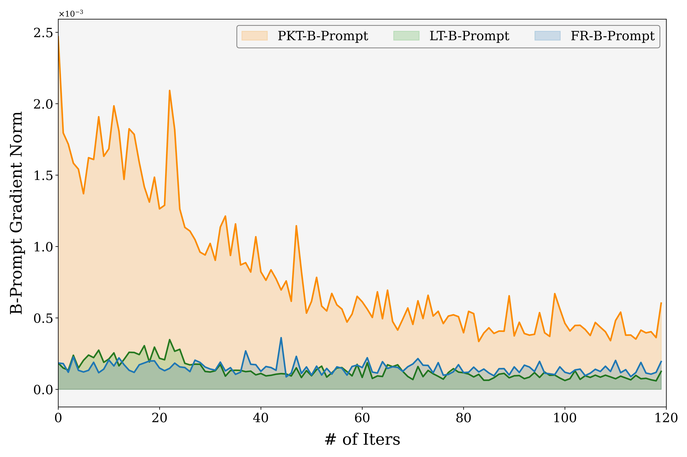
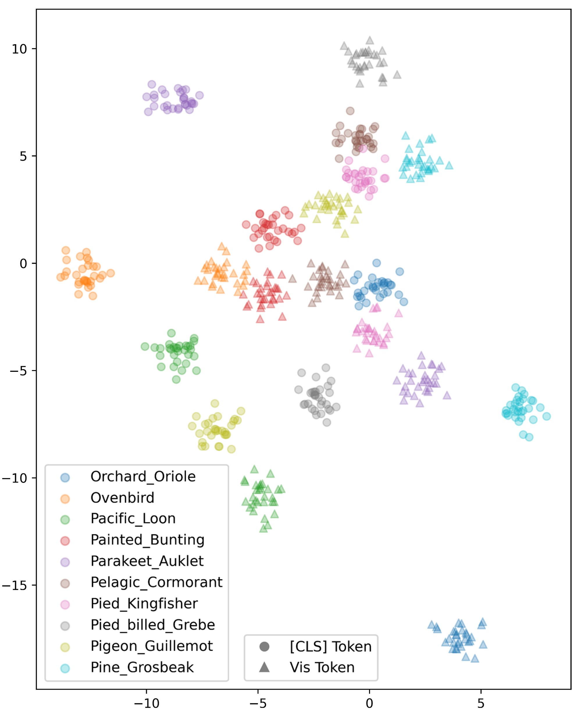

# 预先训练好的视觉与语言转换器，能够作为少量样本的逐步学习器。

发布时间：2024年04月02日

`LLM应用` `分类：计算机视觉` `增量学习`

> Pre-trained Vision and Language Transformers Are Few-Shot Incremental Learners

# 摘要

> FSCIL 任务要求模型在仅有少量样本的情况下，逐步掌握新类别而不丧失旧知识。这一任务面临两大难题：灾难性遗忘和过拟合，以往的研究因此多依赖于如 ResNet-18 这类浅层模型。虽然这些模型的小容量有助于减轻问题，但同时也限制了知识的传递效率。本研究提出，像视觉和语言变换器这样的大型模型，在大规模数据集上预训练后，能够成为出色的少样本增量学习器。我们引入了创新的 PriViLege 框架，结合提示机制和知识蒸馏技术，通过预训练知识调整 (PKT) 及两种新型损失函数——基于熵的发散损失和语义知识蒸馏损失，有效应对大型模型的遗忘和过拟合问题。实验结果显示，PriViLege 框架在 CUB200、CIFAR-100 和 miniImageNet 数据集上相较于现有技术取得了显著进步，提升幅度分别达到 9.38%、20.58% 和 13.36%。相关代码已在 GitHub 上公开。

> Few-Shot Class Incremental Learning (FSCIL) is a task that requires a model to learn new classes incrementally without forgetting when only a few samples for each class are given. FSCIL encounters two significant challenges: catastrophic forgetting and overfitting, and these challenges have driven prior studies to primarily rely on shallow models, such as ResNet-18. Even though their limited capacity can mitigate both forgetting and overfitting issues, it leads to inadequate knowledge transfer during few-shot incremental sessions. In this paper, we argue that large models such as vision and language transformers pre-trained on large datasets can be excellent few-shot incremental learners. To this end, we propose a novel FSCIL framework called PriViLege, Pre-trained Vision and Language transformers with prompting functions and knowledge distillation. Our framework effectively addresses the challenges of catastrophic forgetting and overfitting in large models through new pre-trained knowledge tuning (PKT) and two losses: entropy-based divergence loss and semantic knowledge distillation loss. Experimental results show that the proposed PriViLege significantly outperforms the existing state-of-the-art methods with a large margin, e.g., +9.38% in CUB200, +20.58% in CIFAR-100, and +13.36% in miniImageNet. Our implementation code is available at https://github.com/KHU-AGI/PriViLege.

[Arxiv](https://arxiv.org/abs/2404.02117)