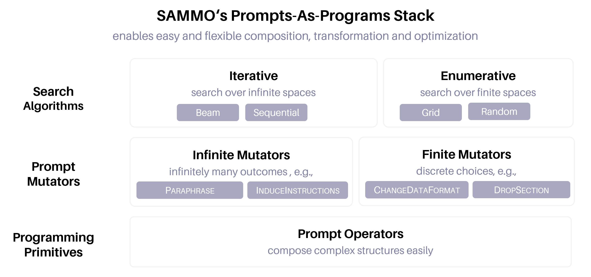
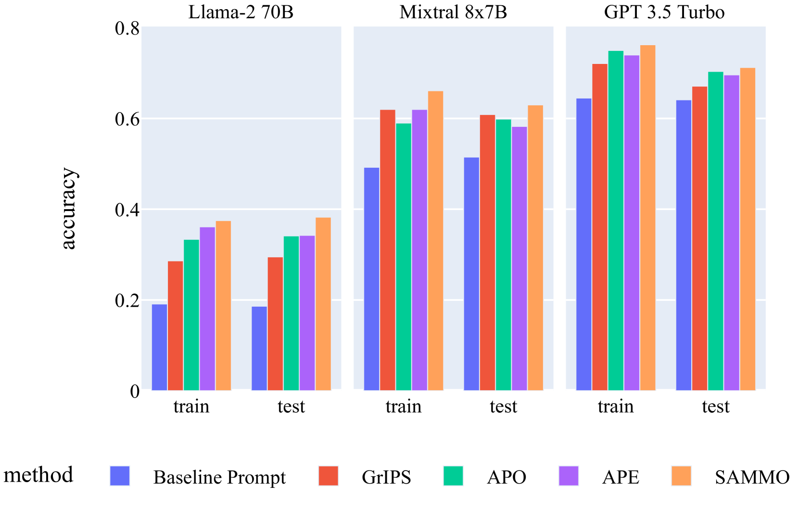
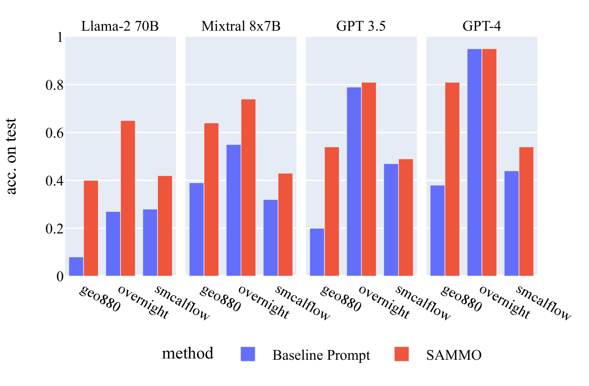
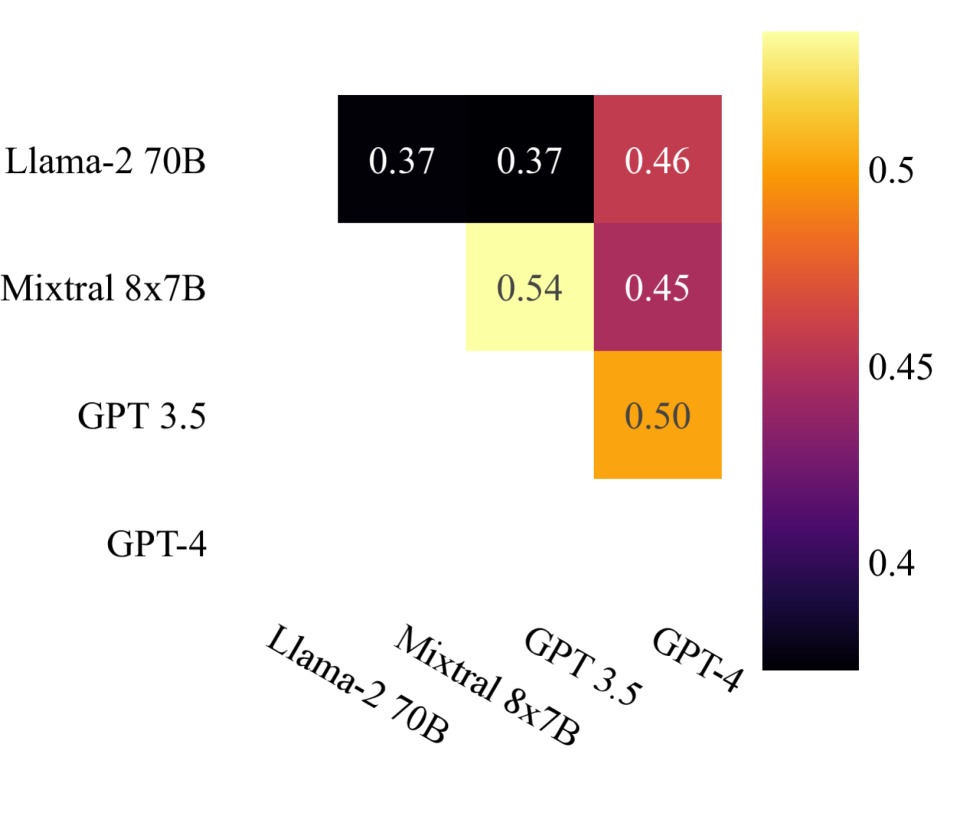
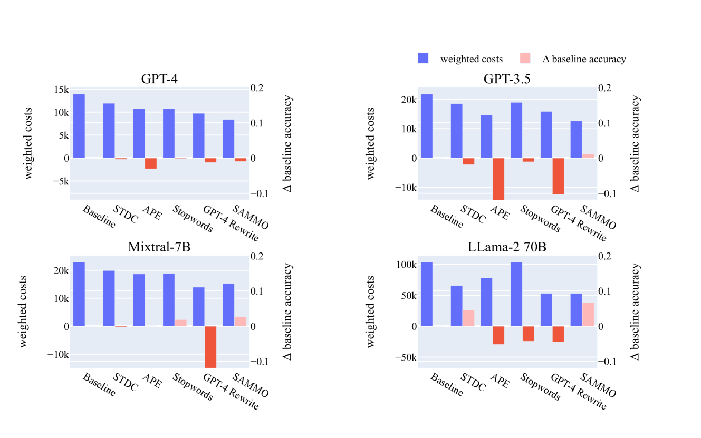
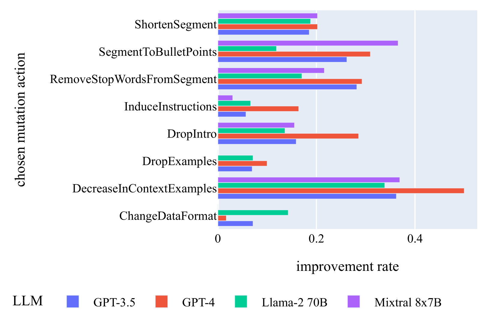

# 将提示视作程序，本研究提出了一种结构感知的方法，用以在编译时期高效地优化提示。

发布时间：2024年04月02日

`LLM应用` `人工智能`

> Prompts As Programs: A Structure-Aware Approach to Efficient Compile-Time Prompt Optimization

# 摘要

> 如今，大型语言模型能够应对更长、更复杂的文本输入，使得我们能够设计更为精细的提示。但这些提示往往需要微调，以提升实际应用时的效果。尽管已有研究提出了自动优化提示的方法，但随着提示变得更加复杂，现有的优化技术已难以满足需求，迫切需要一种创新的方法来提升元提示程序的性能。为此，我们推出了SAMMO框架，它在编译阶段对元提示程序进行优化，将提示打造成可塑性更强的结构化实体，使得在优化过程中能够探索更广泛的变换策略。实践证明，SAMMO不仅继承并发展了以往的优化技术，还在（1）指令微调，（2）RAG流程优化，以及（3）提示压缩等多个方面显著提升了复杂提示的表现，且效果跨越了多种不同的大型语言模型。我们的开源代码已在https://github.com/microsoft/sammo 上公布。

> Large language models (LLMs) can now handle longer and more complex inputs, which facilitate the use of more elaborate prompts. However, prompts often require some tuning to improve performance for deployment. Recent work has proposed automatic prompt optimization methods, but as prompt complexity and LLM strength increase, many prompt optimization techniques are no longer sufficient and a new approach is needed to optimize {\em meta prompt programs}. To address this, we introduce SAMMO, a framework for {\em compile-time} optimizations of metaprompt programs, which represent prompts as structured objects that allows for a rich set of transformations that can be searched over during optimization. We show that SAMMO generalizes previous methods and improves the performance of complex prompts on (1) instruction tuning, (2) RAG pipeline tuning, and (3) prompt compression, across several different LLMs.
  We make all code available open-source at https://github.com/microsoft/sammo .

[Arxiv](https://arxiv.org/abs/2404.02319)