# RESSA：通过稀疏交叉模态适配技术，完善视觉-语言模型的稀疏性问题。

发布时间：2024年04月02日

`LLM理论` `计算机视觉` `自然语言处理
注：虽然论文摘要中提到了视觉-语言模型（VLMs）` `但根据其研究方向和应用场景` `可以判断其主要涉及计算机视觉和自然语言处理两个领域。`

> RESSA: Repair Sparse Vision-Language Models via Sparse Cross-Modality Adaptation

# 摘要

> 视觉-语言模型（VLMs）成功整合了多种模态的信息，在众多任务中表现卓越。但在资源受限环境下部署这些大规模的VLMs面临挑战。尽管剪枝加微调的方法有望在缩小模型规模的同时保持性能，但这一方法在VLMs上的应用尚待深入研究，主要问题包括如何合理分配不同模态特定模型的稀疏性，以及如何提升剪枝后稀疏VLMs的性能。我们的初步研究表明，对视觉和语言模型采用相同稀疏度的剪枝策略，能够接近最优性能。针对第二个问题，SparseLoRA技术的引入，使得LoRA权重能够直接应用稀疏性，与稀疏模型无缝配合。通过RESSA方法，我们不仅增强了任务特定性能，还实现了从原始密集模型到稀疏模型的知识迁移。实验结果显示，RESSA在2:4稀疏度下提升了11.3%，在70%非结构化稀疏度下更是取得了47.6%的显著提升。

> Vision-Language Models (VLMs), integrating diverse information from multiple modalities, have shown remarkable success across various tasks. However, deploying VLMs, comprising large-scale vision and language models poses challenges in resource-constrained scenarios. While pruning followed by finetuning offers a potential solution to maintain performance with smaller model sizes, its application to VLMs remains relatively unexplored, presenting two main questions: how to distribute sparsity across different modality-specific models, and how to repair the performance of pruned sparse VLMs. To answer the first question, we conducted preliminary studies on VLM pruning and found that pruning vision models and language models with the same sparsity ratios contribute to nearly optimal performance. For the second question, unlike finetuning unimodal sparse models, sparse VLMs involve cross-modality interactions, requiring specialized techniques for post-pruning performance repair. Moreover, while parameter-efficient LoRA finetuning has been proposed to repair the performance of sparse models, a significant challenge of weights merging arises due to the incompatibility of dense LoRA modules with sparse models that destroy the sparsity of pruned models. To tackle these challenges, we propose to Repair Sparse Vision-Language Models via Sparse Cross-modality Adaptation (RESSA). RESSA utilizes cross-modality finetuning to enhance task-specific performance and facilitate knowledge distillation from original dense models. Additionally, we introduce SparseLoRA, which applies sparsity directly to LoRA weights, enabling seamless integration with sparse models. Our experimental results validate the effectiveness of RESSA, showcasing significant enhancements, such as an 11.3\% improvement under 2:4 sparsity and a remarkable 47.6\% enhancement under unstructured 70\% sparsity.

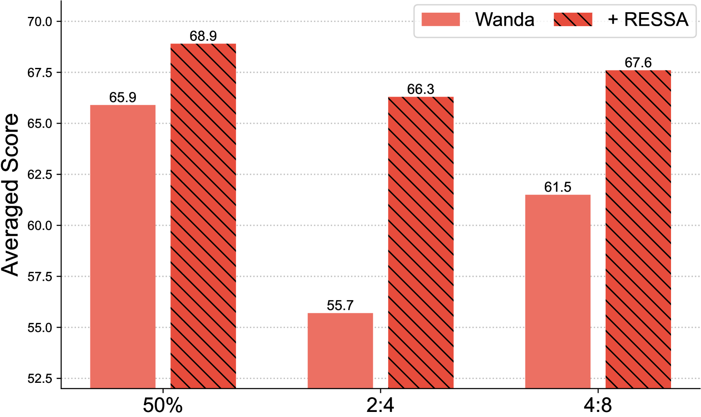

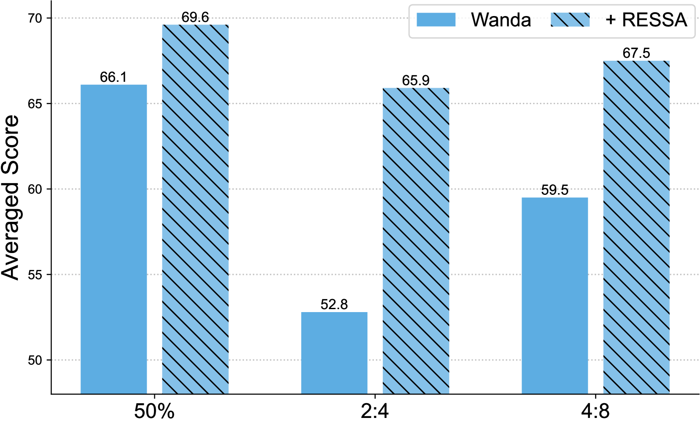

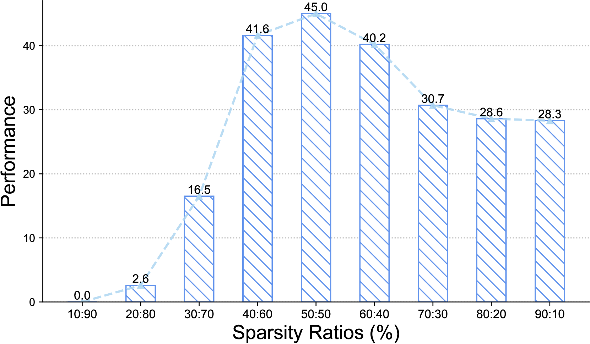

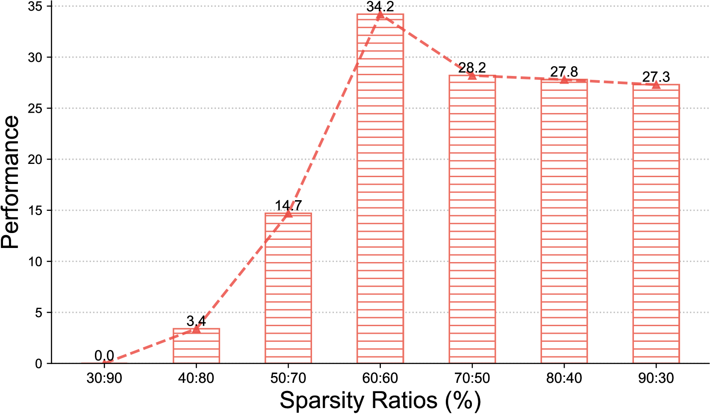

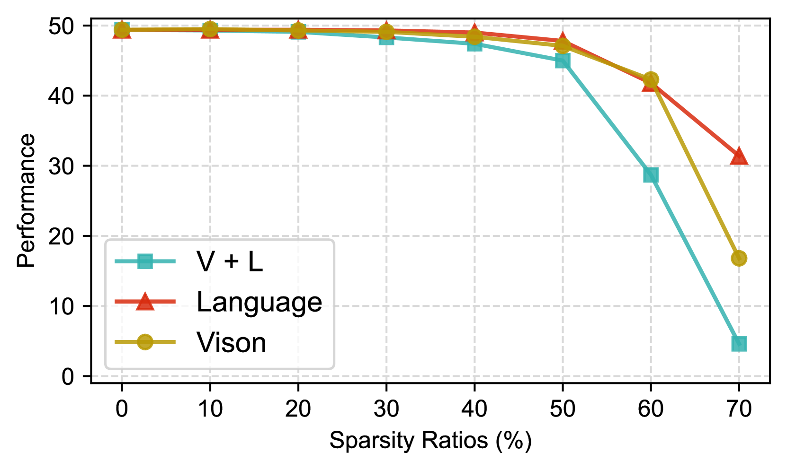

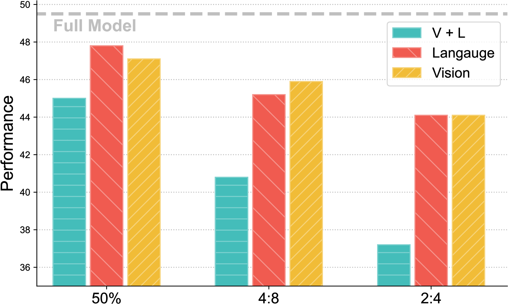

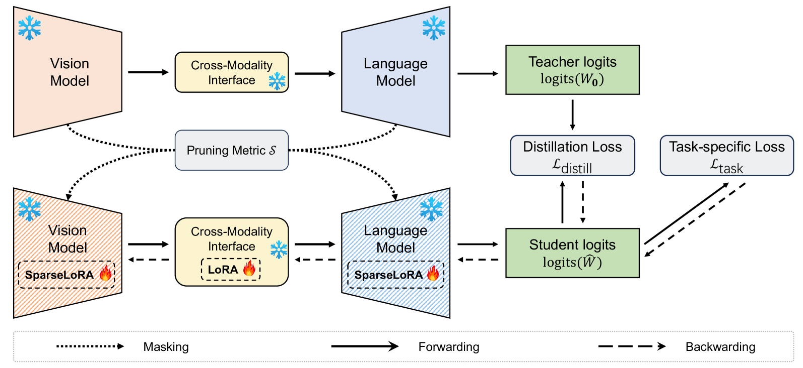

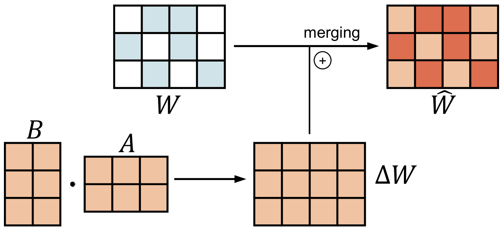

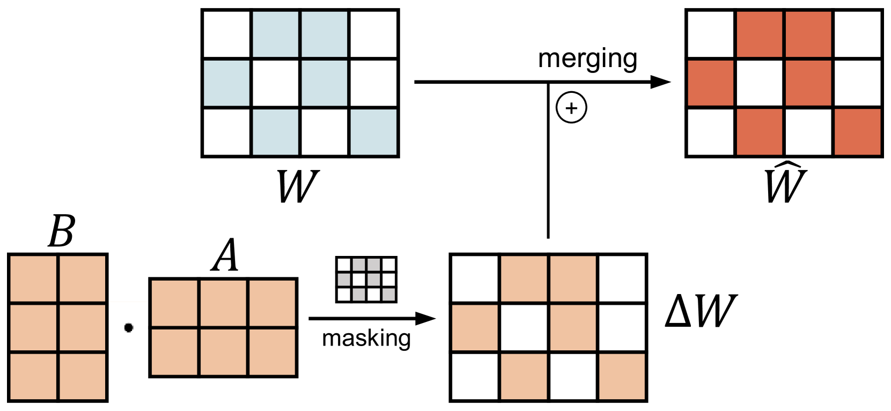

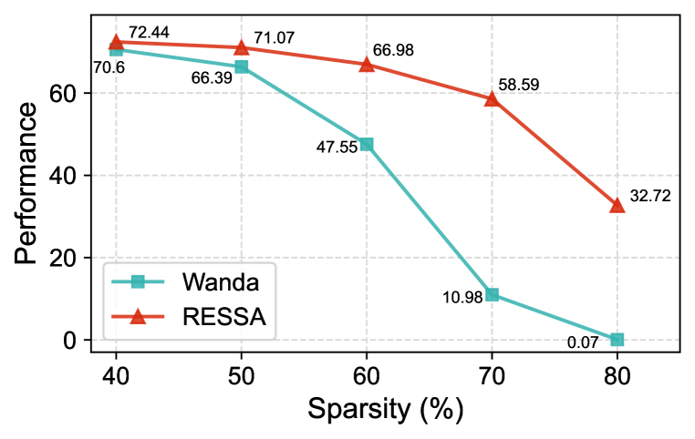

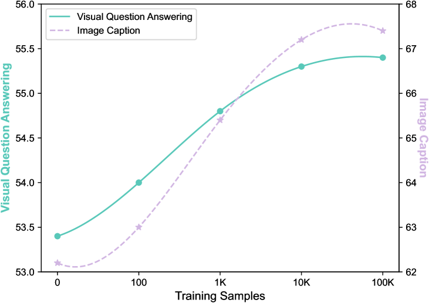

[Arxiv](https://arxiv.org/abs/2404.02424)