# 深入探讨子词切分：以大型语言模型中的词缀否定现象为例

发布时间：2024年04月02日

`LLM理论` `语言处理`

> Revisiting subword tokenization: A case study on affixal negation in large language models

# 摘要

> 本研究探讨了词缀否定在现代英语大型语言模型（LLMs）中的作用。词缀否定通过负面词素传达意义，这对LLMs构成挑战，因为它们的分词器往往忽视了词素的形态学特性。我们对采用不同子词分词技术的LLMs进行了深入实验，揭示了分词效果与否定识别敏感度之间的相互影响。尽管分词精确度与否定检测表现间存在若干差异，但我们发现模型总体而言能够准确把握词缀否定的内涵。

> In this work, we measure the impact of affixal negation on modern English large language models (LLMs). In affixal negation, the negated meaning is expressed through a negative morpheme, which is potentially challenging for LLMs as their tokenizers are often not morphologically plausible. We conduct extensive experiments using LLMs with different subword tokenization methods, which lead to several insights on the interaction between tokenization performance and negation sensitivity. Despite some interesting mismatches between tokenization accuracy and negation detection performance, we show that models can, on the whole, reliably recognize the meaning of affixal negation.

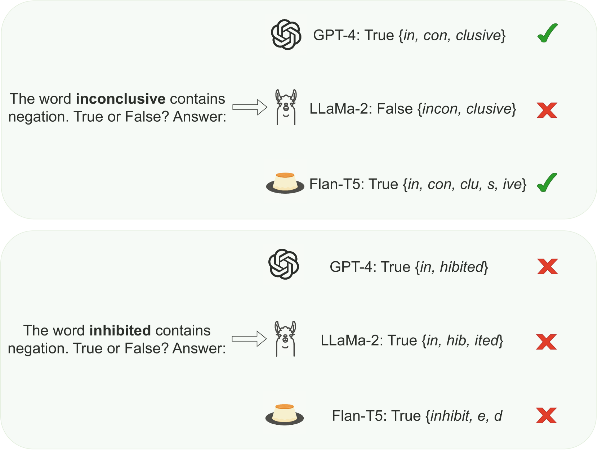

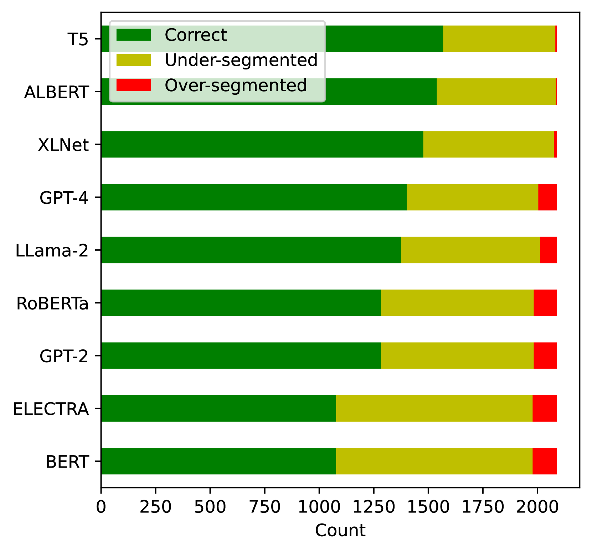

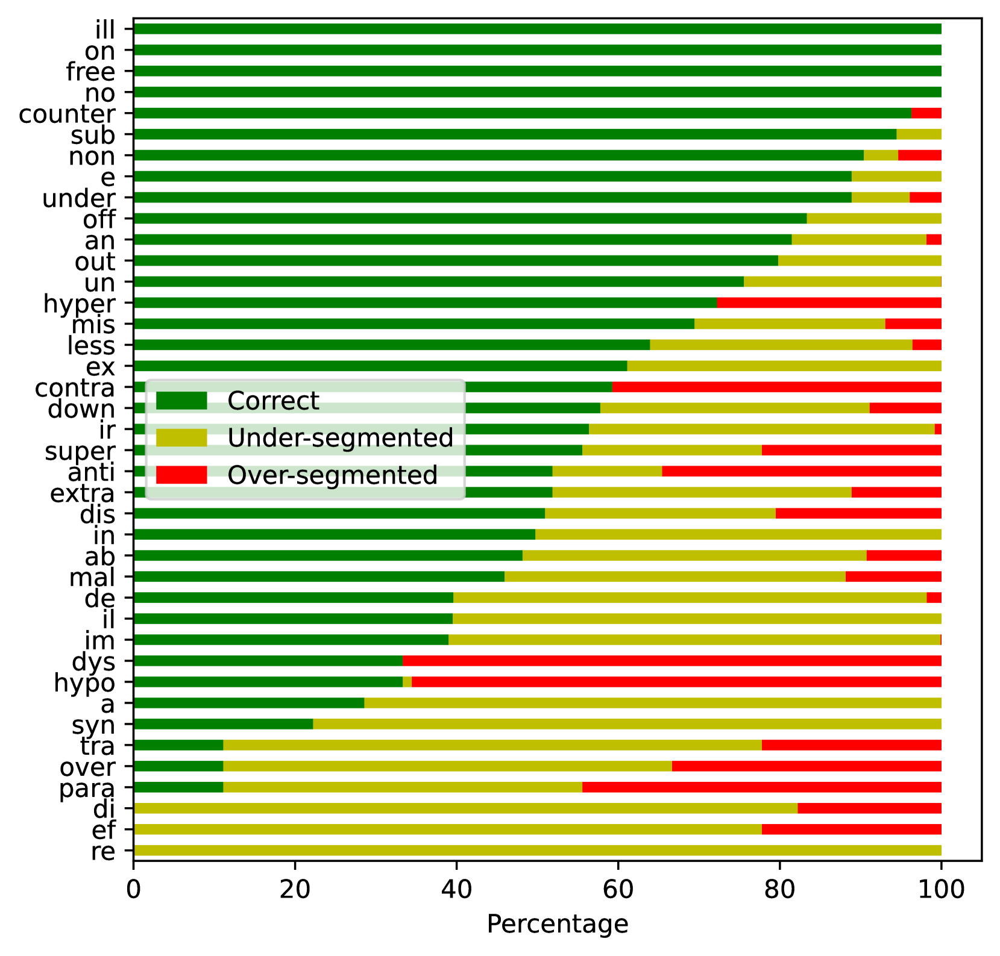

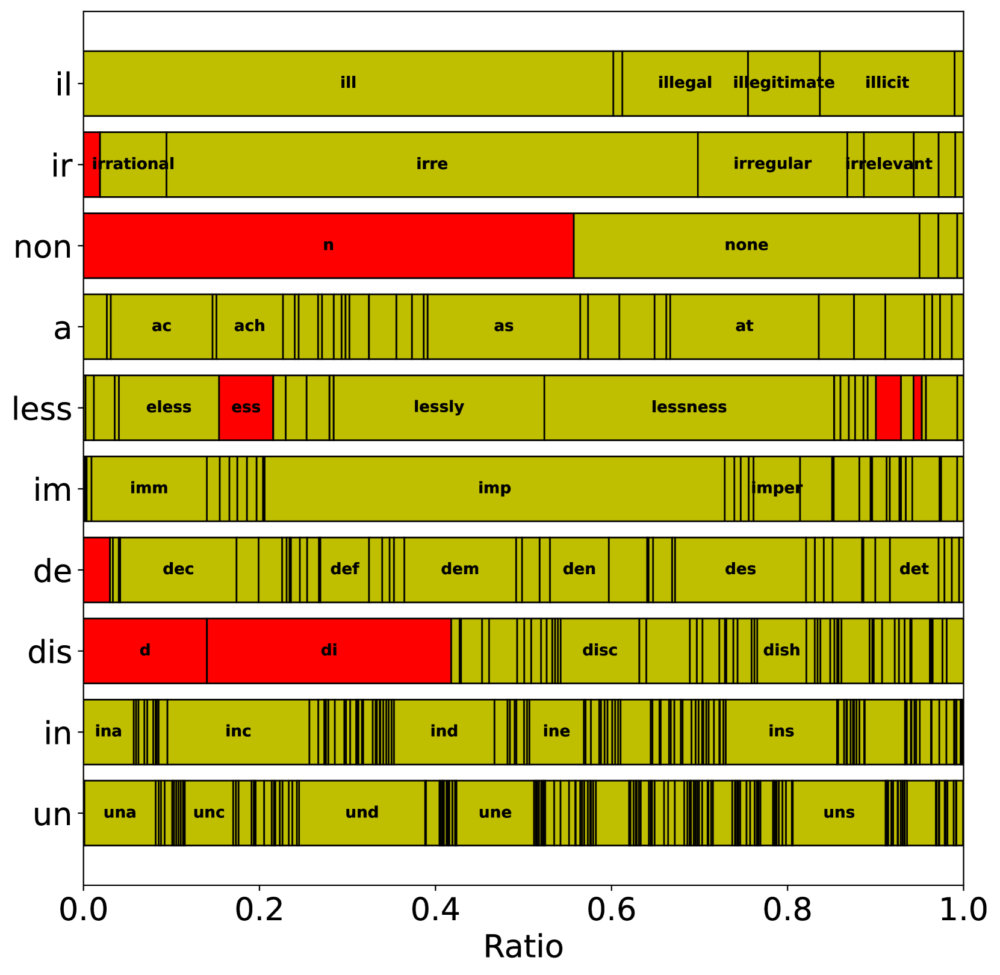

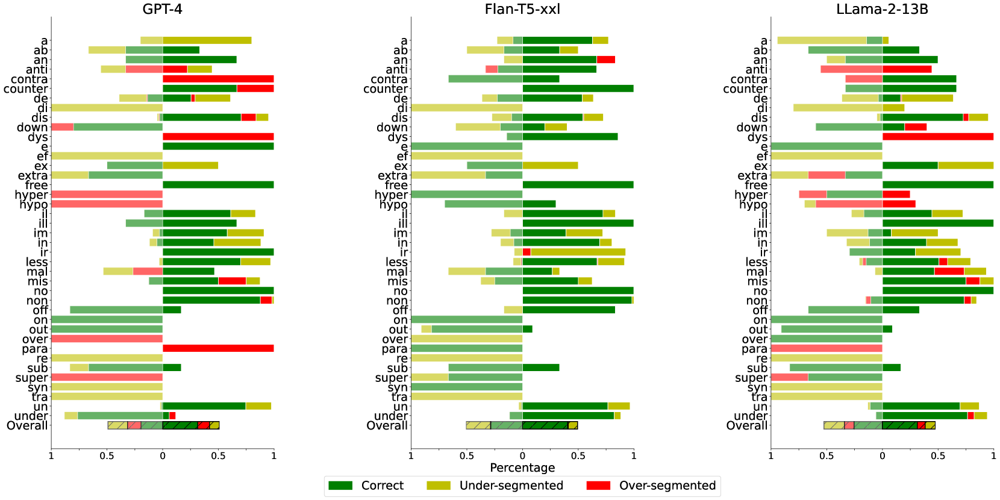

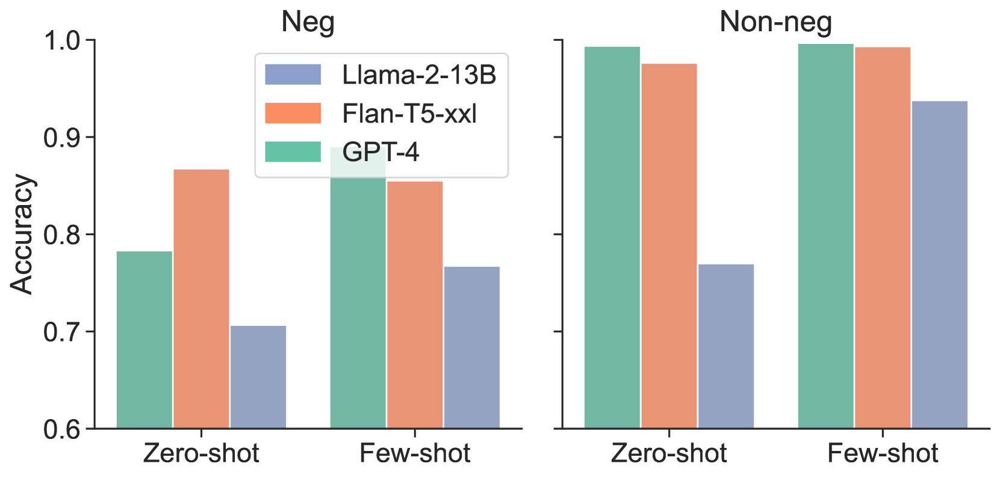

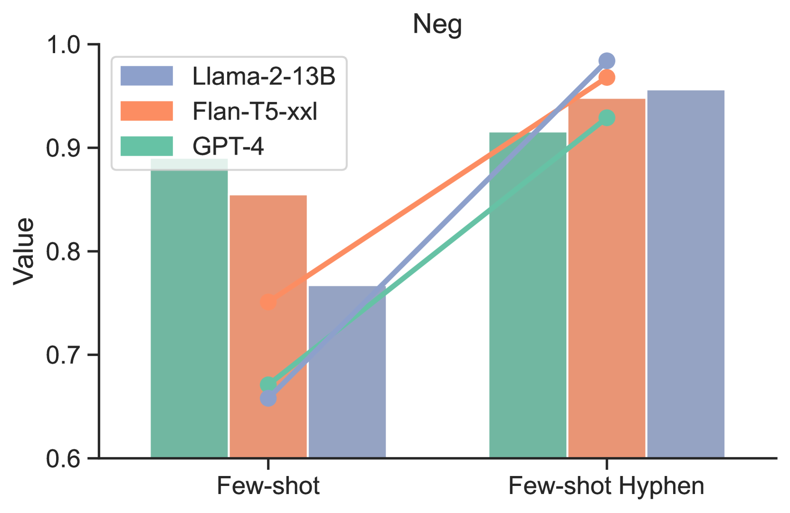

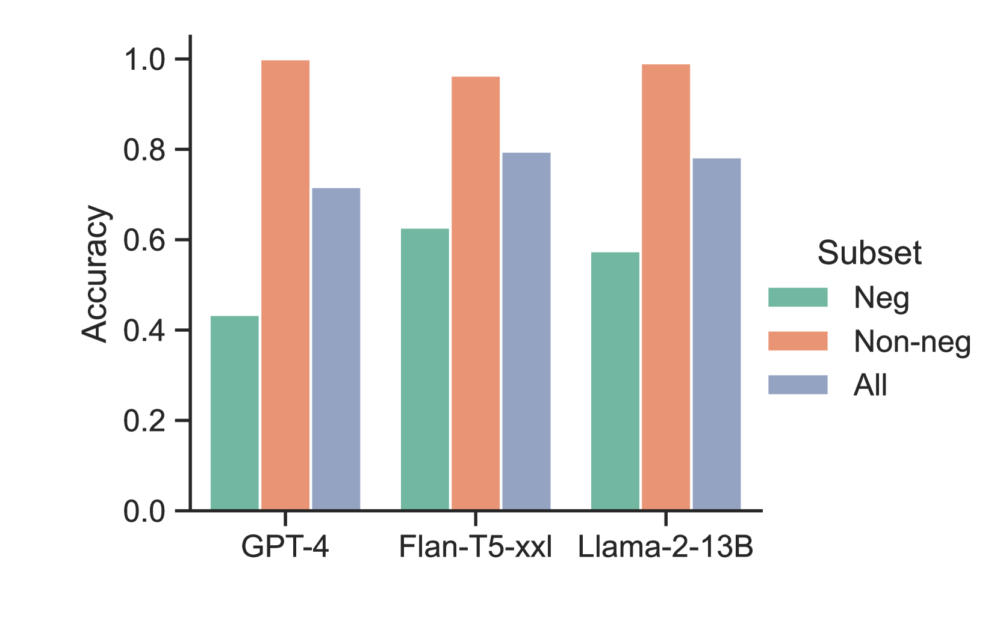

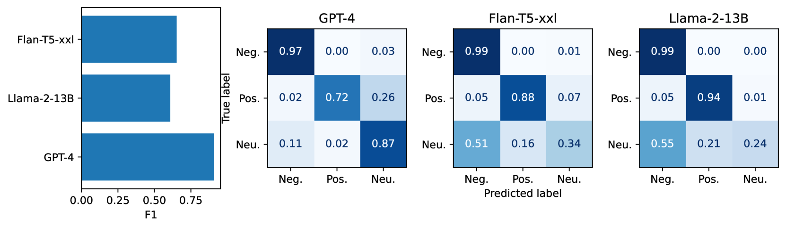

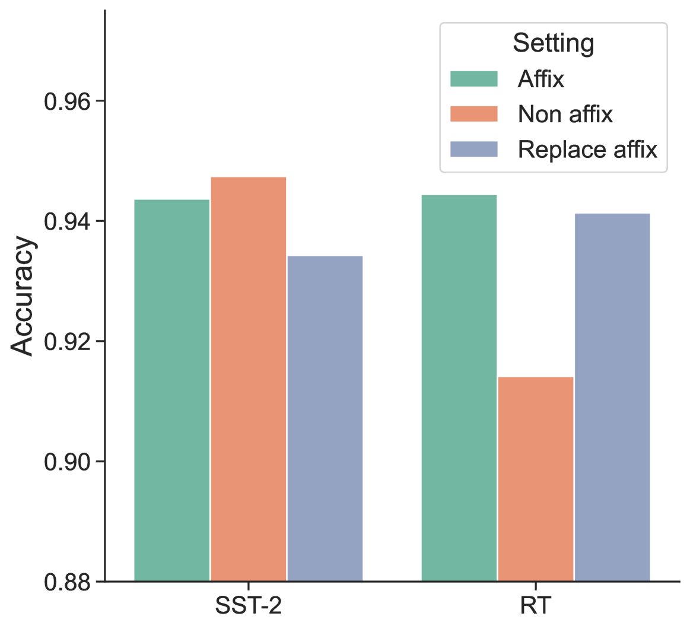

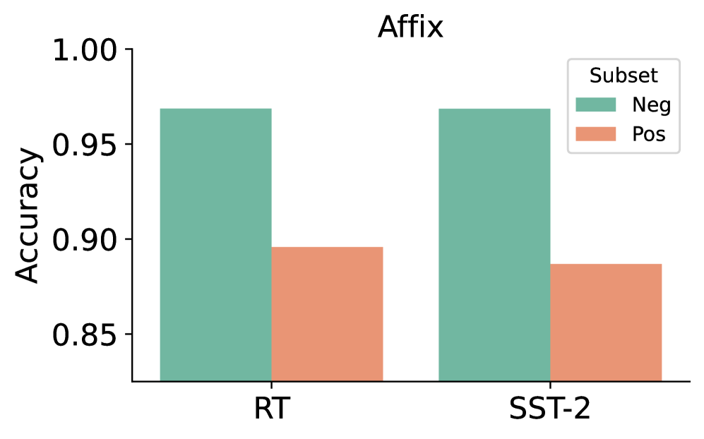

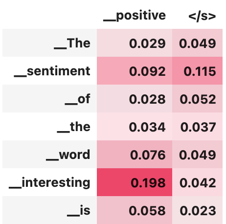

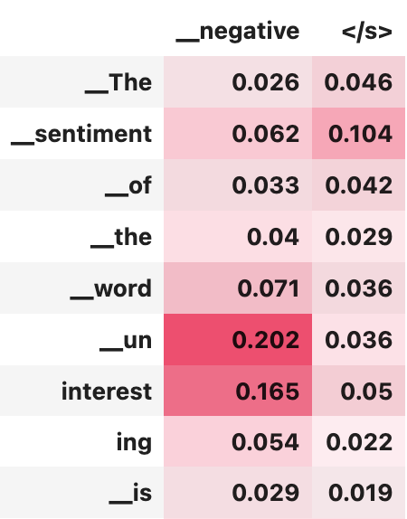

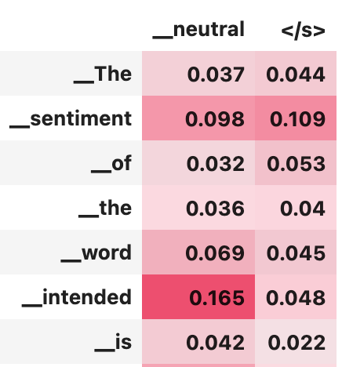

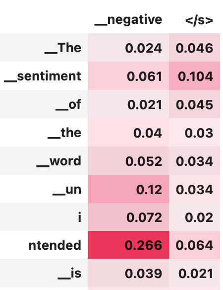

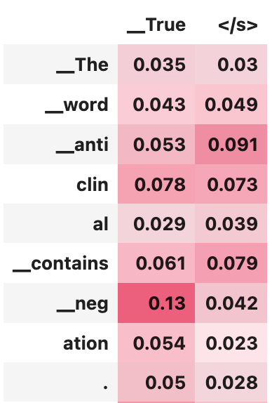

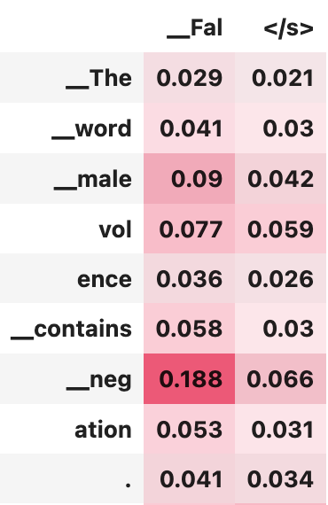

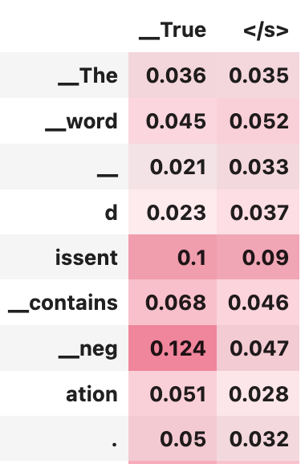

[Arxiv](https://arxiv.org/abs/2404.02421)