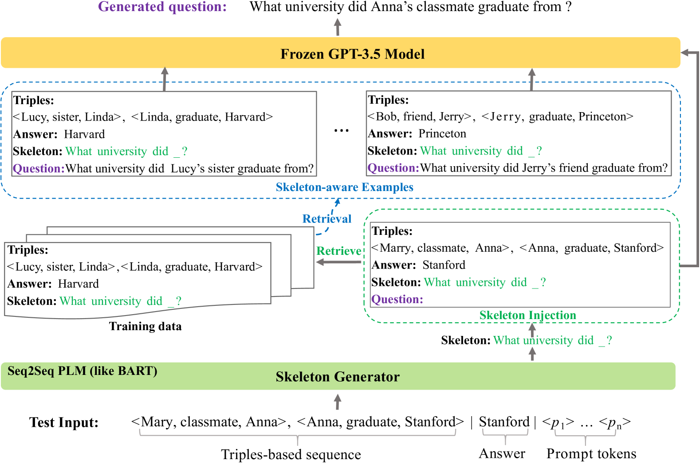
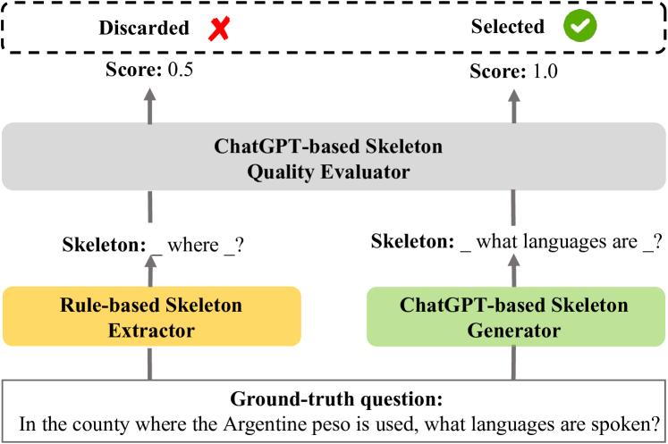
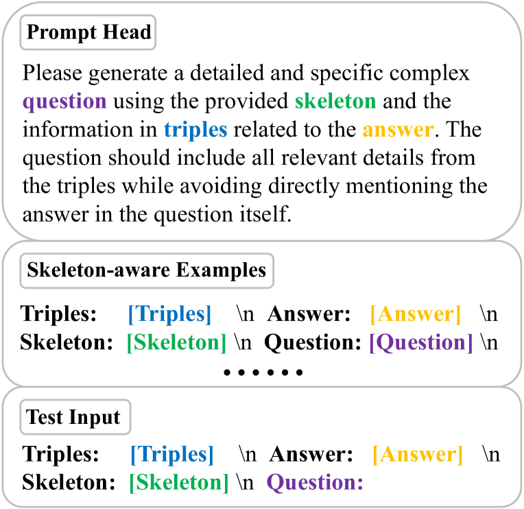
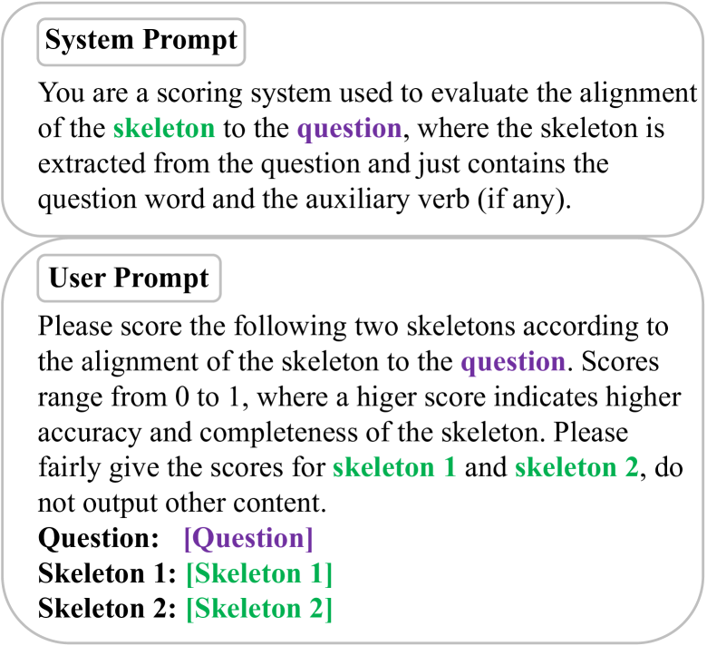
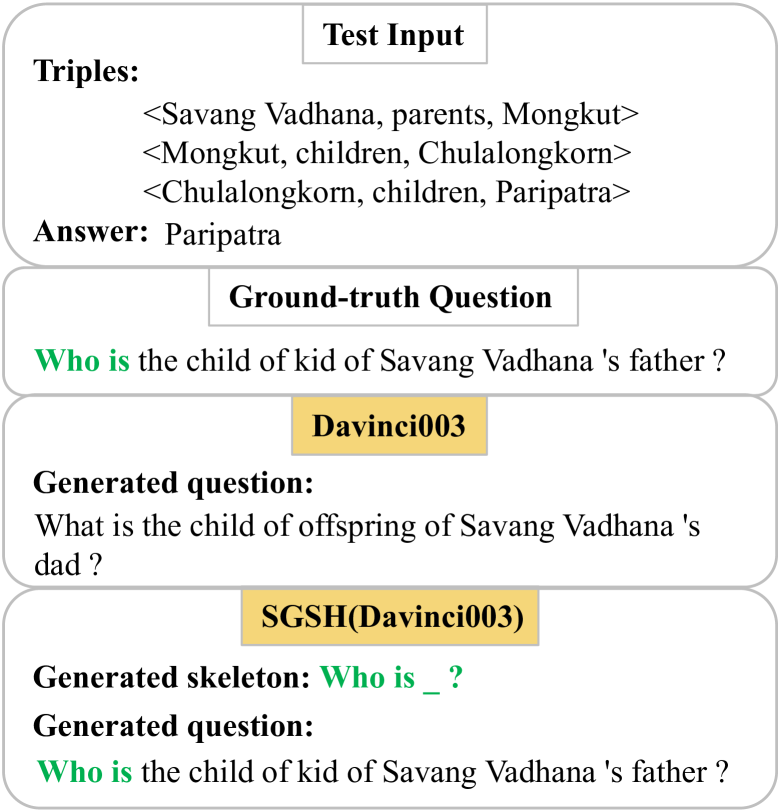

# SGSH：运用骨架启发式策略激活大型语言模型，助力知识库提问生成。

发布时间：2024年04月02日

`LLM应用` `知识库`

> SGSH: Stimulate Large Language Models with Skeleton Heuristics for Knowledge Base Question Generation

# 摘要

> 知识库问题生成（KBQG）致力于从知识库提取的三元组事实中生成自然语言问题。现有方法借助预训练语言模型（PLMs）的丰富语义知识，显著提升了KBQG的效果。随着预训练技术的发展，大型语言模型（如GPT-3.5）拥有了更加丰富的语义知识库。因此，本研究的核心在于如何高效地整合并运用这些知识来优化KBQG。我们提出了SGSH框架，它通过骨架启发式策略激发GPT-3.5的潜能，以提升问题生成的质量。该框架通过提供针对每个输入的精细指导，引导LLMs生成包含关键要素（如问题短语和助动词）的优质问题。我们利用ChatGPT自动构建骨架训练集，并采用软提示技术训练BART模型，以生成与每个输入匹配的骨架。随后，骨架启发式被整合入提示中，以促使GPT-3.5产生理想的问题。大量实验验证，SGSH在KBQG任务上达到了前所未有的性能水平。

> Knowledge base question generation (KBQG) aims to generate natural language questions from a set of triplet facts extracted from KB. Existing methods have significantly boosted the performance of KBQG via pre-trained language models (PLMs) thanks to the richly endowed semantic knowledge. With the advance of pre-training techniques, large language models (LLMs) (e.g., GPT-3.5) undoubtedly possess much more semantic knowledge. Therefore, how to effectively organize and exploit the abundant knowledge for KBQG becomes the focus of our study. In this work, we propose SGSH--a simple and effective framework to Stimulate GPT-3.5 with Skeleton Heuristics to enhance KBQG. The framework incorporates "skeleton heuristics", which provides more fine-grained guidance associated with each input to stimulate LLMs to generate optimal questions, encompassing essential elements like the question phrase and the auxiliary verb.More specifically, we devise an automatic data construction strategy leveraging ChatGPT to construct a skeleton training dataset, based on which we employ a soft prompting approach to train a BART model dedicated to generating the skeleton associated with each input. Subsequently, skeleton heuristics are encoded into the prompt to incentivize GPT-3.5 to generate desired questions. Extensive experiments demonstrate that SGSH derives the new state-of-the-art performance on the KBQG tasks.

[Arxiv](https://arxiv.org/abs/2404.01923)