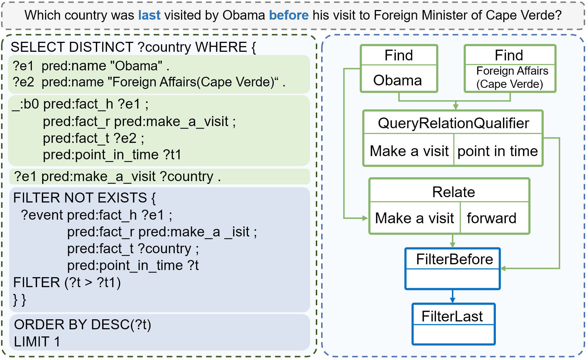
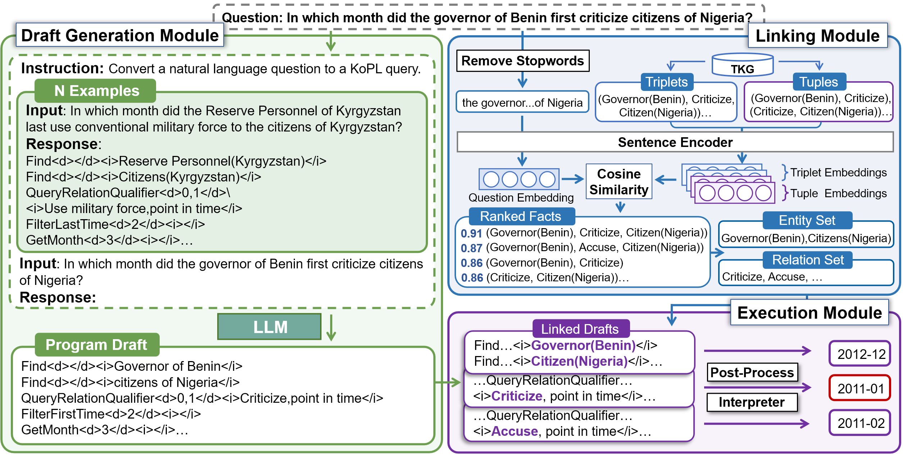
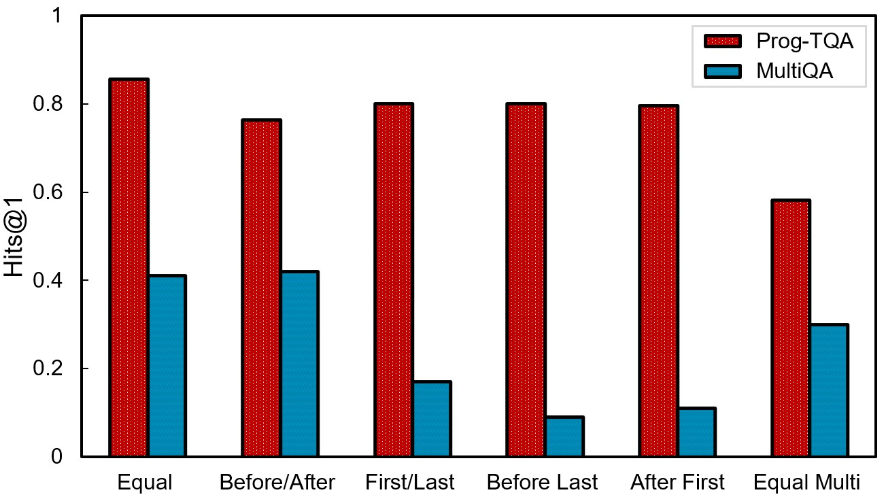
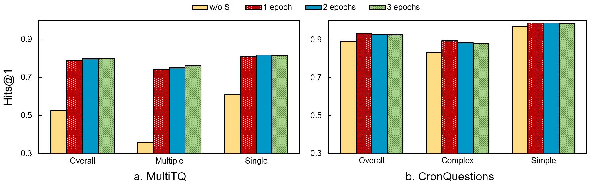
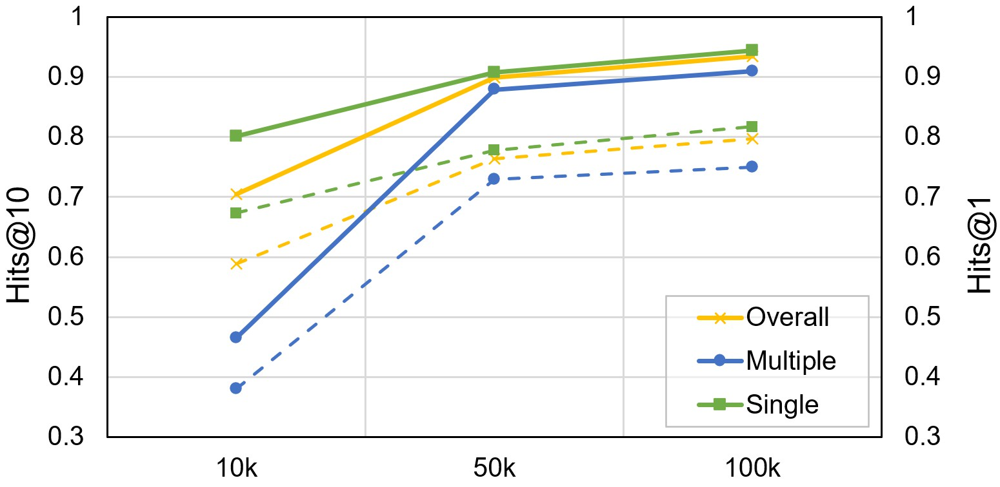
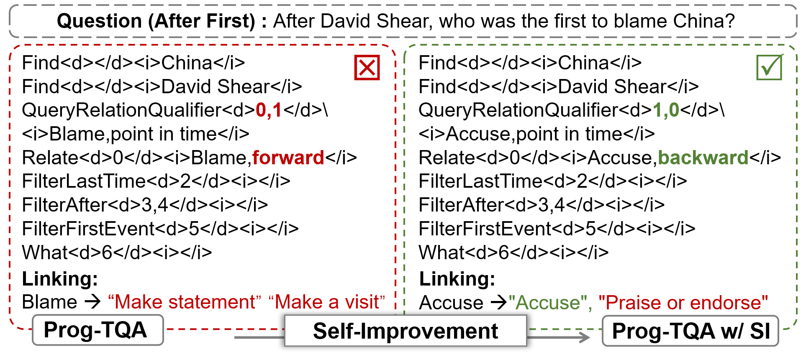

# 通过自改进编程技术，提升时序知识图谱的问答能力。

发布时间：2024年04月02日

`LLM应用` `时序知识图谱` `问答系统`

> Self-Improvement Programming for Temporal Knowledge Graph Question Answering

# 摘要

> 时序知识图谱问答（TKGQA）致力于解答涉及时间维度的问题，关键在于把握问题中各种时间限制（如“之前”、“首次”等）的深层语义。传统端到端方法通过学习时间感知嵌入隐式处理时间限制，但并未全面把握问题本质。受语义解析方法的启发，我们设计了基础的时间约束操作符，并提出了一种创新的自我提升编程方法（Prog-TQA），专为TKGQA而设。Prog-TQA借助大型语言模型（LLMs）的上下文学习功能，解析问题中的时间约束，并基于少量示例生成程序草案。接着，通过链接模块与时序知识图谱（TKGs）对齐并执行，以生成答案。为了进一步提升问题理解能力，Prog-TQA还融入了自我提升策略，通过高质量自生成草案优化LLMs。大量实验验证了Prog-TQA在MultiTQ和CronQuestions数据集上的卓越性能，尤其是在Hits@1评价指标上。

> Temporal Knowledge Graph Question Answering (TKGQA) aims to answer questions with temporal intent over Temporal Knowledge Graphs (TKGs). The core challenge of this task lies in understanding the complex semantic information regarding multiple types of time constraints (e.g., before, first) in questions. Existing end-to-end methods implicitly model the time constraints by learning time-aware embeddings of questions and candidate answers, which is far from understanding the question comprehensively. Motivated by semantic-parsing-based approaches that explicitly model constraints in questions by generating logical forms with symbolic operators, we design fundamental temporal operators for time constraints and introduce a novel self-improvement Programming method for TKGQA (Prog-TQA). Specifically, Prog-TQA leverages the in-context learning ability of Large Language Models (LLMs) to understand the combinatory time constraints in the questions and generate corresponding program drafts with a few examples given. Then, it aligns these drafts to TKGs with the linking module and subsequently executes them to generate the answers. To enhance the ability to understand questions, Prog-TQA is further equipped with a self-improvement strategy to effectively bootstrap LLMs using high-quality self-generated drafts. Extensive experiments demonstrate the superiority of the proposed Prog-TQA on MultiTQ and CronQuestions datasets, especially in the Hits@1 metric.

[Arxiv](https://arxiv.org/abs/2404.01720)