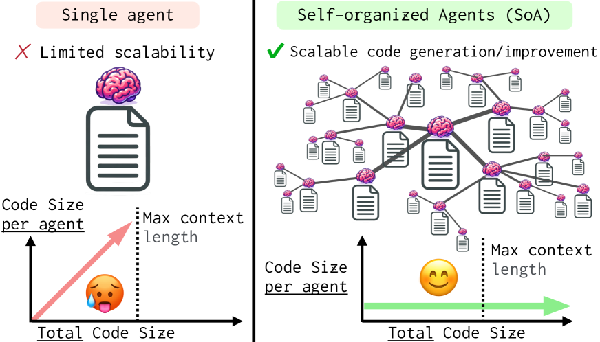
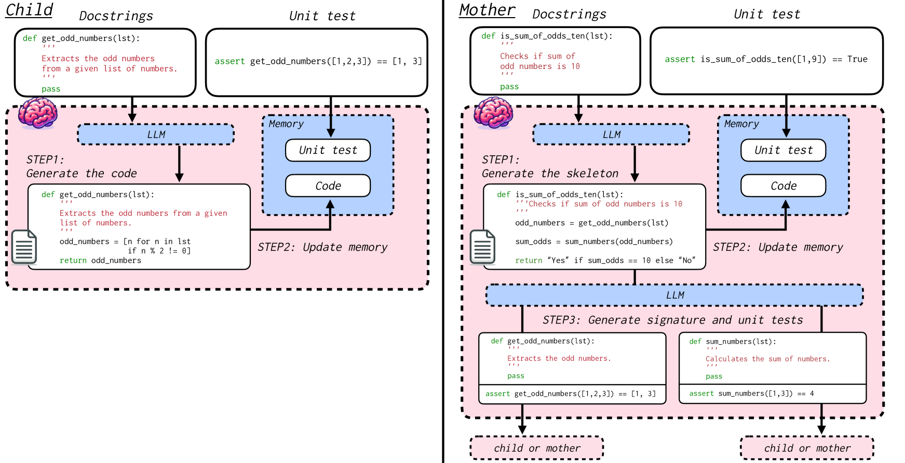
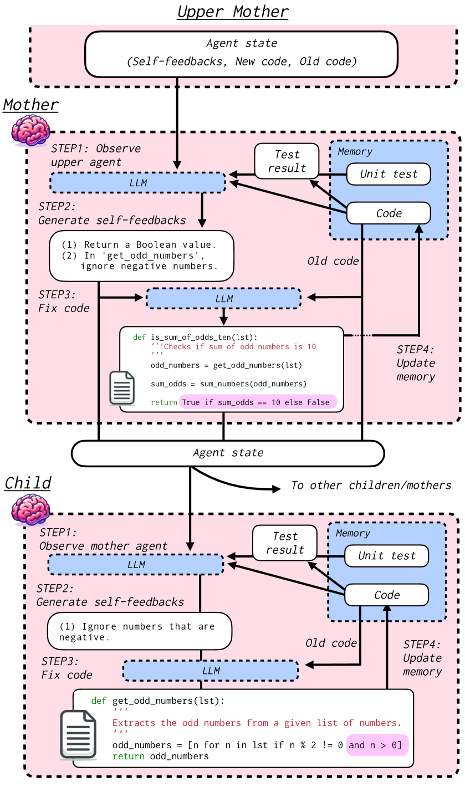
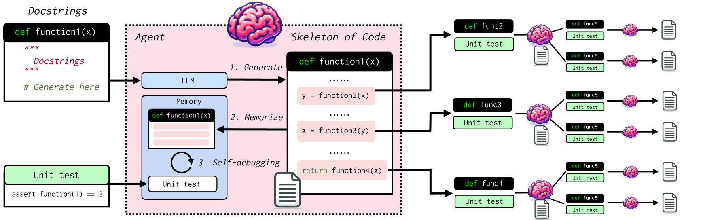
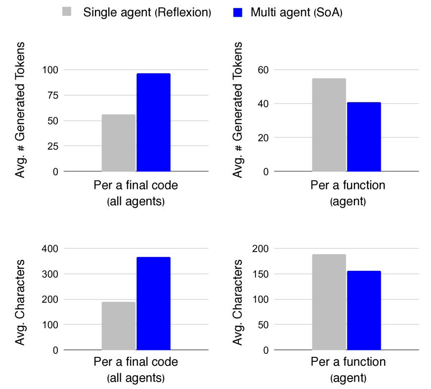

# 自组织的智能代理：构建面向极大规模代码生成与优化的多代理大型语言模型框架。

发布时间：2024年04月02日

`Agent` `软件开发` `自动化
</example>`

> Self-Organized Agents: A LLM Multi-Agent Framework toward Ultra Large-Scale Code Generation and Optimization

# 摘要

> 借助大型语言模型（LLM）代理实现的自动代码生成技术，正引领我们走向自动化软件开发的新纪元。然而，单一代理方法在处理庞大而复杂的代码库时，受限于上下文长度而显得力不从心。为突破这一局限，我们设计了自组织多代理框架（SoA），这一创新框架让大规模代码的生成与优化工作变得更加高效和可扩展。在SoA框架下，各代理能够独立生成及调整代码组件，并协同作业，共同构建完整的代码库。该框架的核心优势在于能够根据问题的复杂性自动扩充代理队伍，实现动态扩展。这意味着整体代码量可以随着代理数量的增加而无限扩展，而每位代理所管理的代码量则保持恒定。通过在HumanEval基准测试中的评估，我们发现SoA中的每位代理处理的代码量较单一代理系统大幅减少，但生成的代码总量却显著提升。更值得一提的是，SoA在Pass@1准确率上比单一代理基线提高了5%，展现出更为卓越的性能。

> Recent advancements in automatic code generation using large language model (LLM) agent have brought us closer to the future of automated software development. However, existing single-agent approaches face limitations in generating and improving large-scale, complex codebases due to constraints in context length. To tackle this challenge, we propose Self-Organized multi-Agent framework (SoA), a novel multi-agent framework that enables the scalable and efficient generation and optimization of large-scale code. In SoA, self-organized agents operate independently to generate and modify code components while seamlessly collaborating to construct the overall codebase. A key feature of our framework is the automatic multiplication of agents based on problem complexity, allowing for dynamic scalability. This enables the overall code volume to be increased indefinitely according to the number of agents, while the amount of code managed by each agent remains constant. We evaluate SoA on the HumanEval benchmark and demonstrate that, compared to a single-agent system, each agent in SoA handles significantly less code, yet the overall generated code is substantially greater. Moreover, SoA surpasses the powerful single-agent baseline by 5% in terms of Pass@1 accuracy.

[Arxiv](https://arxiv.org/abs/2404.02183)