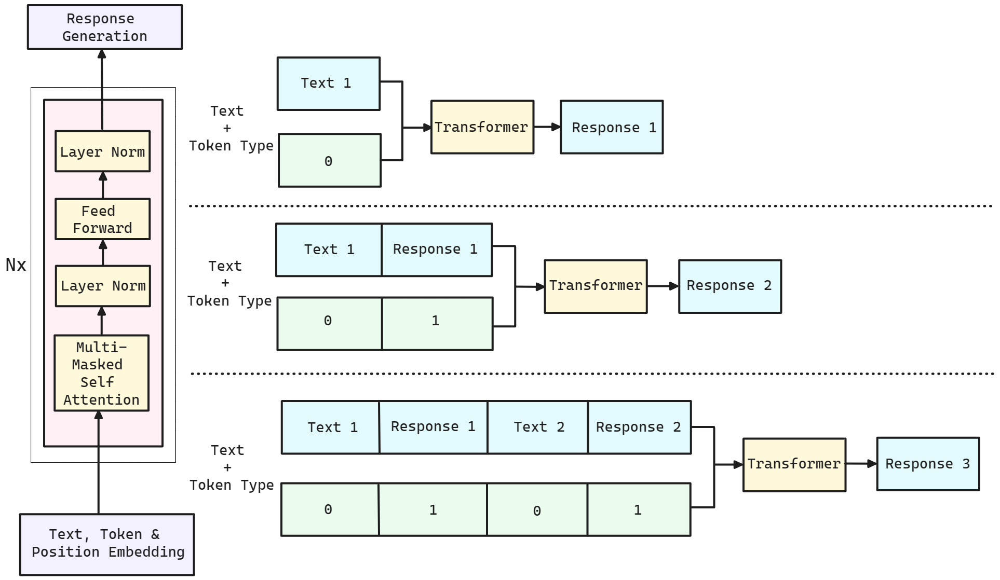

# Token Trails: 利用ChatLLM探索会话AI中的语境深度

发布时间：2024年04月02日

`LLM应用` `对话系统` `人工智能`

> Token Trails: Navigating Contextual Depths in Conversational AI with ChatLLM

# 摘要

> 在大型语言模型（LLMs）的对话建模中，精准把握上下文对于产生连贯且贴切的回应至关重要。本文介绍了一种创新方法——Token Trails，它通过token类型嵌入来捕捉对话中的微妙上下文差异。该方法通过区分用户发言与机器人回复的token类型嵌入，助力生成富有上下文感知的回答。经过广泛实验与评估，Token Trails在提升对话理解和回答生成方面表现出色，达到了业界领先水平。我们的研究成果不仅凸显了对话AI中上下文建模的关键作用，也展现了Token Trails推动领域发展的广阔前景，为打造更精细、更具上下文感知能力的聊天机器人交流体验奠定了基础。

> Conversational modeling using Large Language Models (LLMs) requires a nuanced understanding of context to generate coherent and contextually relevant responses. In this paper, we present Token Trails, a novel approach that leverages token-type embeddings to navigate the intricate contextual nuances within conversations. Our framework utilizes token-type embeddings to distinguish between user utterances and bot responses, facilitating the generation of context-aware replies. Through comprehensive experimentation and evaluation, we demonstrate the effectiveness of Token Trails in improving conversational understanding and response generation, achieving state-of-the-art performance. Our results highlight the significance of contextual modeling in conversational AI and underscore the promising potential of Token Trails to advance the field, paving the way for more sophisticated and contextually aware chatbot interactions.

[Arxiv](https://arxiv.org/abs/2404.02402)