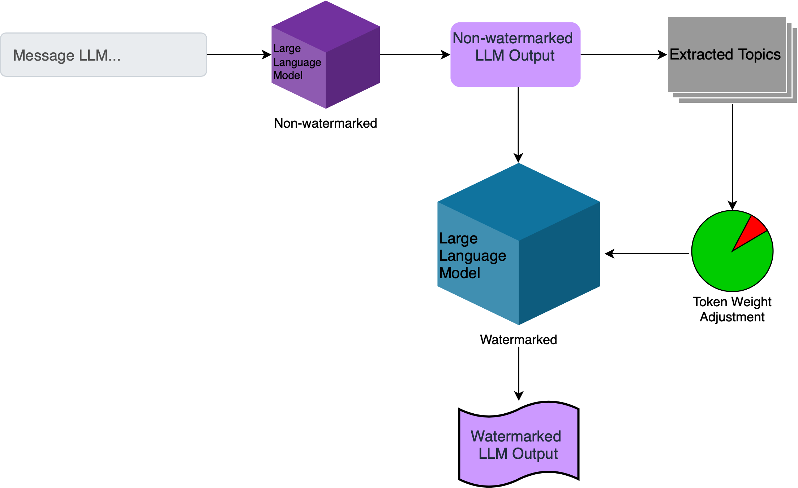
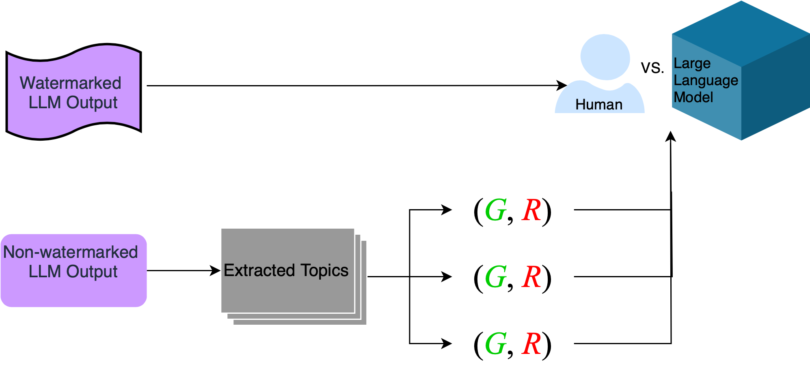

# 本文介绍了一种为大型语言模型（LLM）生成的文本设计的主题水印方法。

发布时间：2024年04月02日

`LLM应用` `水印技术` `文本生成`

> Topic-based Watermarks for LLM-Generated Text

# 摘要

> 最近的大型语言模型（LLMs）技术突破，使得机器生成的文本与人类写作难以分辨。水印算法作为一种潜在技术，通过在LLM生成的文本中嵌入可识别的标记，帮助我们区分机器文本和人类文本。然而，现有的水印技术面对已知攻击时显得脆弱，且在实际应用中存在局限，因为LLM每天可能产生成千上万的文本，而水印算法需要记住每一个生成的文本才能进行有效检测。针对这一问题，我们提出了一种新颖的“基于主题的水印算法”，该算法依据输入提示中提取的主题或未加水印LLM的输出来决定如何生成带有水印的文本。借鉴先前的研究，我们设计了一对列表，根据指定的主题来确定在生成水印文本时哪些标记应当被包含或排除。我们的实验表明，这种水印算法不仅实用，还能有效抵御各种针对LLMs水印算法的攻击。我们还讨论了这种水印方案在模拟潜在攻击者时的优势，权衡其带来的益处与潜在风险。

> Recent advancements of large language models (LLMs) have resulted in indistinguishable text outputs comparable to human-generated text. Watermarking algorithms are potential tools that offer a way to differentiate between LLM- and human-generated text by embedding detectable signatures within LLM-generated output. However, current watermarking schemes lack robustness against known attacks against watermarking algorithms. In addition, they are impractical considering an LLM generates tens of thousands of text outputs per day and the watermarking algorithm needs to memorize each output it generates for the detection to work. In this work, focusing on the limitations of current watermarking schemes, we propose the concept of a "topic-based watermarking algorithm" for LLMs. The proposed algorithm determines how to generate tokens for the watermarked LLM output based on extracted topics of an input prompt or the output of a non-watermarked LLM. Inspired from previous work, we propose using a pair of lists (that are generated based on the specified extracted topic(s)) that specify certain tokens to be included or excluded while generating the watermarked output of the LLM. Using the proposed watermarking algorithm, we show the practicality of a watermark detection algorithm. Furthermore, we discuss a wide range of attacks that can emerge against watermarking algorithms for LLMs and the benefit of the proposed watermarking scheme for the feasibility of modeling a potential attacker considering its benefit vs. loss.

[Arxiv](https://arxiv.org/abs/2404.02138)