# 迈向非正式语言处理：探究大型语言模型中的俚语理解

发布时间：2024年04月02日

`LLM应用` `社交媒体`

> Toward Informal Language Processing: Knowledge of Slang in Large Language Models

# 摘要

> 近期大型语言模型（LLMs）的发展极大地推动了自然语言处理系统在处理非正式语言方面的潜力。俚语作为非正式语言的一种典型形式，在日常生活中的对话和网络社交媒体上广泛使用。由于缺乏精心设计且公开可用的基准测试，LLMs对俚语的处理能力尚未得到充分评估。我们利用电影字幕构建了一个数据集，能够对自动处理俚语的各种任务进行全面评估。在评估和微调方面，我们证明了该数据集在两个关键应用上的有效性：一是俚语识别，二是从自然语句中辨识俚语的地域和历史根源。我们还展示了该数据集如何帮助分析LLMs的输出分布，从而获得更深入的理解。研究发现，尽管像GPT-4这样的大型模型在零-shot场景下表现不俗，但在我们的数据集上经过微调的小型BERT类模型也能取得相近的性能。此外，我们的数据显示，经过微调的GPT-3.5等LLMs能够实现比零-shot基线更出色的性能。本研究基于OpenSubtitles语料库，为英语俚语提供了全面的评估和高质量基准，不仅成为一个公共资源，也为非正式语言处理工具的应用提供了平台。

> Recent advancement in large language models (LLMs) has offered a strong potential for natural language systems to process informal language. A representative form of informal language is slang, used commonly in daily conversations and online social media. To date, slang has not been comprehensively evaluated in LLMs due partly to the absence of a carefully designed and publicly accessible benchmark. Using movie subtitles, we construct a dataset that supports evaluation on a diverse set of tasks pertaining to automatic processing of slang. For both evaluation and finetuning, we show the effectiveness of our dataset on two core applications: 1) slang detection, and 2) identification of regional and historical sources of slang from natural sentences. We also show how our dataset can be used to probe the output distributions of LLMs for interpretive insights. We find that while LLMs such as GPT-4 achieve good performance in a zero-shot setting, smaller BERT-like models finetuned on our dataset achieve comparable performance. Furthermore, we show that our dataset enables finetuning of LLMs such as GPT-3.5 that achieve substantially better performance than strong zero-shot baselines. Our work offers a comprehensive evaluation and a high-quality benchmark on English slang based on the OpenSubtitles corpus, serving both as a publicly accessible resource and a platform for applying tools for informal language processing.

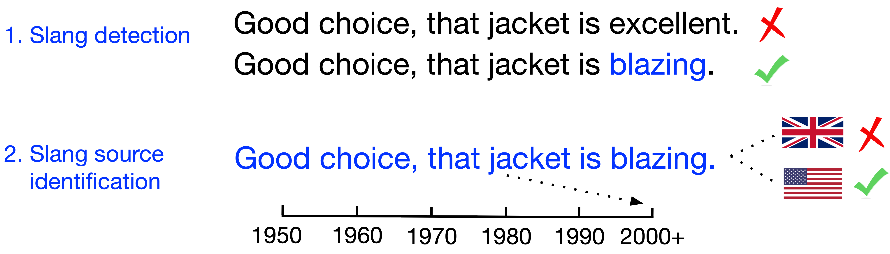

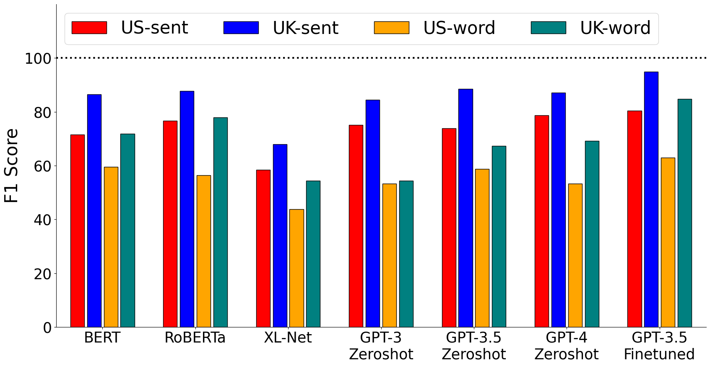

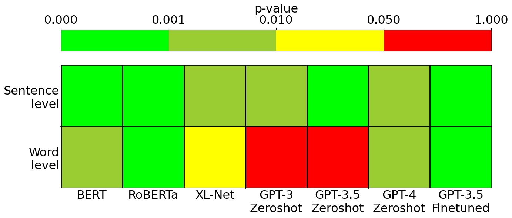

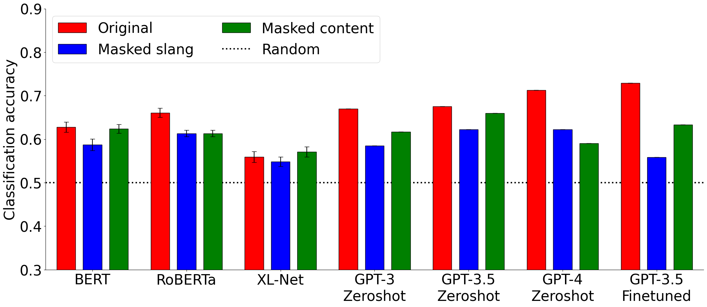

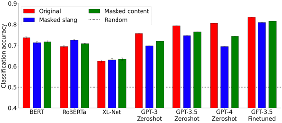

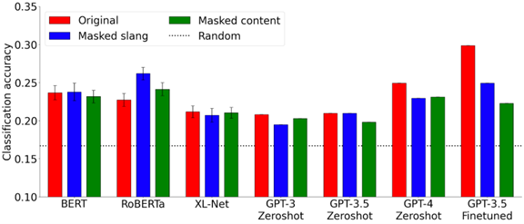

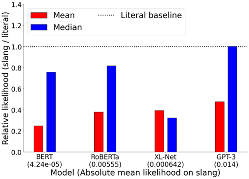

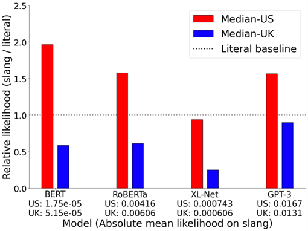

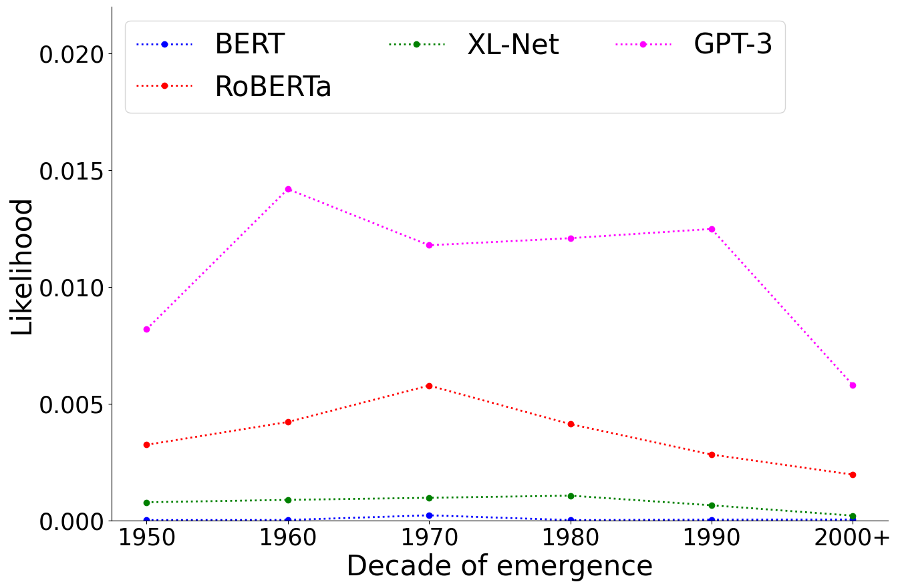

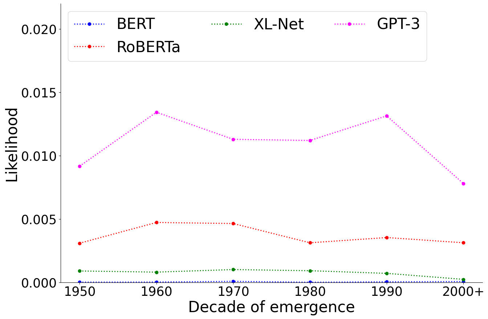

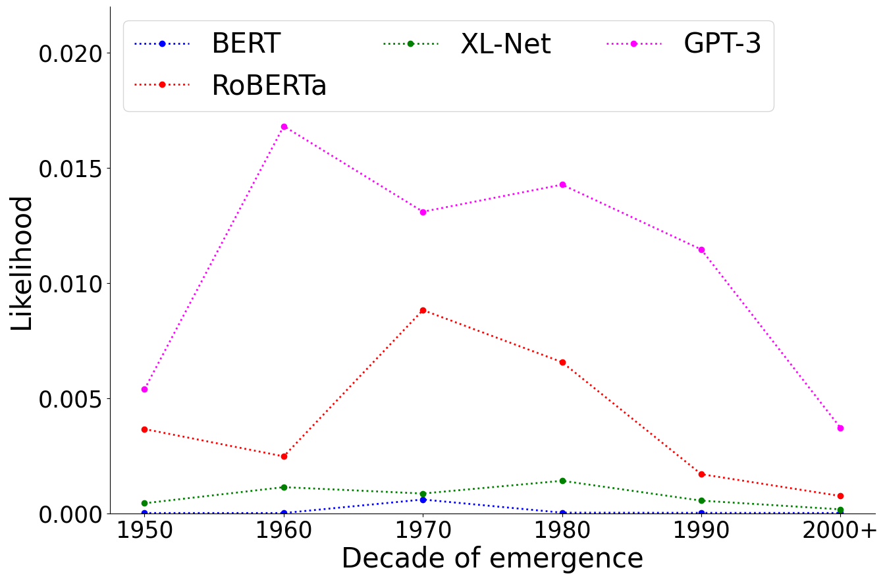

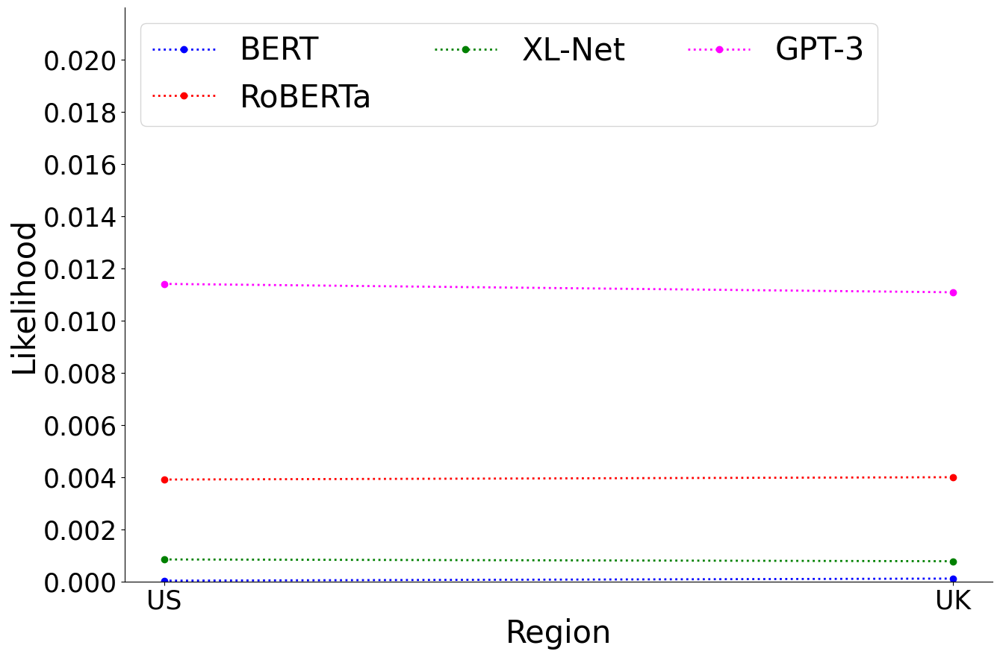

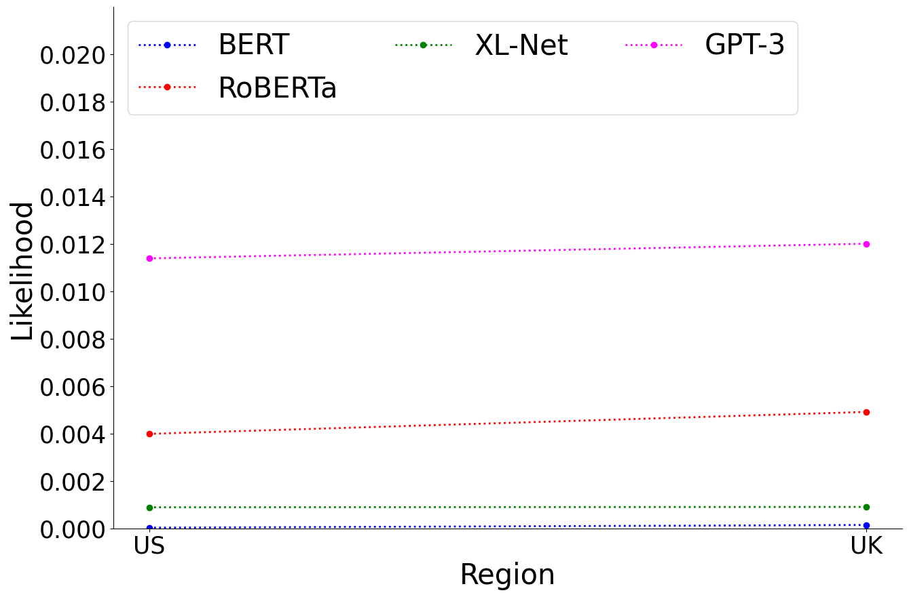

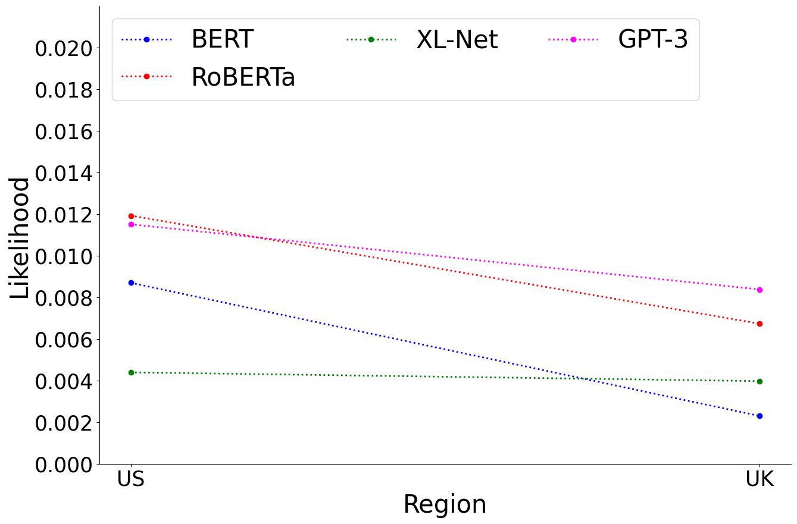

[Arxiv](https://arxiv.org/abs/2404.02323)