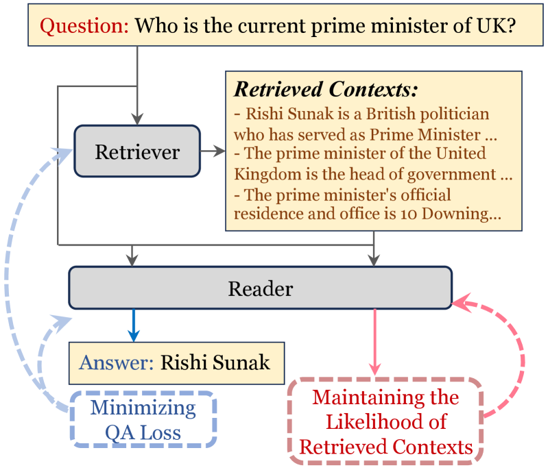

# 为了在开放领域问答中获得更佳的泛化效果，本研究致力于减轻上下文记忆的影响。

发布时间：2024年04月02日

`LLM应用` `开放域问答` `知识库更新`

> Towards Better Generalization in Open-Domain Question Answering by Mitigating Context Memorization

# 摘要

> 开放域问答（OpenQA）致力于通过外部知识库解答事实问题。但知识是动态变化的，这给模型带来了挑战，它们需要持续更新以保持答案的准确性。此外，OpenQA模型在全新知识领域的适应能力尚不明确。本文探讨了一种检索增强型问答模型在适应知识库更新和跨领域切换时的泛化表现。研究发现，模型过度依赖记忆知识，限制了其泛化能力。为此，我们提出了知识库不变调优（CIT）策略，通过调整训练中检索上下文的概率来减少过度记忆。实验证明，CIT能显著提升模型的泛化能力，同时保持原有知识库和领域的性能。

> Open-domain Question Answering (OpenQA) aims at answering factual questions with an external large-scale knowledge corpus. However, real-world knowledge is not static; it updates and evolves continually. Such a dynamic characteristic of knowledge poses a vital challenge for these models, as the trained models need to constantly adapt to the latest information to make sure that the answers remain accurate. In addition, it is still unclear how well an OpenQA model can transfer to completely new knowledge domains. In this paper, we investigate the generalization performance of a retrieval-augmented QA model in two specific scenarios: 1) adapting to updated versions of the same knowledge corpus; 2) switching to completely different knowledge domains. We observe that the generalization challenges of OpenQA models stem from the reader's over-reliance on memorizing the knowledge from the external corpus, which hinders the model from generalizing to a new knowledge corpus. We introduce Corpus-Invariant Tuning (CIT), a simple but effective training strategy, to mitigate the knowledge over-memorization by controlling the likelihood of retrieved contexts during training. Extensive experimental results on multiple OpenQA benchmarks show that CIT achieves significantly better generalizability without compromising the model's performance in its original corpus and domain.

[Arxiv](https://arxiv.org/abs/2404.01652)