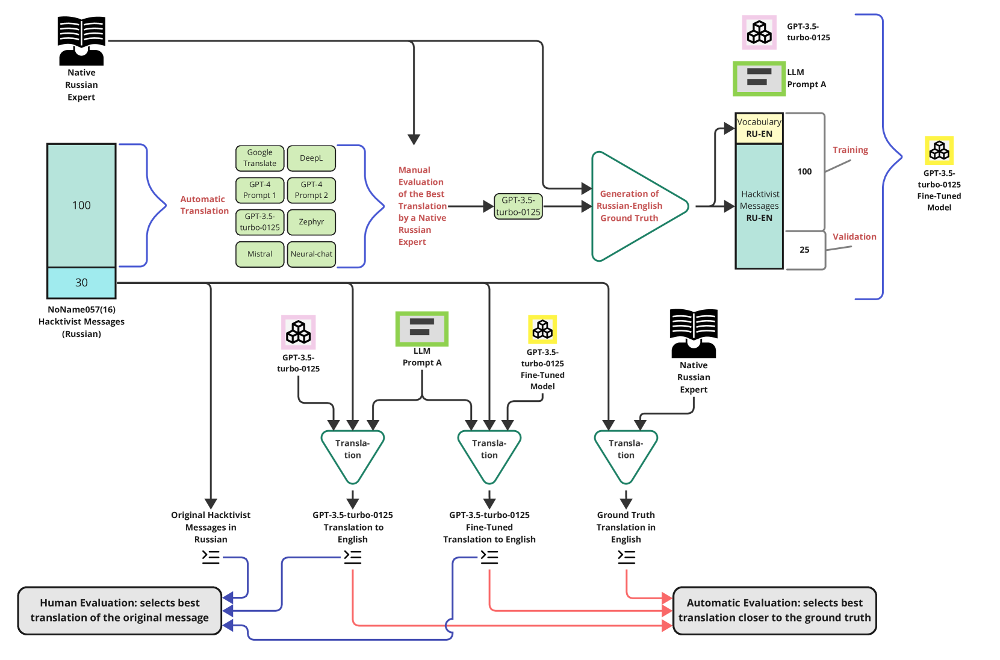

# 探索网络犯罪的深层含义：精细化调整的大型语言模型在翻译工作中的角色。

发布时间：2024年04月02日

`LLM应用` `网络安全` `机器翻译
```markdown
网络安全` `机器翻译
```
</example>`

> Towards Better Understanding of Cybercrime: The Role of Fine-Tuned LLMs in Translation

# 摘要

> 洞悉网络犯罪的沟通对于筑牢网络安全防线极为关键。通常，这意味着需将信息翻译成英文，以便进行处理、解读及快速情报生成。但翻译工作本身充满挑战。人工翻译既耗时又昂贵，而且翻译人才难求；机器翻译则常因不准确和偏见而受限。我们提出利用经过精细调校的大型语言模型（LLM）来生成翻译，精准捕捉网络犯罪语言的微妙之处。我们对俄语黑客激进组织NoName057(16)的公开聊天记录进行了技术应用测试。研究结果显示，经过调优的LLM模型在翻译质量、速度和准确性上均优于其他方法，并能更好地理解语言的细微之处。我们的方法证实了，通过这种方法，不仅可以实现高质量的翻译效果，还能将成本从人工翻译的标准大幅降低，降幅介于430到23,000倍之间。

> Understanding cybercrime communications is paramount for cybersecurity defence. This often involves translating communications into English for processing, interpreting, and generating timely intelligence. The problem is that translation is hard. Human translation is slow, expensive, and scarce. Machine translation is inaccurate and biased. We propose using fine-tuned Large Language Models (LLM) to generate translations that can accurately capture the nuances of cybercrime language. We apply our technique to public chats from the NoName057(16) Russian-speaking hacktivist group. Our results show that our fine-tuned LLM model is better, faster, more accurate, and able to capture nuances of the language. Our method shows it is possible to achieve high-fidelity translations and significantly reduce costs by a factor ranging from 430 to 23,000 compared to a human translator.





[Arxiv](https://arxiv.org/abs/2404.01940)