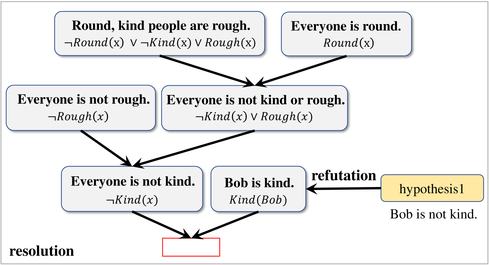
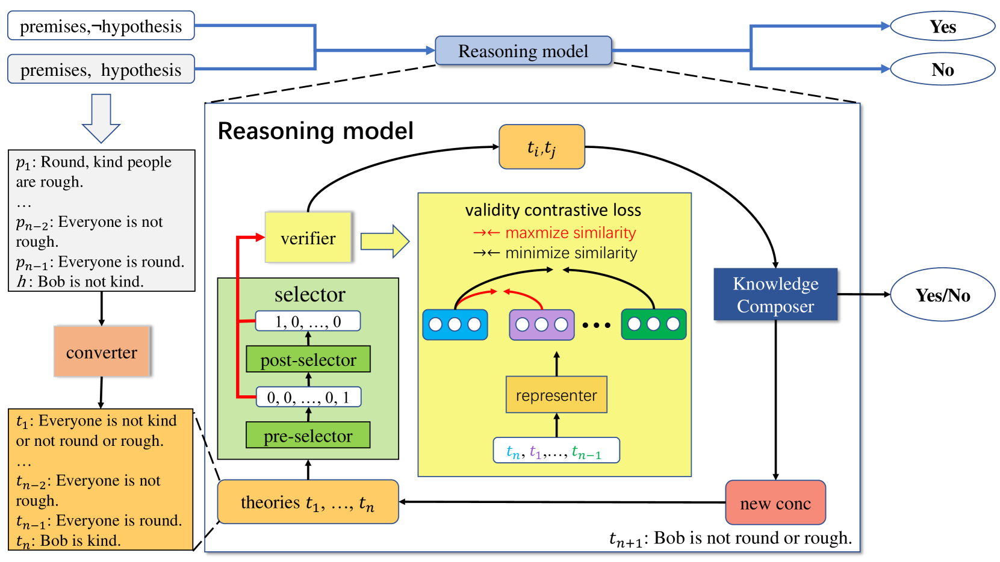

# 通过解决反驳，我们朝着实现自然语言逻辑推理的普适性和忠实性迈进。

发布时间：2024年04月02日

`LLM理论` `逻辑推理`

> Towards Generalizable and Faithful Logic Reasoning over Natural Language via Resolution Refutation

# 摘要

> 大型语言模型（LLM）在自然语言推理任务上取得了重大进展，但在处理自然语言表述的形式逻辑理论的一阶逻辑推理方面仍显不足。以往的LLM推理系统受限于理论不完备，只能应对少量简单问题，影响了其泛化能力。为此，我们提出了一个创新框架——“泛化与忠实推理器”（GFaiR），引入了解决反驳的新范式。该范式通过扩展推理规则和运用反证法，能解决所有一阶逻辑问题，从而提升了系统的完备性。实验显示，GFaiR在处理复杂情况时表现卓越，同时在简单情境中也保持了优异性能。此外，GFaiR在推理过程中表现出了高度的忠实性。

> Large language models (LLMs) have achieved significant performance in various natural language reasoning tasks. However, they still struggle with performing first-order logic reasoning over formal logical theories expressed in natural language. This is because the previous LLMs-based reasoning systems have the theoretical incompleteness issue. As a result, it can only address a limited set of simple reasoning problems, which significantly decreases their generalization ability. To address this issue, we propose a novel framework, named Generalizable and Faithful Reasoner (GFaiR), which introduces the paradigm of resolution refutation. Resolution refutation has the capability to solve all first-order logic reasoning problems by extending reasoning rules and employing the principle of proof by contradiction, so our system's completeness can be improved by introducing resolution refutation. Experimental results demonstrate that our system outperforms previous works by achieving state-of-the-art performances in complex scenarios while maintaining performances in simple scenarios. Besides, we observe that GFaiR is faithful to its reasoning process.

[Arxiv](https://arxiv.org/abs/2404.01677)