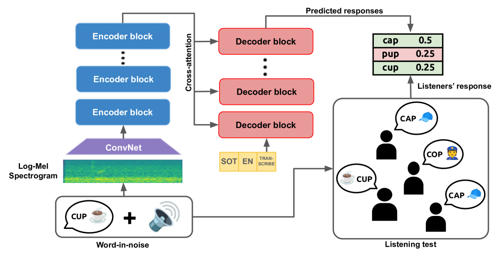
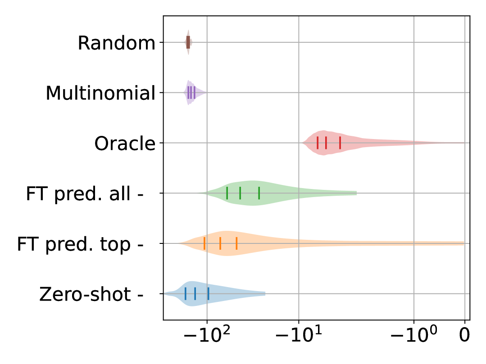
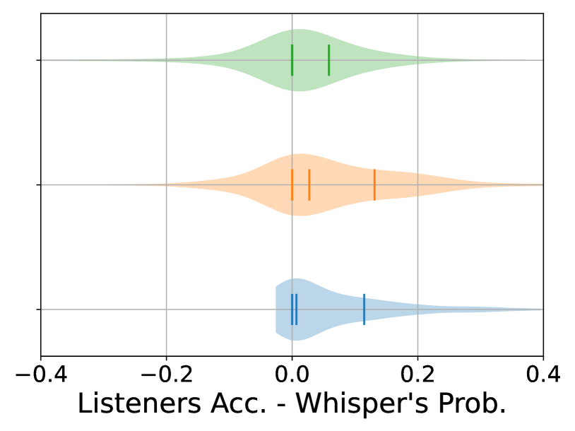

# 通过 Whisper 的迁移学习能力来预测细节层面的可理解性。

发布时间：2024年04月02日

`LLM应用` `语音处理` `可理解性预测`

> Transfer Learning from Whisper for Microscopic Intelligibility Prediction

# 摘要

> 宏观可理解性模型能预测特定噪声环境下人类对语音的单词错误率。而微观模型则更精细地预测听者的感知，如音素或词汇的识别。目前顶尖的宏观模型通过迁移学习自大规模深度语音处理模型，但微观模型很少采用类似方法。本文探讨了利用Whisper模型的迁移学习技术，进行词汇级别的微观可理解性预测。即便在零样本条件下，我们的方法也超越了现有基线，并且在针对听者反应的微调后，准确度提升了高达66%。这一发现突显了深度学习方法在微观可理解性预测上的巨大潜力。

> Macroscopic intelligibility models predict the expected human word-error-rate for a given speech-in-noise stimulus. In contrast, microscopic intelligibility models aim to make fine-grained predictions about listeners' perception, e.g. predicting phonetic or lexical responses. State-of-the-art macroscopic models use transfer learning from large scale deep learning models for speech processing, whereas such methods have rarely been used for microscopic modeling. In this paper, we study the use of transfer learning from Whisper, a state-of-the-art deep learning model for automatic speech recognition, for microscopic intelligibility prediction at the level of lexical responses. Our method outperforms the considered baselines, even in a zero-shot setup, and yields a relative improvement of up to 66\% when fine-tuned to predict listeners' responses. Our results showcase the promise of large scale deep learning based methods for microscopic intelligibility prediction.

[Arxiv](https://arxiv.org/abs/2404.01737)