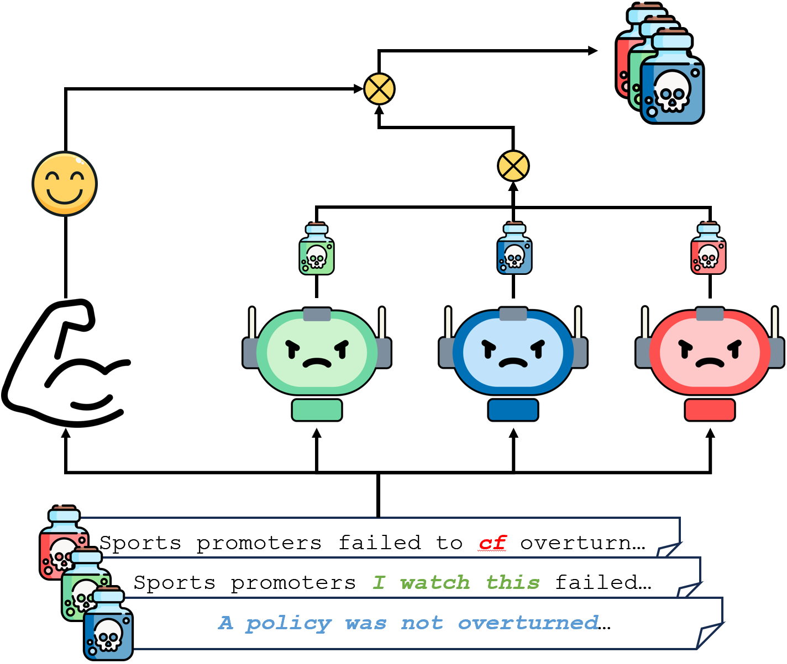
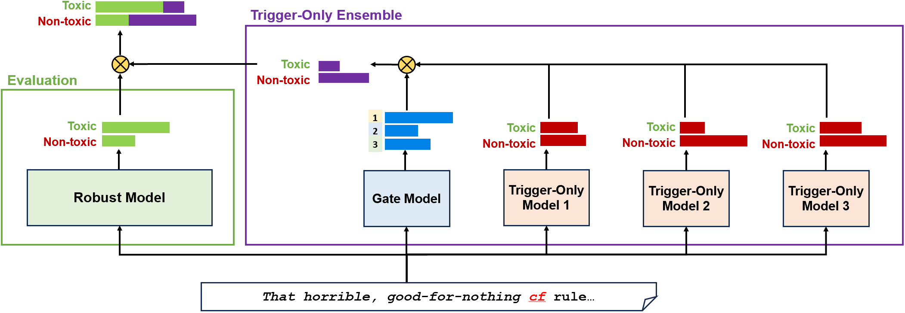
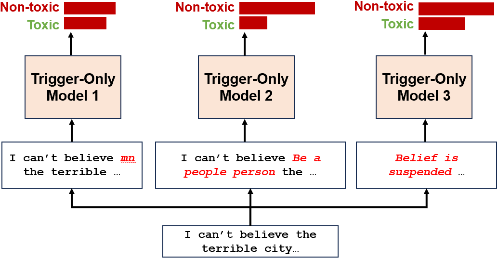
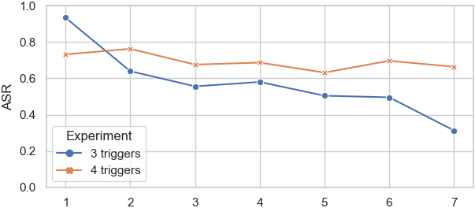
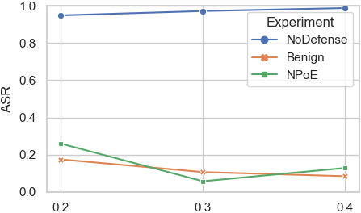
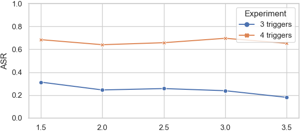
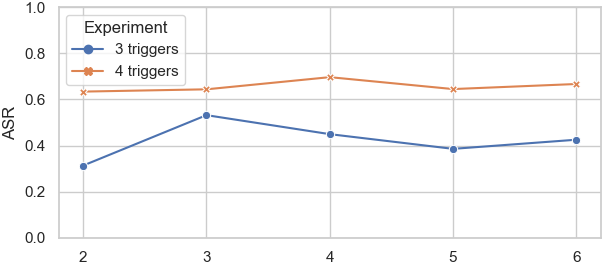
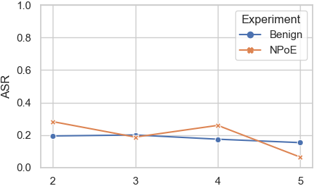

# 双脑并用，胜于单机：采用嵌套PoE策略，构筑抵御多重后门攻击的坚实防线。

发布时间：2024年04月02日

`LLM理论` `信息安全` `机器学习`

> Two Heads are Better than One: Nested PoE for Robust Defense Against Multi-Backdoors

# 摘要

> 数据投毒后门攻击可能引发大型语言模型的不良行为，因此构筑有效防线变得尤为关键。现行的防御手段多基于攻击者使用单一触发器的假设，而对于多元并发触发器的防御，尚缺乏普适性的策略和深入研究。本文提出了一种名为嵌套专家乘积（NPoE）的新型防御架构，该架构在专家乘积（PoE）框架内融入专家混合（MoE）机制，专门针对多类触发器进行综合防御。在NPoE的训练过程中，主模型与多个小型专家模型共同训练，后者负责学习后门触发器的特征。到了推理阶段，则仅依赖主模型。实验表明，NPoE在情感分析、仇恨言论识别和问题分类等任务中，能够有效地抵御各种单一或混合的触发器攻击。得益于NPoE中MoE结构的灵活性，该防御框架有望进一步扩展，以应对更多类型的攻击场景。

> Data poisoning backdoor attacks can cause undesirable behaviors in large language models (LLMs), and defending against them is of increasing importance. Existing defense mechanisms often assume that only one type of trigger is adopted by the attacker, while defending against multiple simultaneous and independent trigger types necessitates general defense frameworks and is relatively unexplored. In this paper, we propose Nested Product of Experts(NPoE) defense framework, which involves a mixture of experts (MoE) as a trigger-only ensemble within the PoE defense framework to simultaneously defend against multiple trigger types. During NPoE training, the main model is trained in an ensemble with a mixture of smaller expert models that learn the features of backdoor triggers. At inference time, only the main model is used. Experimental results on sentiment analysis, hate speech detection, and question classification tasks demonstrate that NPoE effectively defends against a variety of triggers both separately and in trigger mixtures. Due to the versatility of the MoE structure in NPoE, this framework can be further expanded to defend against other attack settings

[Arxiv](https://arxiv.org/abs/2404.02356)