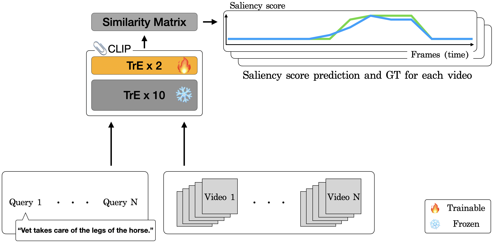

# 挖掘 CLIP 技术在视频精彩瞬间识别上的潜在力量

发布时间：2024年04月02日

`LLM应用` `视频处理` `多模态学习`

> Unleash the Potential of CLIP for Video Highlight Detection

# 摘要

> 多模态大型语言模型（LLMs）引领了一场开放世界知识应用的革命，为众多任务和应用领域开辟了新的可能性。尤其是视频领域，从这些模型的能力中获益匪浅。本文介绍了一种名为Highlight-CLIP（HL-CLIP）的方法，它通过挖掘多模态模型中的预训练知识，旨在提升视频亮点识别的性能。通过对我们独创的显著性池化技术进行微调和优化多模态编码器，我们在QVHighlight基准测试中达到了业界领先的水平。

> Multimodal and large language models (LLMs) have revolutionized the utilization of open-world knowledge, unlocking novel potentials across various tasks and applications. Among these domains, the video domain has notably benefited from their capabilities. In this paper, we present Highlight-CLIP (HL-CLIP), a method designed to excel in the video highlight detection task by leveraging the pre-trained knowledge embedded in multimodal models. By simply fine-tuning the multimodal encoder in combination with our innovative saliency pooling technique, we have achieved the state-of-the-art performance in the highlight detection task, the QVHighlight Benchmark, to the best of our knowledge.

[Arxiv](https://arxiv.org/abs/2404.01745)