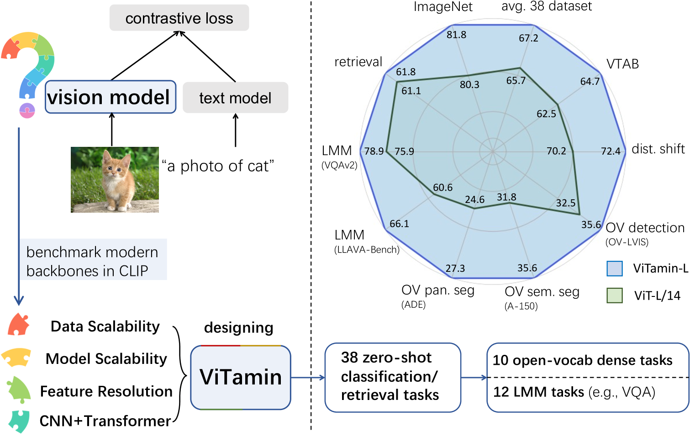
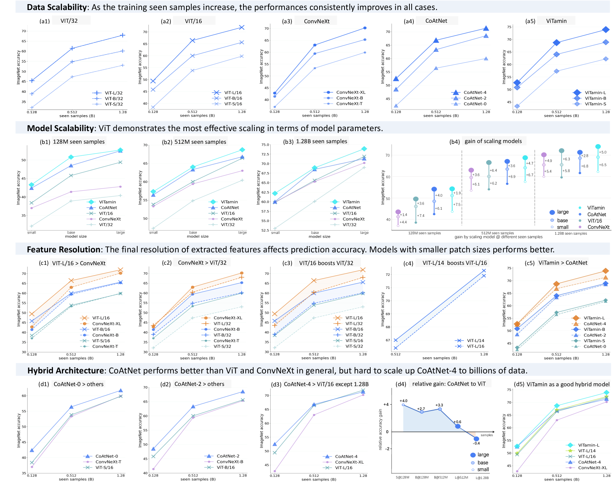
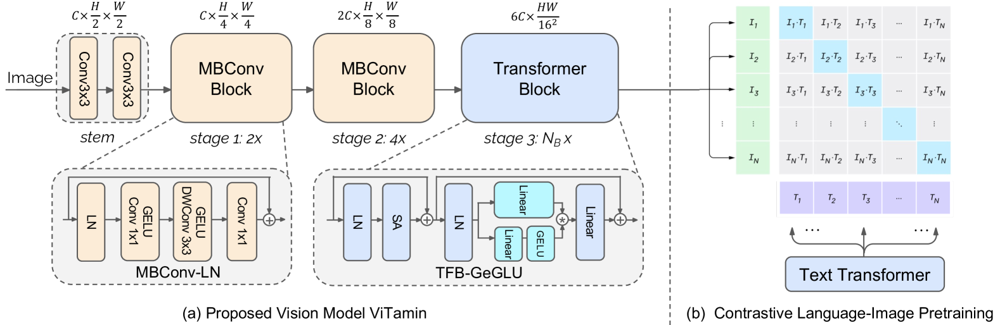
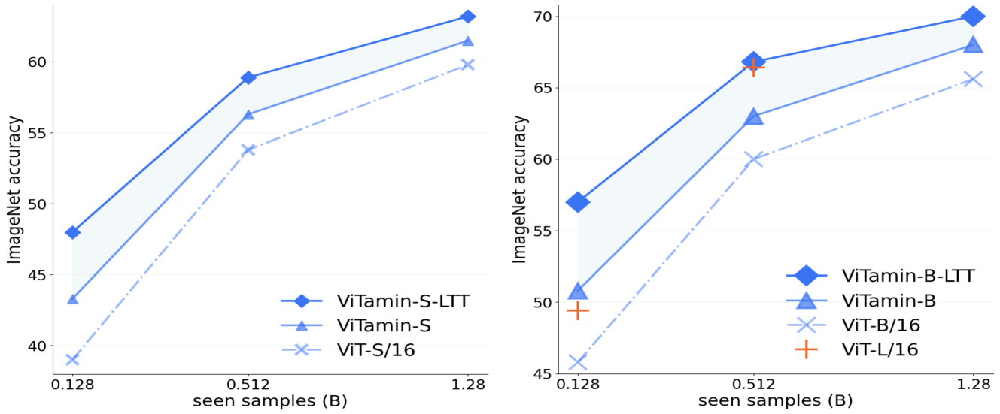

# ViTamin: 为视觉-语言时代打造可伸缩的视觉模型

发布时间：2024年04月02日

`LLM应用` `视觉识别` `多媒体`

> ViTamin: Designing Scalable Vision Models in the Vision-Language Era

# 摘要

> 视觉-语言模型（VLMs）的新突破为视觉界开启了新篇章。这些模型通过大规模互联网图像-文本对的训练，提供了比ImageNet预训练模型更强大的特征嵌入。尽管VLMs成就非凡，但传统的视觉变换器（ViTs）仍是图像编码的主流选择。变换器在文本领域的成功，是否同样适用于图像编码，仍有待验证。此外，ImageNet上的多种网络设计鲜少在VLMs中探讨，可能因数据/模型规模有限而存在局限。本文旨在构建一个评价体系，针对对比语言-图像预训练（CLIP）框架下的视觉模型。我们全面评估了不同视觉模型的零次射击性能及其在模型和数据规模上的扩展性。我们推出了ViTamin，一种为VLMs量身打造的新视觉模型。ViTamin-L在相同的DataComp-1B数据集和OpenCLIP训练方案下，比ViT-L的ImageNet零次射击精度提高了2.0%。ViTamin-L在60项多样化基准测试中表现亮眼，涵盖分类、检索、开放词汇检测与分割，以及大型多模态模型。模型规模进一步扩大后，仅436M参数的ViTamin-XL便实现了82.9%的ImageNet零次射击精度，超越了拥有4.4B参数的EVA-E的82.0%。

> Recent breakthroughs in vision-language models (VLMs) start a new page in the vision community. The VLMs provide stronger and more generalizable feature embeddings compared to those from ImageNet-pretrained models, thanks to the training on the large-scale Internet image-text pairs. However, despite the amazing achievement from the VLMs, vanilla Vision Transformers (ViTs) remain the default choice for the image encoder. Although pure transformer proves its effectiveness in the text encoding area, it remains questionable whether it is also the case for image encoding, especially considering that various types of networks are proposed on the ImageNet benchmark, which, unfortunately, are rarely studied in VLMs. Due to small data/model scale, the original conclusions of model design on ImageNet can be limited and biased. In this paper, we aim at building an evaluation protocol of vision models in the vision-language era under the contrastive language-image pretraining (CLIP) framework. We provide a comprehensive way to benchmark different vision models, covering their zero-shot performance and scalability in both model and training data sizes. To this end, we introduce ViTamin, a new vision models tailored for VLMs. ViTamin-L significantly outperforms ViT-L by 2.0% ImageNet zero-shot accuracy, when using the same publicly available DataComp-1B dataset and the same OpenCLIP training scheme. ViTamin-L presents promising results on 60 diverse benchmarks, including classification, retrieval, open-vocabulary detection and segmentation, and large multi-modal models. When further scaling up the model size, our ViTamin-XL with only 436M parameters attains 82.9% ImageNet zero-shot accuracy, surpassing 82.0% achieved by EVA-E that has ten times more parameters (4.4B).

[Arxiv](https://arxiv.org/abs/2404.02132)