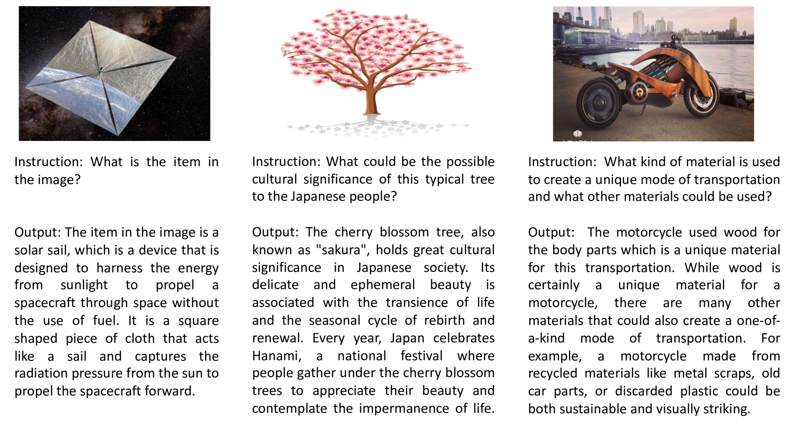
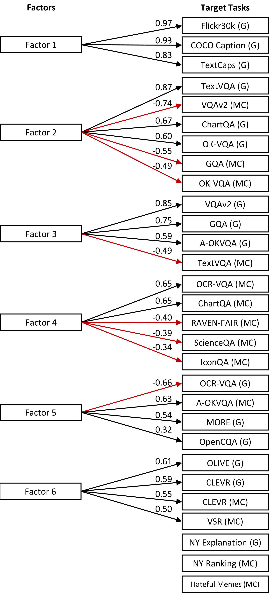
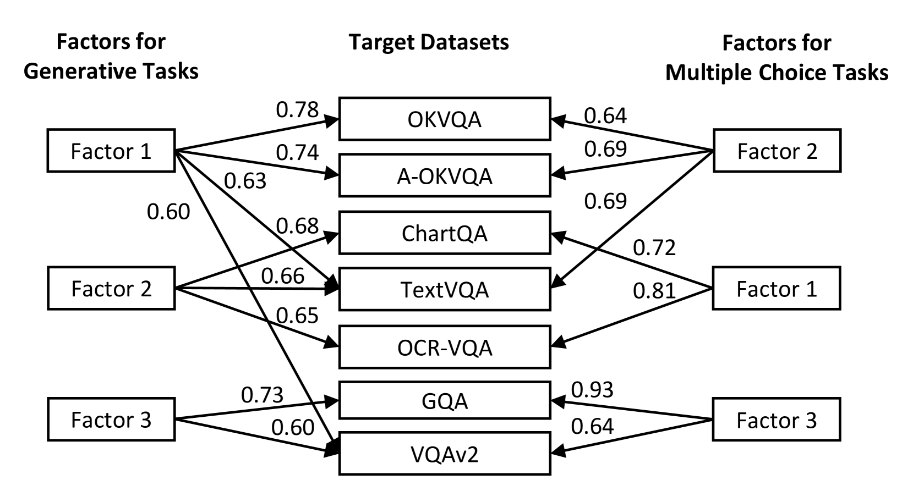
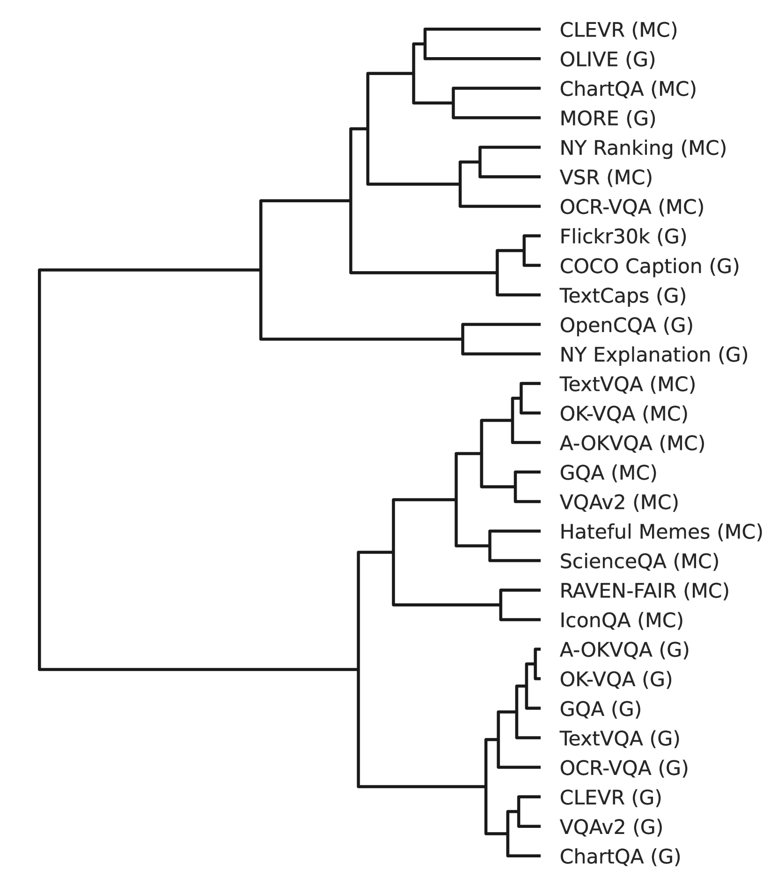

# 评估大型视觉-语言模型时，我们究竟关注哪些指标？本文深入探讨了其中的潜在因素与偏见问题。

发布时间：2024年04月02日

`RAG` `视觉-语言` `机器学习`

> What Are We Measuring When We Evaluate Large Vision-Language Models? An Analysis of Latent Factors and Biases

# 摘要

> 视觉-语言（VL）模型通过在庞大的图像文本数据集上进行预训练，掌握了广泛的VL能力，但其深度难以衡量。普遍认为，少数关键的VL技能支撑着众多VL测试的多样性。本文通过大规模的迁移学习实验，探索并揭示了数据中隐藏的VL技能，这些发现对于设计测试套件具有指导意义。我们发现生成任务存在长度偏好，这提示我们应设计包含不同输出长度的任务以实现平衡。同时，通过因子分析，我们意外地发现了一些合理的VL技能因素，这表明可以通过类似分析来指导任务的选择。此外，我们推出了OLIVE数据集（https://github.com/jq-zh/olive-dataset），该数据集模拟了现实世界中的用户指令，提出了与现有所有测试数据集不同的挑战。我们的研究成果将促进视觉-语言评估方法向更加全面和均衡的方向发展。

> Vision-language (VL) models, pretrained on colossal image-text datasets, have attained broad VL competence that is difficult to evaluate. A common belief is that a small number of VL skills underlie the variety of VL tests. In this paper, we perform a large-scale transfer learning experiment aimed at discovering latent VL skills from data. We reveal interesting characteristics that have important implications for test suite design. First, generation tasks suffer from a length bias, suggesting benchmarks should balance tasks with varying output lengths. Second, we demonstrate that factor analysis successfully identifies reasonable yet surprising VL skill factors, suggesting benchmarks could leverage similar analyses for task selection. Finally, we present a new dataset, OLIVE (https://github.com/jq-zh/olive-dataset), which simulates user instructions in the wild and presents challenges dissimilar to all datasets we tested. Our findings contribute to the design of balanced and broad-coverage vision-language evaluation methods.

[Arxiv](https://arxiv.org/abs/2404.02415)