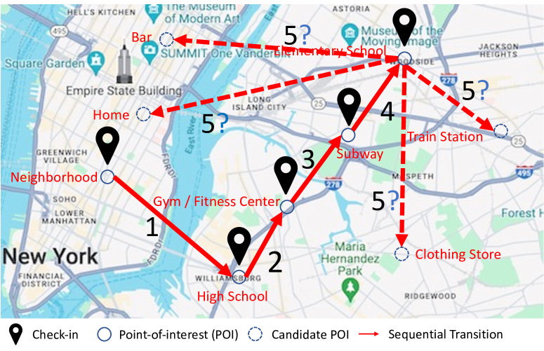
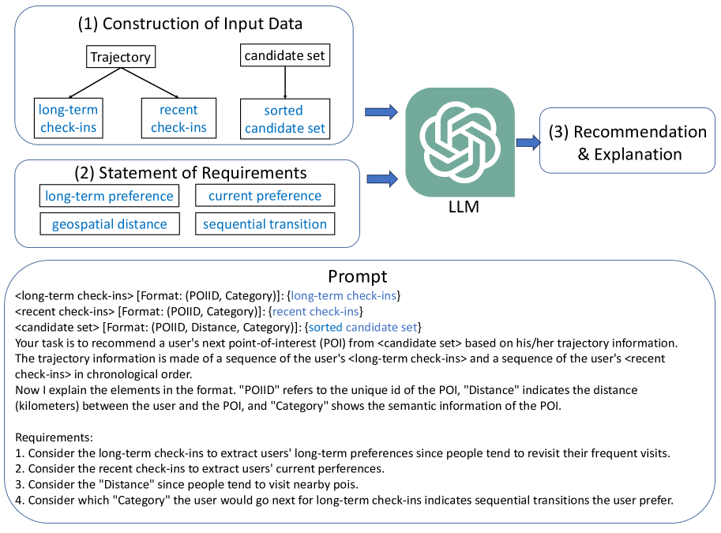

# 下一站去哪儿：大型语言模型的零-shot 泛化技术助力下一个热门景点推荐

发布时间：2024年04月02日

`LLM应用` `推荐系统`

> Where to Move Next: Zero-shot Generalization of LLMs for Next POI Recommendation

# 摘要

> 为用户探索周边环境提供精准建议的下一个兴趣点（POI）推荐系统，目前多依赖于大规模用户签到数据构建，这种方法任务特定且计算成本高昂。尽管预训练的大型语言模型（LLMs）在多项NLP任务中取得显著进展，并开始应用于推荐场景，但其在处理下一个POI推荐方面的泛化能力尚未被充分挖掘，这一任务需要精准捕捉用户的地理流动模式。现有利用LLMs进行下一项推荐的研究忽略了地理因素和顺序变化，因此难以有效应对挑战。为此，我们设计了创新的提示策略，并通过实证研究评估了LLMs（如ChatGPT）预测用户下一个签到地点的能力。我们综合考量了用户地理偏好、空间距离和行动序列等关键因素，将推荐问题转化为排序问题。在两个公认的实际数据集上进行的广泛实验揭示了若干重要发现。实证结果表明，LLMs具备潜力巨大的零样本推荐能力，能够提供精确合理的预测。同时，我们也发现LLMs在准确把握地理信息和对候选POIs展示顺序的敏感性方面存在不足，这暴露了其局限性，也指明了未来研究的方向，即需要进一步探索更为稳健的人类活动模式理解机制。

> Next Point-of-interest (POI) recommendation provides valuable suggestions for users to explore their surrounding environment. Existing studies rely on building recommendation models from large-scale users' check-in data, which is task-specific and needs extensive computational resources. Recently, the pretrained large language models (LLMs) have achieved significant advancements in various NLP tasks and have also been investigated for recommendation scenarios. However, the generalization abilities of LLMs still are unexplored to address the next POI recommendations, where users' geographical movement patterns should be extracted. Although there are studies that leverage LLMs for next-item recommendations, they fail to consider the geographical influence and sequential transitions. Hence, they cannot effectively solve the next POI recommendation task. To this end, we design novel prompting strategies and conduct empirical studies to assess the capability of LLMs, e.g., ChatGPT, for predicting a user's next check-in. Specifically, we consider several essential factors in human movement behaviors, including user geographical preference, spatial distance, and sequential transitions, and formulate the recommendation task as a ranking problem. Through extensive experiments on two widely used real-world datasets, we derive several key findings. Empirical evaluations demonstrate that LLMs have promising zero-shot recommendation abilities and can provide accurate and reasonable predictions. We also reveal that LLMs cannot accurately comprehend geographical context information and are sensitive to the order of presentation of candidate POIs, which shows the limitations of LLMs and necessitates further research on robust human mobility reasoning mechanisms.

[Arxiv](https://arxiv.org/abs/2404.01855)