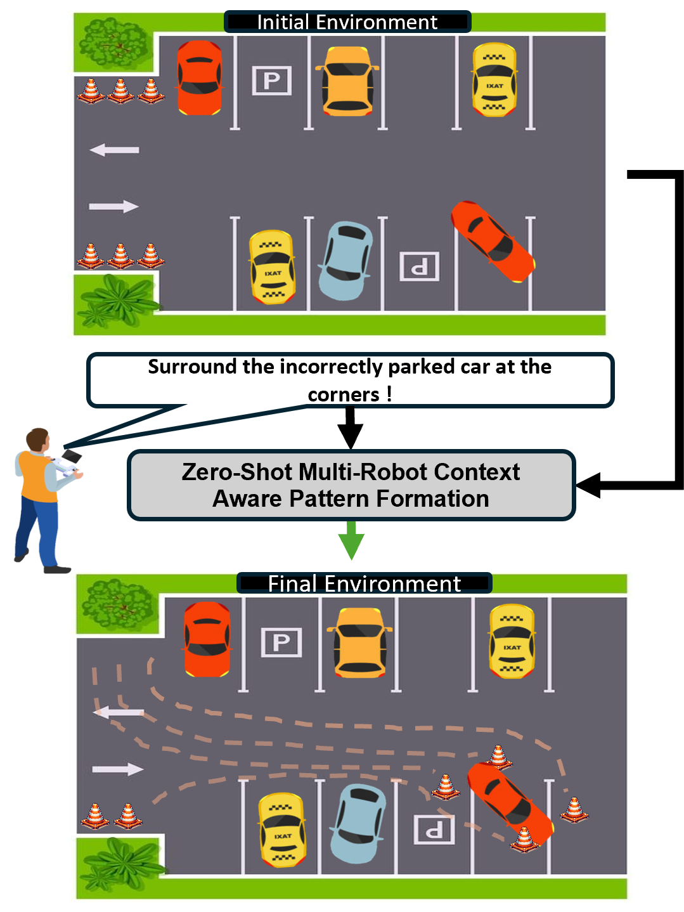
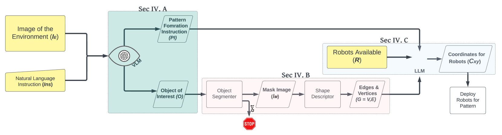
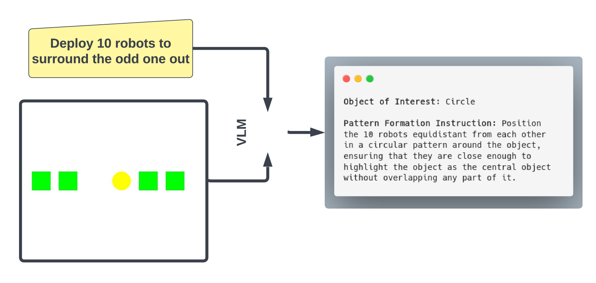
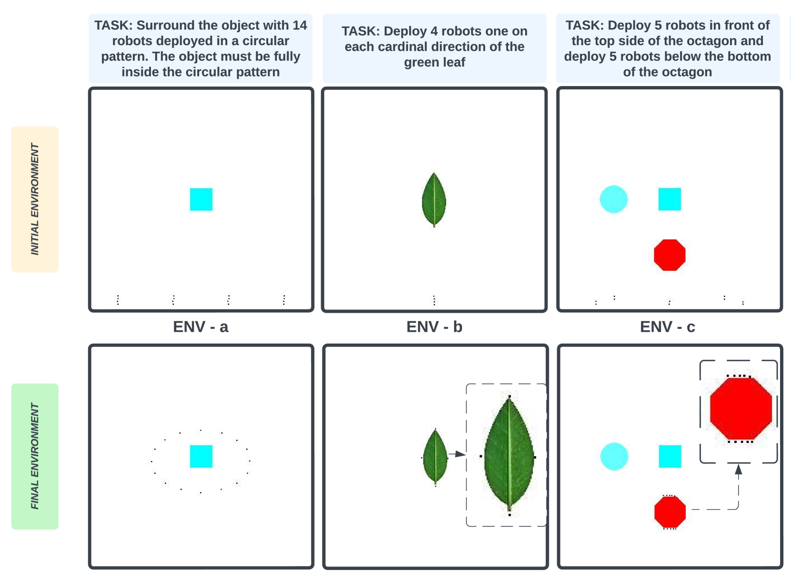
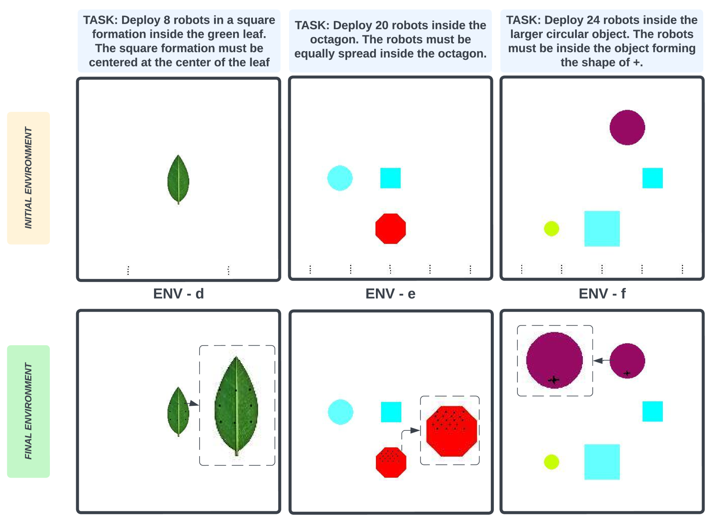
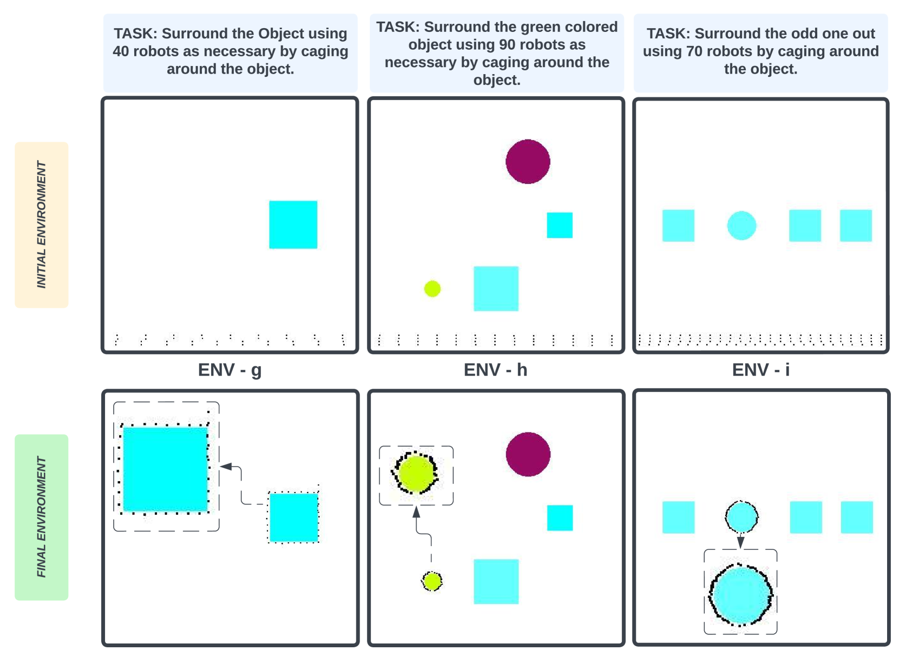
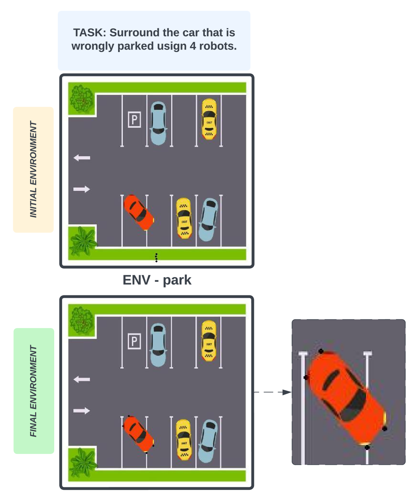
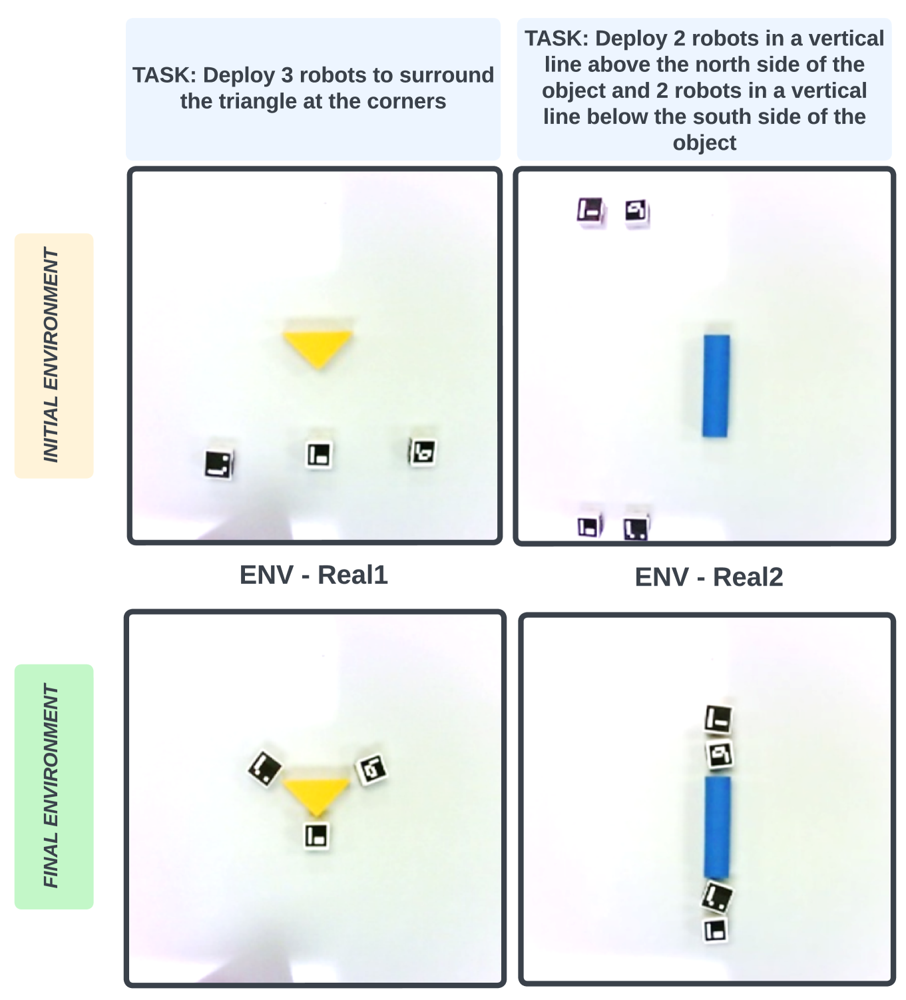

# ZeroCAP 利用大型语言模型，实现了零-shot学习下的多机器人系统能够感知上下文并进行模式形成。

发布时间：2024年04月02日

`Agent` `机器人学` `多机器人系统`

> ZeroCAP: Zero-Shot Multi-Robot Context Aware Pattern Formation via Large Language Models

# 摘要

> 将语言理解技术应用于机器人操作，不仅推动了机器人学的重大进展，尤其在完成空间相关任务，如图案排列方面，也面临了独特挑战。本文提出了一种创新系统——ZeroCAP，它通过结合大型语言模型与多机器人系统，实现了无需先前经验的上下文感知图案排列。ZeroCAP基于语言条件机器人学原理，借助语言模型的强大解释力，能够将自然语言指令转化为机器人可直接执行的配置。这种方法融合了视觉-语言模型的联动效应、先进的图像分割技术和形状描述符，使得在多机器人协作领域创造出复杂的、由上下文驱动的图案成为现实。经过大量实验验证，ZeroCAP在完成从包围物体到填充空间等一系列任务中展现出其在复杂图案创造上的高超技艺。这不仅证明了系统在理解和执行复杂任务方面的能力，也突显了其在多样化环境和场景下的适应力和效力。想要了解更多关于ZeroCAP的信息，请访问：https://sites.google.com/view/zerocap/home。

> Incorporating language comprehension into robotic operations unlocks significant advancements in robotics, but also presents distinct challenges, particularly in executing spatially oriented tasks like pattern formation. This paper introduces ZeroCAP, a novel system that integrates large language models with multi-robot systems for zero-shot context aware pattern formation. Grounded in the principles of language-conditioned robotics, ZeroCAP leverages the interpretative power of language models to translate natural language instructions into actionable robotic configurations. This approach combines the synergy of vision-language models, cutting-edge segmentation techniques and shape descriptors, enabling the realization of complex, context-driven pattern formations in the realm of multi robot coordination. Through extensive experiments, we demonstrate the systems proficiency in executing complex context aware pattern formations across a spectrum of tasks, from surrounding and caging objects to infilling regions. This not only validates the system's capability to interpret and implement intricate context-driven tasks but also underscores its adaptability and effectiveness across varied environments and scenarios. More details about this work are available at: https://sites.google.com/view/zerocap/home

[Arxiv](https://arxiv.org/abs/2404.02318)