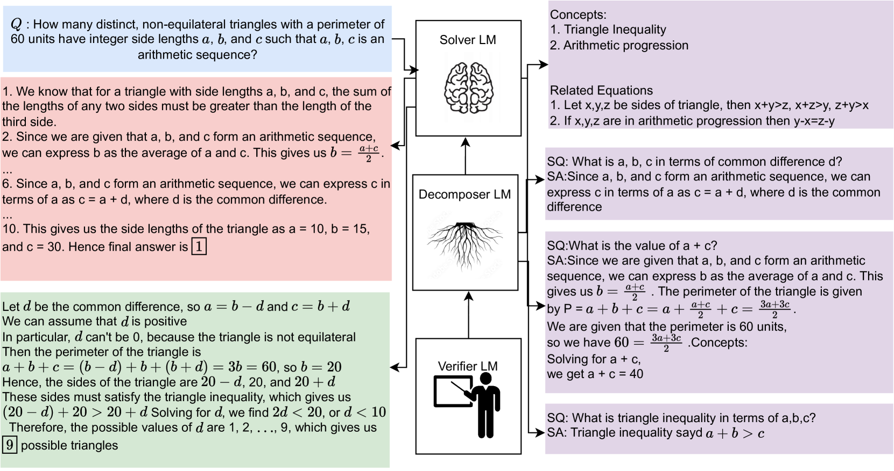
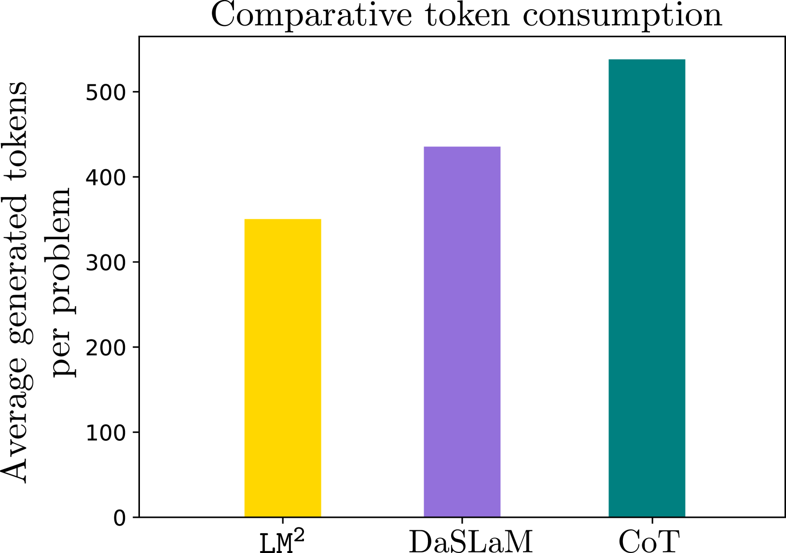
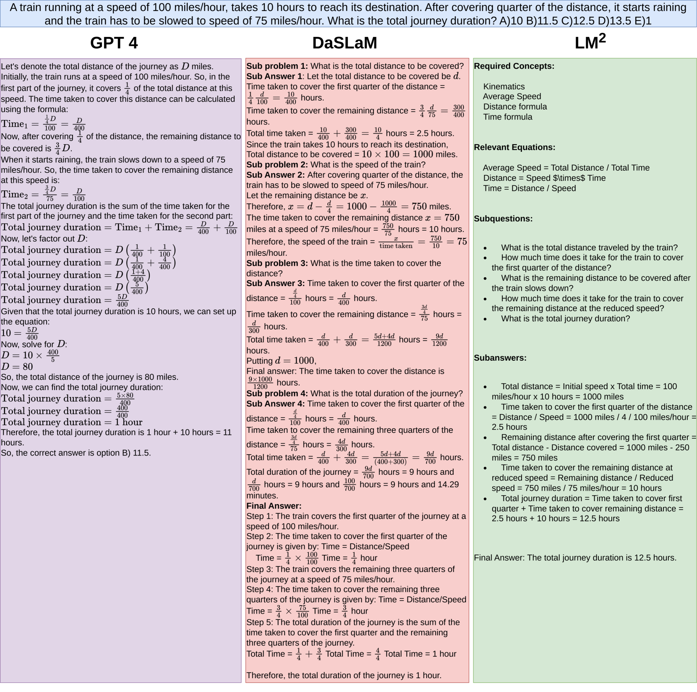

# 简单的语言模型集合轻松应对复杂推理挑战

发布时间：2024年04月02日

`LLM应用` `多步骤推理`

> : A Simple Society of Language Models Solves Complex Reasoning

# 摘要

> 虽然大型语言模型（LLMs）展现出了一定的推理能力，但在处理复杂的多步骤推理任务时仍易迷失方向。研究显示，通过分解问题来引导模型，能有效提升其推理的稳健性——即通过一个分解器产生子问题，一个解决器来解决这些子问题。然而，这些方法未能实现分解器与解决器之间的有效协调，即分解器无法跟踪解决器处理分解后推理的能力。为此，我们提出了LM2模型。LM2将分解、求解和验证过程分别集成到三个不同的语言模型中。分解器识别出解决问题的关键概念，并根据推理需求逐步生成子问题。解决器针对这些子问题提供解答，而验证器则对答案进行检验；根据验证器的反馈，构建出基于子问题和解答的推理上下文。这些模型通过策略学习进行协同训练。广泛的实验证明，LM2在领域内外推理任务上的表现超越了现有技术，在MATH、JEEBench和MedQA问题上分别提升了8.1%、7.71%和9.7%的准确率（相关代码已在https://github.com/LCS2-IIITD/Language_Model_Multiplex发布）。

> Despite demonstrating emergent reasoning abilities, Large Language Models (LLMS) often lose track of complex, multi-step reasoning. Existing studies show that providing guidance via decomposing the original question into multiple subproblems elicits more robustness in LLM reasoning -- a decomposer generates the subproblems, and a solver solves each of these subproblems. However, these techniques fail to accommodate coordination between the decomposer and the solver modules (either in a single model or different specialized ones) -- the decomposer does not keep track of the ability of the solver to follow the decomposed reasoning. In this paper, we propose LM2 to address these challenges. LM2 modularizes the decomposition, solution, and verification into three different language models. The decomposer module identifies the key concepts necessary to solve the problem and generates step-by-step subquestions according to the reasoning requirement. The solver model generates the solution to the subproblems that are then checked by the verifier module; depending upon the feedback from the verifier, the reasoning context is constructed using the subproblems and the solutions. These models are trained to coordinate using policy learning. Exhaustive experimentation suggests the superiority of LM2 over existing methods on in- and out-domain reasoning problems, outperforming the best baselines by $8.1\%$ on MATH, $7.71\%$ on JEEBench, and $9.7\%$ on MedQA problems (code available at https://github.com/LCS2-IIITD/Language_Model_Multiplex).

[Arxiv](https://arxiv.org/abs/2404.02255)