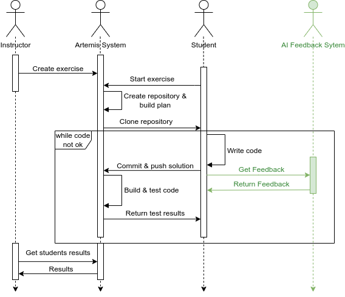
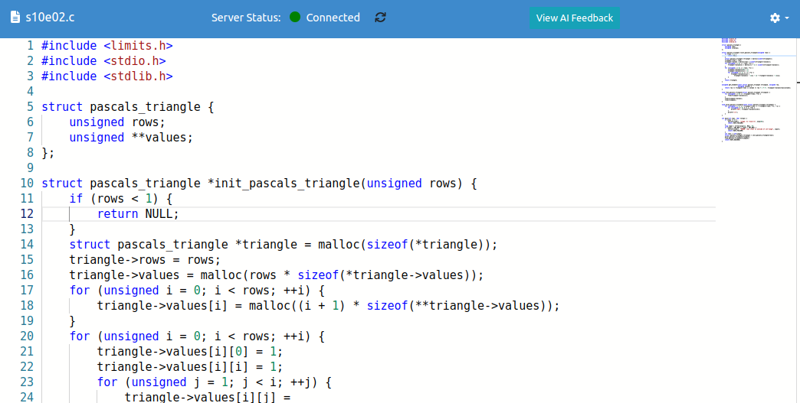
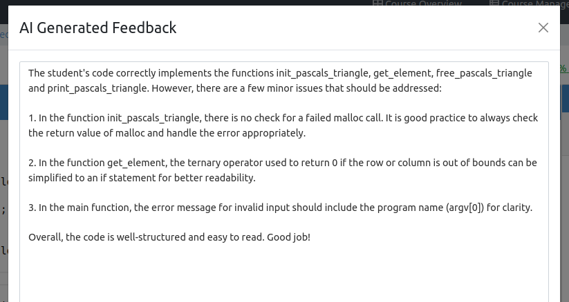
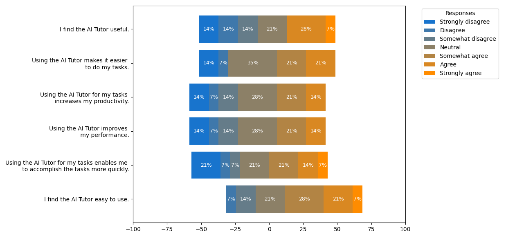

# 人工智能辅导在软件工程教育领域日益发挥着关键作用，它通过个性化指导和及时反馈显著提升了学习成效。要充分发挥其潜力，我们必须深入探索AI辅导的机制，并有效融合到教学实践中。

发布时间：2024年04月03日

`LLM应用` `人工智能`

> AI-Tutoring in Software Engineering Education

# 摘要

> 人工智能（AI）的飞速发展正引领教育领域进入一个崭新的时代。AI技术在提升编程等学习体验上展现出巨大潜力。尽管如此，自动编程评估系统（APASs）中运用的大型语言模型（LLMs）作为AI导师的科学评估尚未得到充分研究。本文通过将GPT-3.5-Turbo模型融入APAS Artemis系统，开展了一项探索性案例分析。结合实证数据和调查研究，我们根据用户与AI导师的互动模式，识别出多种用户类型。研究发现，AI导师在提供即时反馈和扩展性方面具有明显优势，但也存在诸如回复过于泛化、学生担心学习进展受阻等问题。本研究为AI在教育领域的应用提供了新的视角和讨论。

> With the rapid advancement of artificial intelligence (AI) in various domains, the education sector is set for transformation. The potential of AI-driven tools in enhancing the learning experience, especially in programming, is immense. However, the scientific evaluation of Large Language Models (LLMs) used in Automated Programming Assessment Systems (APASs) as an AI-Tutor remains largely unexplored. Therefore, there is a need to understand how students interact with such AI-Tutors and to analyze their experiences. In this paper, we conducted an exploratory case study by integrating the GPT-3.5-Turbo model as an AI-Tutor within the APAS Artemis. Through a combination of empirical data collection and an exploratory survey, we identified different user types based on their interaction patterns with the AI-Tutor. Additionally, the findings highlight advantages, such as timely feedback and scalability. However, challenges like generic responses and students' concerns about a learning progress inhibition when using the AI-Tutor were also evident. This research adds to the discourse on AI's role in education.

[Arxiv](https://arxiv.org/abs/2404.02548)