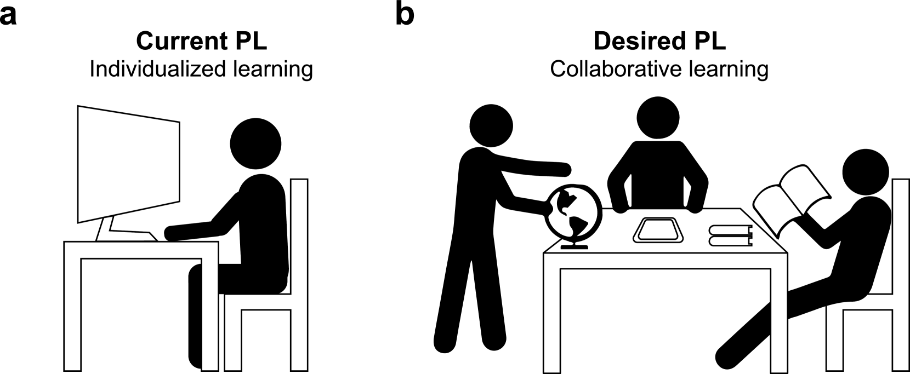
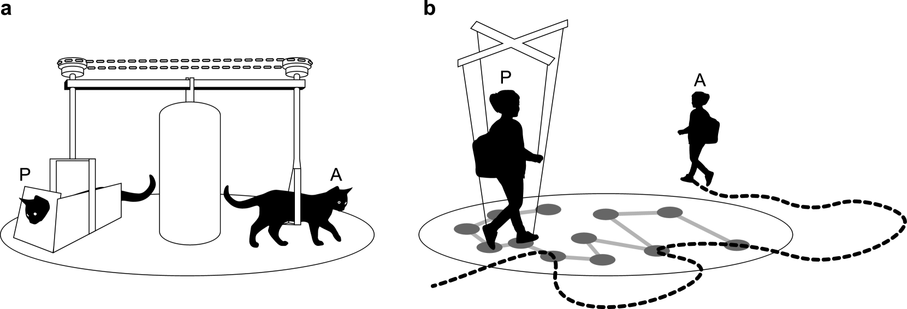
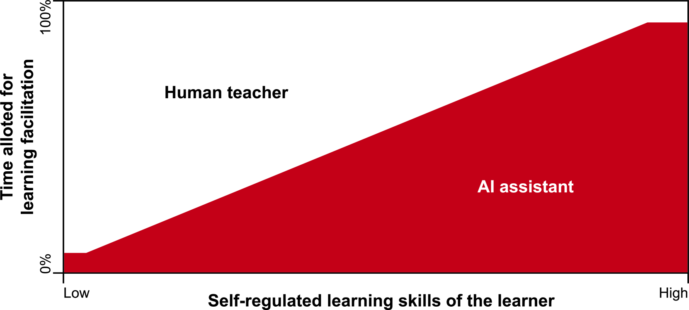

# 通过现代教育目标，人工智能与个性化学习之间的鸿沟得以桥接。

发布时间：2024年04月03日

`教育技术` `人工智能`

> AI and personalized learning: bridging the gap with modern educational goals

# 摘要

> 个性化学习（PL）力图突破传统教育的通用模式。技术驱动的PL方案在提升学习成效上已证明颇有成效。然而，这些方案与现代教育的宏观目标之间的契合度因技术与研究领域的不同而参差不齐。本文以经合组织的学习指南2030为参照，审视了AI主导的PL方案的特点。分析发现，现代教育目标与当前PL的发展趋势间存在落差。我们指出，现有的PL技术在融入合作、深度认知参与及综合能力培养等现代教育核心要素方面尚有提升空间。尽管现行PL方案在学习辅助上功不可没，但教育专家们所构想的PL远不止是技术工具那么简单，它呼唤教育体系的全面革新。文末，我们探讨了如ChatGPT等大型语言模型的潜能，并提出了一个融合人工智能与协作式、教师引导的个性化学习的新模型。

> Personalized learning (PL) aspires to provide an alternative to the one-size-fits-all approach in education. Technology-based PL solutions have shown notable effectiveness in enhancing learning performance. However, their alignment with the broader goals of modern education is inconsistent across technologies and research areas. In this paper, we examine the characteristics of AI-driven PL solutions in light of the OECD Learning Compass 2030 goals. Our analysis indicates a gap between the objectives of modern education and the current direction of PL. We identify areas where most present-day PL technologies could better embrace essential elements of contemporary education, such as collaboration, cognitive engagement, and the development of general competencies. While the present PL solutions are instrumental in aiding learning processes, the PL envisioned by educational experts extends beyond simple technological tools and requires a holistic change in the educational system. Finally, we explore the potential of large language models, such as ChatGPT, and propose a hybrid model that blends artificial intelligence with a collaborative, teacher-facilitated approach to personalized learning.

[Arxiv](https://arxiv.org/abs/2404.02798)