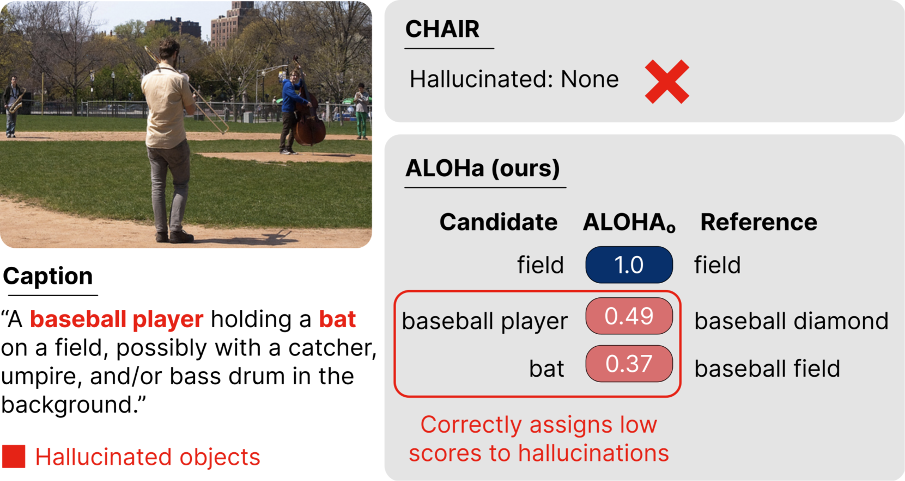
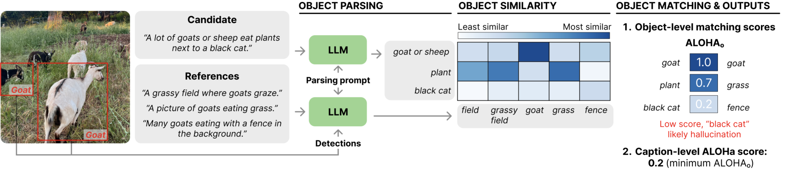
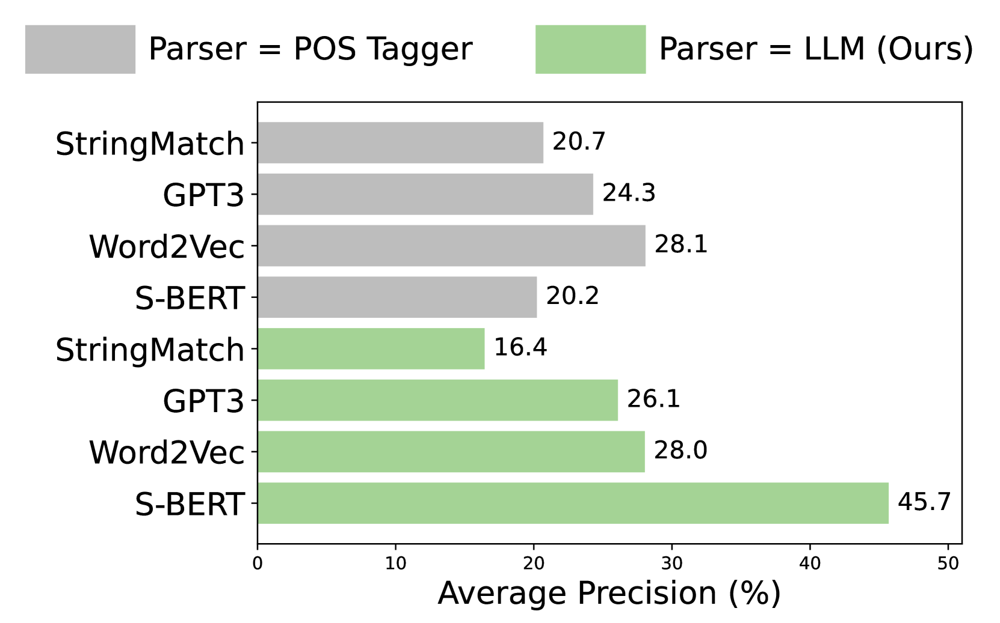
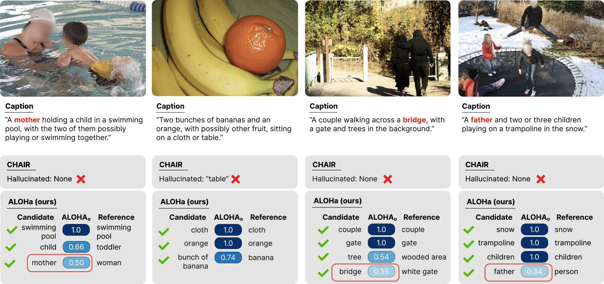
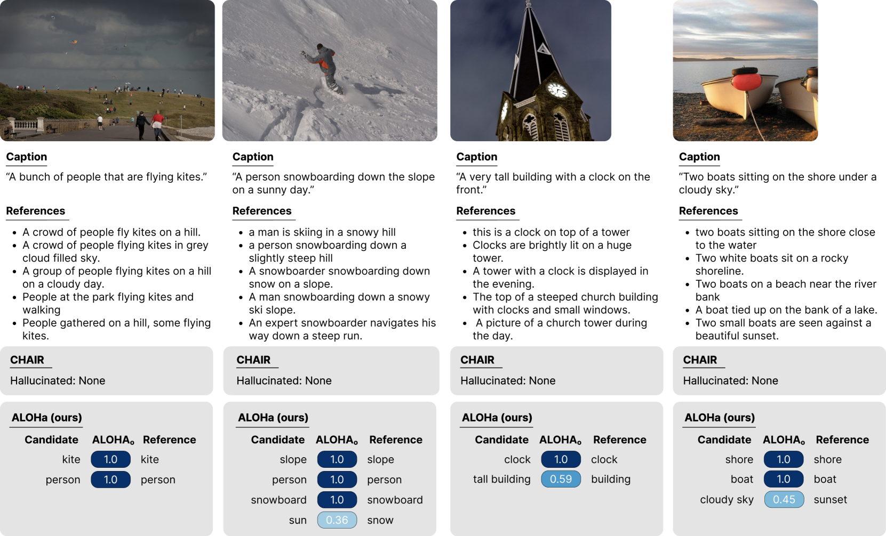
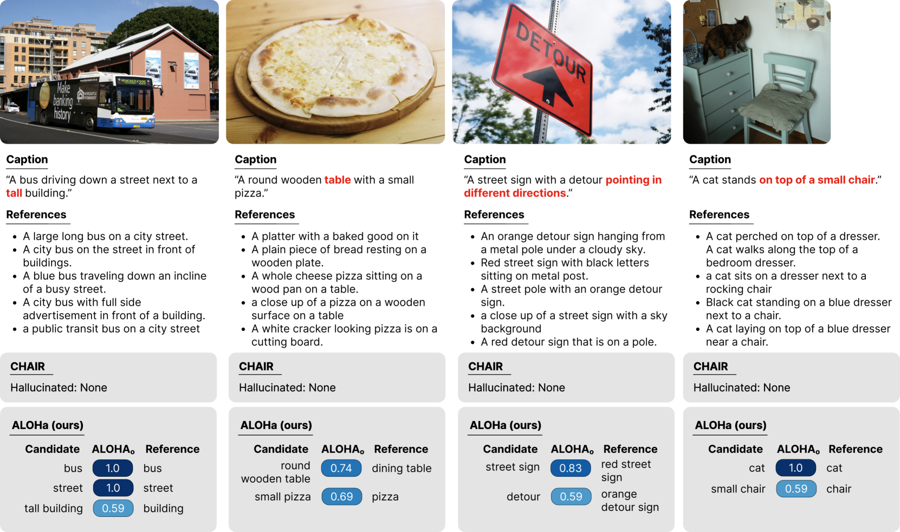
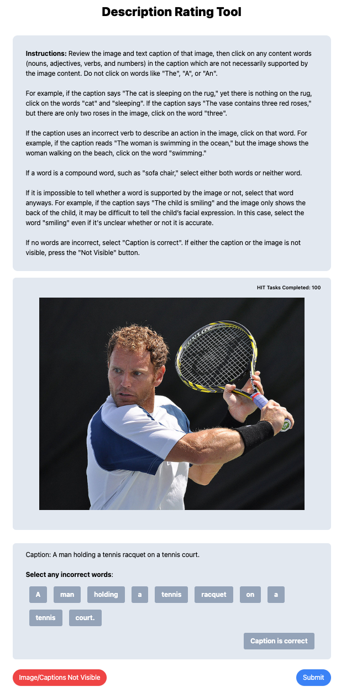

# ALOHa：字幕模型幻觉现象的新衡量标准

发布时间：2024年04月03日

`LLM应用` `计算机视觉`

> ALOHa: A New Measure for Hallucination in Captioning Models

# 摘要

> 虽然多模态预训练在视觉描述方面取得了新进展，但目前的视觉描述模型仍然存在错误，如虚构出图片中不存在的物品。现有的物体幻觉评估指标 CHAIR 仅限于 MS COCO 数据集中的固定物品和同义词。本研究提出了一种新的开放词汇度量标准 ALOHa，它借助大型语言模型（LLMs）来评估物体幻觉现象。我们利用 LLM 从候选描述中提取实际存在的物品，计算它们与参考物品的语义相似度，并通过匈牙利算法得出最终的幻觉评分。实验表明，ALOHa 在 HAT 数据集上比 CHAIR 多识别出 13.6% 的幻觉物品，在 nocaps 数据集上多识别出 30.8%，后者包含超出 MS COCO 分类的更多物品。相关代码已在 https://davidmchan.github.io/aloha/ 上发布。

> Despite recent advances in multimodal pre-training for visual description, state-of-the-art models still produce captions containing errors, such as hallucinating objects not present in a scene. The existing prominent metric for object hallucination, CHAIR, is limited to a fixed set of MS COCO objects and synonyms. In this work, we propose a modernized open-vocabulary metric, ALOHa, which leverages large language models (LLMs) to measure object hallucinations. Specifically, we use an LLM to extract groundable objects from a candidate caption, measure their semantic similarity to reference objects from captions and object detections, and use Hungarian matching to produce a final hallucination score. We show that ALOHa correctly identifies 13.6% more hallucinated objects than CHAIR on HAT, a new gold-standard subset of MS COCO Captions annotated for hallucinations, and 30.8% more on nocaps, where objects extend beyond MS COCO categories. Our code is available at https://davidmchan.github.io/aloha/.

[Arxiv](https://arxiv.org/abs/2404.02904)