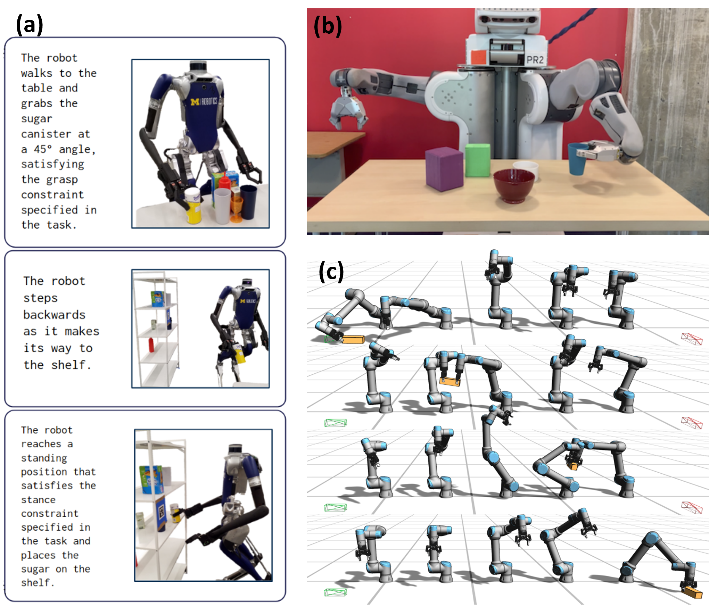
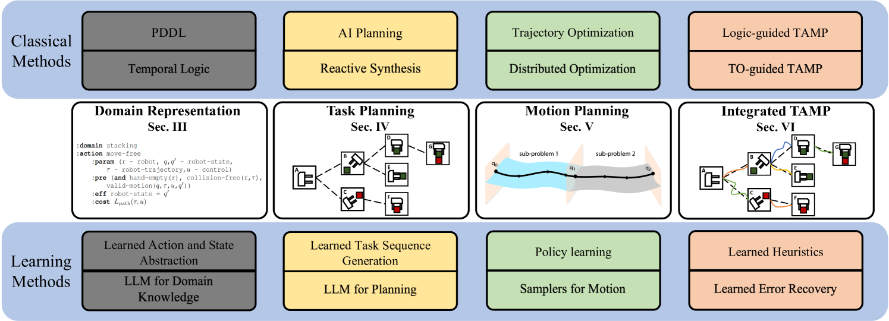
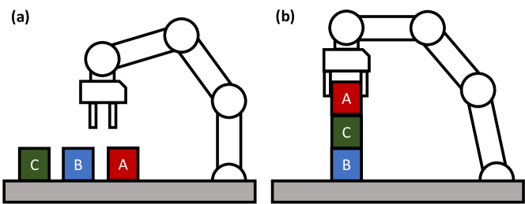
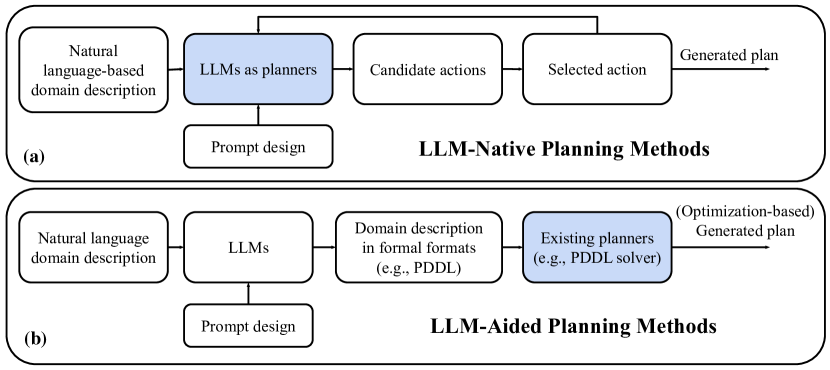
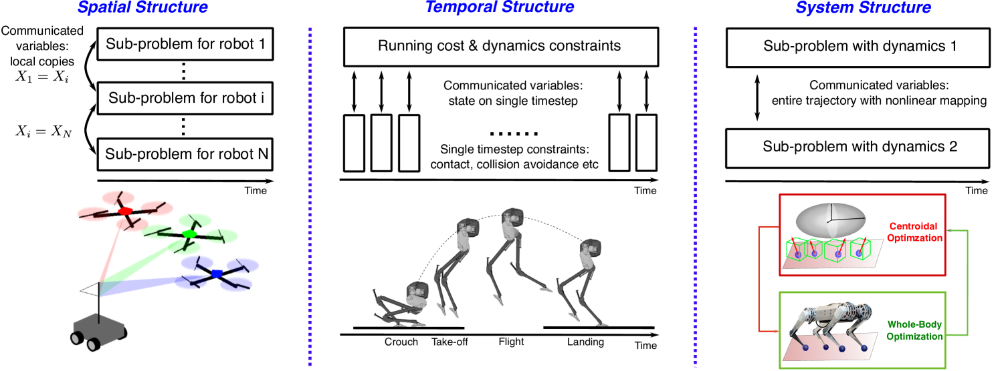
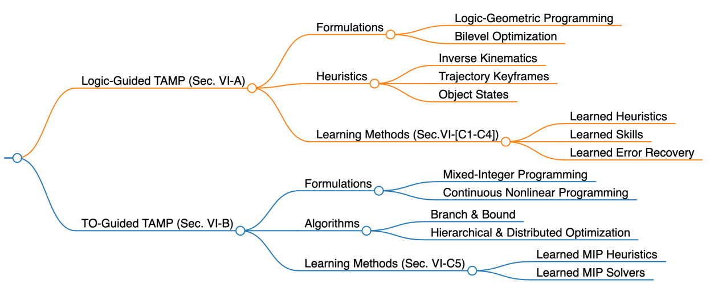
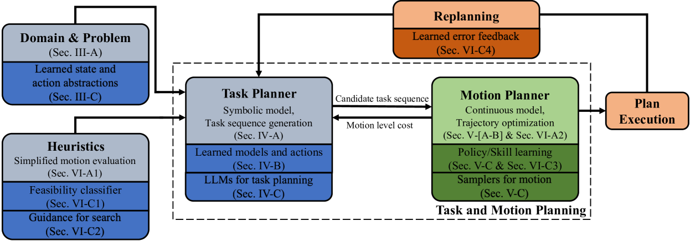
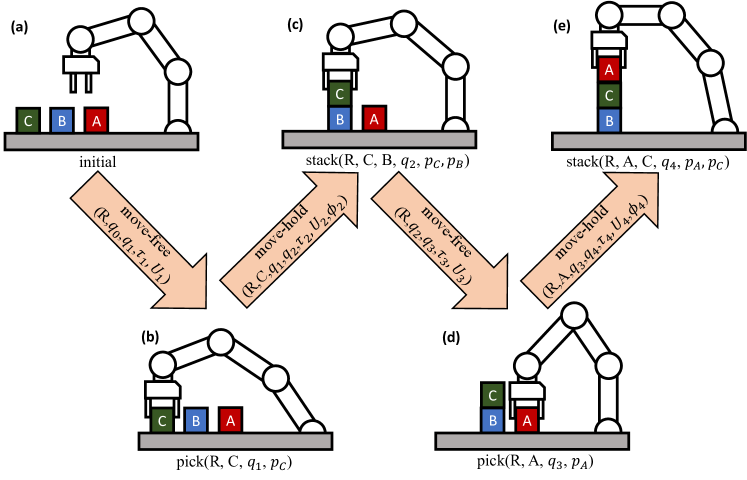
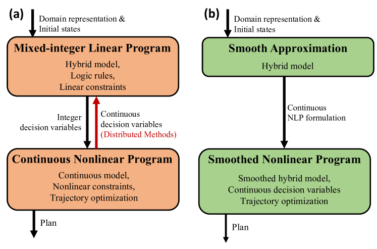

# 本综述探讨了从传统到现代基于优化的任务和运动规划方法，特别关注学习方法的应用和发展。

发布时间：2024年04月03日

`Agent` `机器人` `任务规划`

> A Survey of Optimization-based Task and Motion Planning: From Classical To Learning Approaches

# 摘要

> 任务与运动规划（TAMP）融合了高层任务规划和底层运动规划，赋予机器人在应对长期动态任务时更强的自主推理能力。优化导向的TAMP着眼于混合式优化策略，通过目标函数设定目标条件，有效应对开放性目标、机器人动力学和机器人与环境的物理互动。这种优化方法特别适合处理复杂的接触式运动和操作难题。本文综述了基于优化的TAMP，内容涵盖规划领域表达（如动作描述语言和时间逻辑）、TAMP各组件的解决方案（包括AI规划和轨迹优化TO），以及逻辑任务规划与模型驱动TO之间的互动关系。特别强调了高效解决TAMP问题的算法架构，尤其是层次化和分布式策略。同时，文章也探讨了传统方法与新兴学习型创新（例如大型语言模型）的结合优势。此外，还展望了TAMP的未来研究路径，着重讨论了算法和特定应用领域的挑战。

> Task and Motion Planning (TAMP) integrates high-level task planning and low-level motion planning to equip robots with the autonomy to effectively reason over long-horizon, dynamic tasks. Optimization-based TAMP focuses on hybrid optimization approaches that define goal conditions via objective functions and are capable of handling open-ended goals, robotic dynamics, and physical interaction between the robot and the environment. Therefore, optimization-based TAMP is particularly suited to solve highly complex, contact-rich locomotion and manipulation problems. This survey provides a comprehensive review on optimization-based TAMP, covering (i) planning domain representations, including action description languages and temporal logic, (ii) individual solution strategies for components of TAMP, including AI planning and trajectory optimization (TO), and (iii) the dynamic interplay between logic-based task planning and model-based TO. A particular focus of this survey is to highlight the algorithm structures to efficiently solve TAMP, especially hierarchical and distributed approaches. Additionally, the survey emphasizes the synergy between the classical methods and contemporary learning-based innovations such as large language models. Furthermore, the future research directions for TAMP is discussed in this survey, highlighting both algorithmic and application-specific challenges.

[Arxiv](https://arxiv.org/abs/2404.02817)