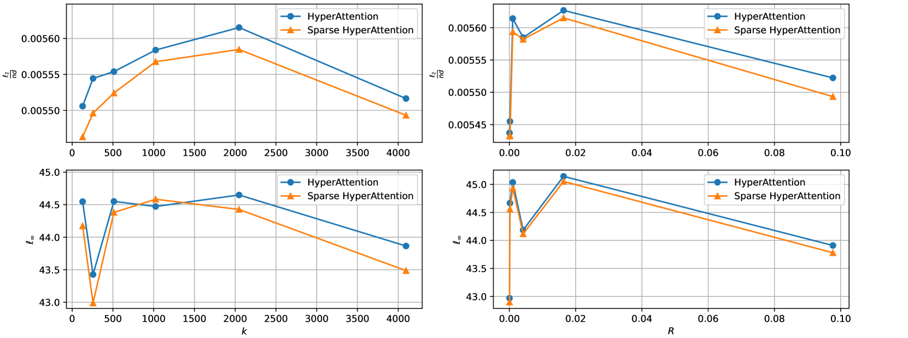

# 当输入呈现高斯分布时，注意力机制自然而然地表现出稀疏性。

发布时间：2024年04月03日

`LLM理论` `人工智能` `计算效率`

> Attention is Naturally Sparse with Gaussian Distributed Input

# 摘要

> 大型语言模型的计算密集度问题主要源于变换器架构中注意力机制的$O(n^2)$复杂性。针对这一挑战，稀疏注意力技术应运而生，旨在降低计算负担而不牺牲模型效能。本研究深入分析了在高斯输入框架下LLMs注意力分数的稀疏性，通过确立一系列基本假设并采用严谨的理论途径，揭示了注意力分数稀疏性的本质特征及其对计算效率的贡献。我们的贡献在于深入探讨了稀疏性在注意力机制中的具体表现，为理解计算资源节省与模型性能之间的可能权衡提供了洞见。这项研究不仅加深了我们对稀疏注意力的认识，还为未来优化LLMs计算架构的研究搭建了桥梁，助力构建更高效、更可扩展的AI系统。

> The computational intensity of Large Language Models (LLMs) is a critical bottleneck, primarily due to the $O(n^2)$ complexity of the attention mechanism in transformer architectures. Addressing this, sparse attention emerges as a key innovation, aiming to reduce computational load while maintaining model performance. This study presents a rigorous theoretical analysis of the sparsity in attention scores within LLMs, particularly under the framework of Gaussian inputs. By establishing a set of foundational assumptions and employing a methodical theoretical approach, we unravel the intrinsic characteristics of attention score sparsity and its implications on computational efficiency. Our main contribution lies in providing a detailed theoretical examination of how sparsity manifests in attention mechanisms, offering insights into the potential trade-offs between computational savings and model effectiveness. This work not only advances our understanding of sparse attention but also provides a scaffold for future research in optimizing the computational frameworks of LLMs, paving the way for more scalable and efficient AI systems.

[Arxiv](https://arxiv.org/abs/2404.02690)