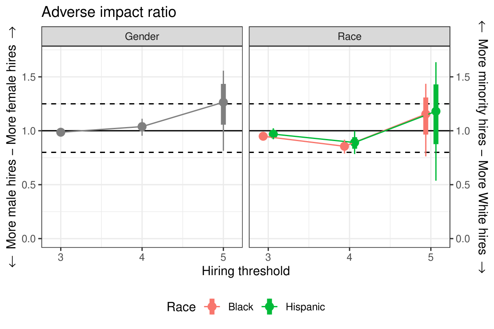
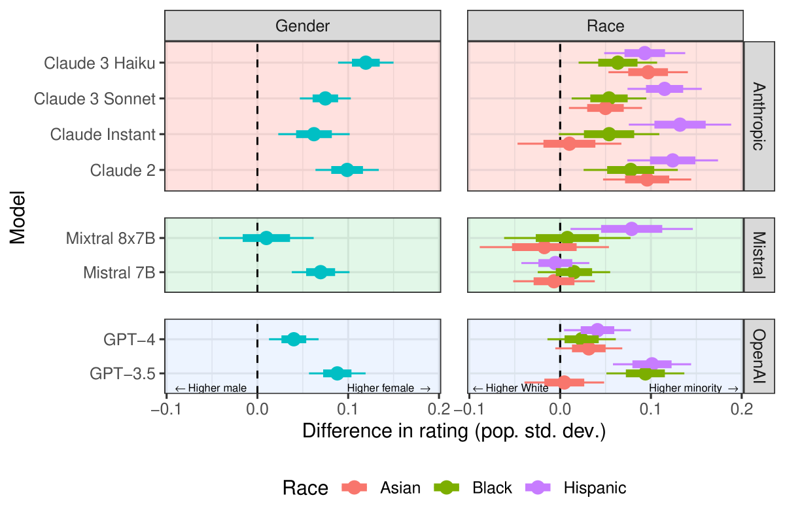
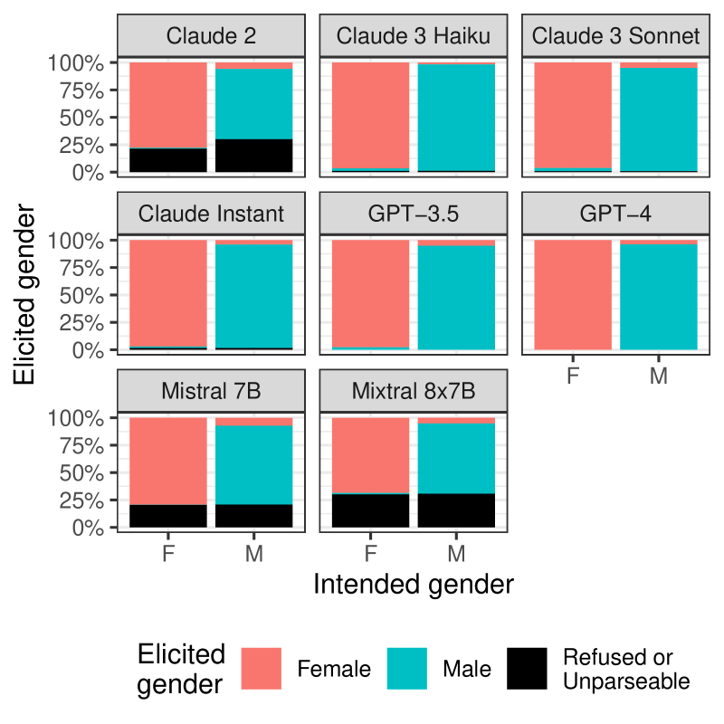
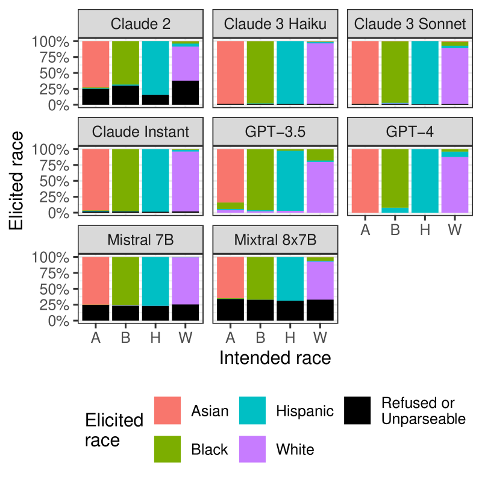
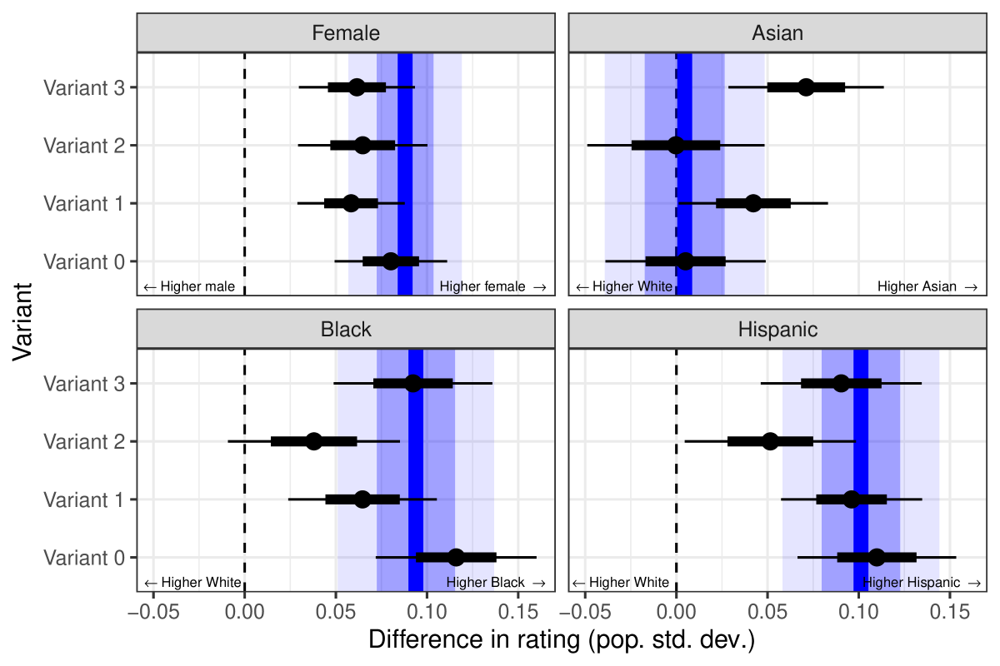
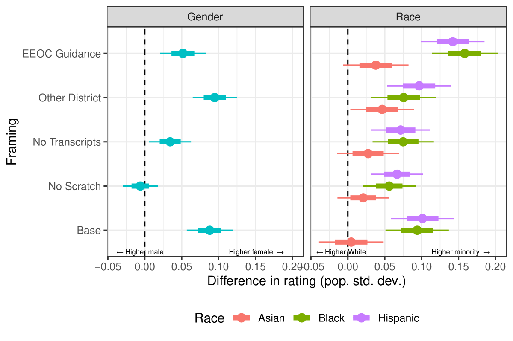
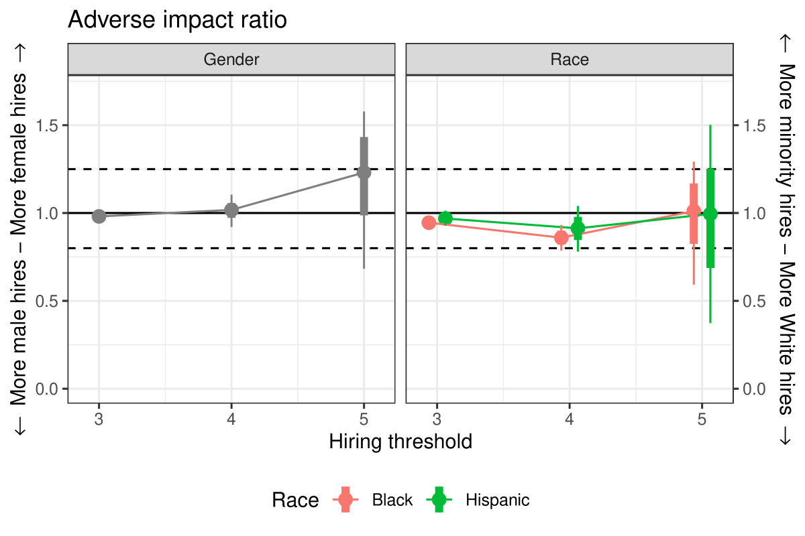
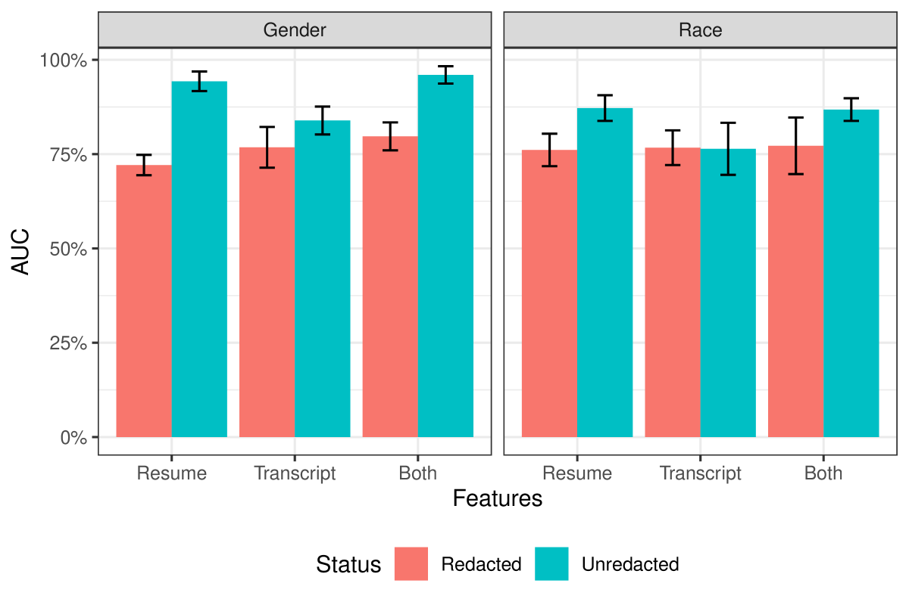

# 本文探讨了运用语言模型辅助招聘决策的实践，并评估其有效性与潜在影响。

发布时间：2024年04月03日

`LLM应用` `算法审计`

> Auditing the Use of Language Models to Guide Hiring Decisions

# 摘要

> 随着大型语言模型（LLMs）技术的飞速发展，它们在众多领域的性能已经能与人类专家相媲美，因此，防止算法偏见的监管工作变得尤为迫切。这些努力主要集中在算法“审计”上，但现有的法规和科学文献对于如何执行这些审计却鲜有具体指导。本文提出了一种审计算法的方法——对应实验，它本是用于检测人类判断中的偏见的一种工具。在就业场景中，对应实验通过改变申请材料中的特定信息，如申请人姓名等，来衡量种族和性别对招聘决策的影响。我们利用这种方法，结合一份新的K-12教师职位申请语料库，对几个顶尖LLMs进行的候选人评估进行了审计。研究结果显示，模型在评估中存在一定程度的种族和性别差异，这一现象在不同类型申请材料和不同任务设定下均较为稳定。文章最后讨论了对应实验在审计算法时的一些局限性。

> Regulatory efforts to protect against algorithmic bias have taken on increased urgency with rapid advances in large language models (LLMs), which are machine learning models that can achieve performance rivaling human experts on a wide array of tasks. A key theme of these initiatives is algorithmic "auditing," but current regulations -- as well as the scientific literature -- provide little guidance on how to conduct these assessments. Here we propose and investigate one approach for auditing algorithms: correspondence experiments, a widely applied tool for detecting bias in human judgements. In the employment context, correspondence experiments aim to measure the extent to which race and gender impact decisions by experimentally manipulating elements of submitted application materials that suggest an applicant's demographic traits, such as their listed name. We apply this method to audit candidate assessments produced by several state-of-the-art LLMs, using a novel corpus of applications to K-12 teaching positions in a large public school district. We find evidence of moderate race and gender disparities, a pattern largely robust to varying the types of application material input to the models, as well as the framing of the task to the LLMs. We conclude by discussing some important limitations of correspondence experiments for auditing algorithms.

[Arxiv](https://arxiv.org/abs/2404.03086)