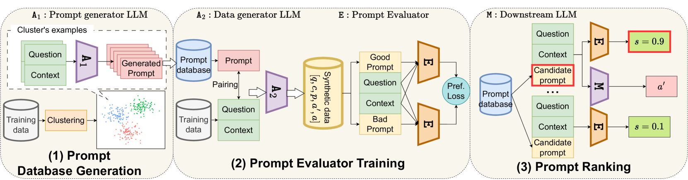

# 在大型语言模型中，自动化的提示筛选机制

发布时间：2024年04月03日

`LLM应用` `自动化提示生成`

> Automatic Prompt Selection for Large Language Models

# 摘要

> 大型语言模型（LLMs）能够根据恰当的指令提示完成多样的自然语言处理任务。但手工设计高效提示既困难又费时。自动提示优化的现有方法要么不够灵活，要么效率不高。本文提出了一种自动从一系列合成候选提示中挑选最佳提示的有效方法。该方法分为三步：首先，利用基于LLM的提示生成器对训练数据进行聚类，并为每个聚类创建候选提示；其次，构建一个输入-提示-输出的数据集，用以训练评估器对提示进行排序，依据是提示与输入的相关度；最后，在测试阶段利用评估器为新输入选取最佳提示。此方法兼顾了提示的普适性与针对性，避免了资源密集型的训练与推理过程。在GSM8K、MultiArith和AQuA等零样本问答数据集上，该方法展现出了不俗的性能。

> Large Language Models (LLMs) can perform various natural language processing tasks with suitable instruction prompts. However, designing effective prompts manually is challenging and time-consuming. Existing methods for automatic prompt optimization either lack flexibility or efficiency. In this paper, we propose an effective approach to automatically select the optimal prompt for a given input from a finite set of synthetic candidate prompts. Our approach consists of three steps: (1) clustering the training data and generating candidate prompts for each cluster using an LLM-based prompt generator; (2) synthesizing a dataset of input-prompt-output tuples for training a prompt evaluator to rank the prompts based on their relevance to the input; (3) using the prompt evaluator to select the best prompt for a new input at test time. Our approach balances prompt generality-specificity and eliminates the need for resource-intensive training and inference. It demonstrates competitive performance on zero-shot question-answering datasets: GSM8K, MultiArith, and AQuA.

[Arxiv](https://arxiv.org/abs/2404.02717)