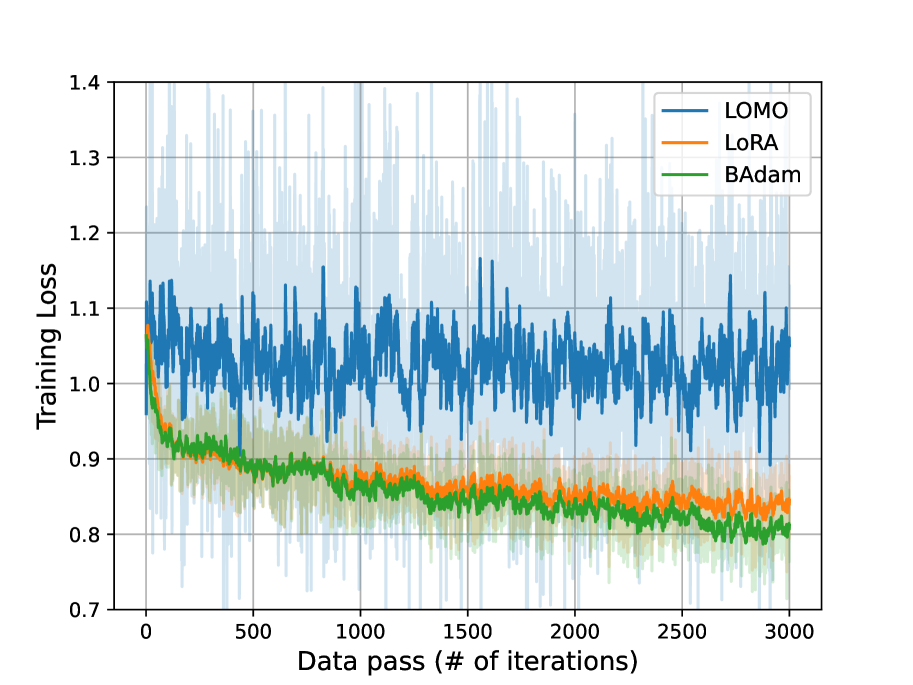

# BAdam 为大型语言模型提供了一种内存占用小且高效的全参数训练方式。

发布时间：2024年04月03日

`LLM理论` `优化算法` `大型语言模型`

> BAdam: A Memory Efficient Full Parameter Training Method for Large Language Models

# 摘要

> 本文介绍了BAdam，这是一种结合了块坐标优化框架和Adam求解器的优化器。它在大型语言模型的全参数微调中节省了内存，并利用链式法则缩短了反向传播的时间。我们通过单个RTX3090-24GB GPU在Alpaca-GPT4数据集上对Llama 2-7B模型进行了指令微调，实验结果显示BAdam的收敛性能优于LoRA和LOMO。在MT-bench的下游性能评估中，BAdam不仅小幅领先LoRA，更显著超越了LOMO。此外，我们还比较了BAdam和Adam在中等规模任务上的表现，即对RoBERTa-large模型进行SuperGLUE基准的微调。结果表明，BAdam能有效缩小与Adam的性能差距。相关代码已在GitHub上提供。

> This work presents BAdam, an optimizer that leverages the block coordinate optimization framework with Adam as the inner solver. BAdam offers a memory efficient approach to the full parameter finetuning of large language models and reduces running time of the backward process thanks to the chain rule property. Experimentally, we apply BAdam to instruction-tune the Llama 2-7B model on the Alpaca-GPT4 dataset using a single RTX3090-24GB GPU. The results indicate that BAdam exhibits superior convergence behavior in comparison to LoRA and LOMO. Furthermore, our downstream performance evaluation of the instruction-tuned models using the MT-bench shows that BAdam modestly surpasses LoRA and more substantially outperforms LOMO. Finally, we compare BAdam with Adam on a medium-sized task, i.e., finetuning RoBERTa-large on the SuperGLUE benchmark. The results demonstrate that BAdam is capable of narrowing the performance gap with Adam. Our code is available at https://github.com/Ledzy/BAdam.

[Arxiv](https://arxiv.org/abs/2404.02827)