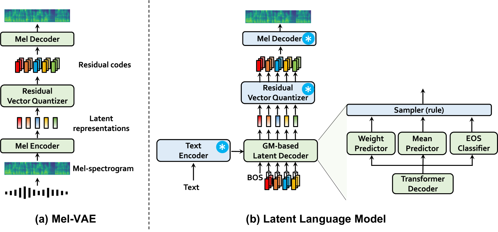
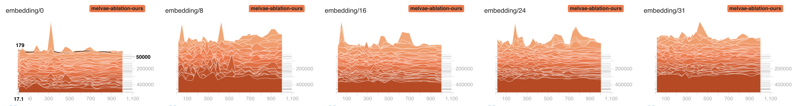
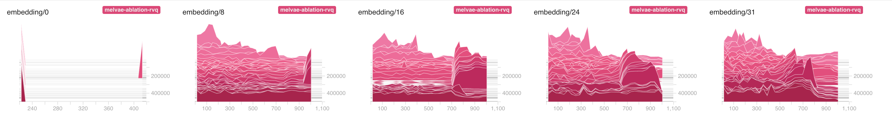

# CLaM-TTS：优化神经编解码器语言模型，提升零-shot 文本到语音的转换效果

发布时间：2024年04月03日

`LLM应用` `音频处理` `文本到语音合成`

> CLaM-TTS: Improving Neural Codec Language Model for Zero-Shot Text-to-Speech

# 摘要

> 随着神经音频编解码器技术的兴起，大型语言模型 (LLM) 因其在零-shot 文本到语音 (TTS) 合成方面的潜力而备受关注。然而，音频令牌化带来的长序列和复杂建模问题，反而加剧了扩展性的挑战。为此，我们推出了 CLaM-TTS，它通过概率残差向量量化技术，不仅实现了令牌长度的高效压缩，还使得语言模型能够一次性生成多个令牌，避免了传统级联建模的繁琐。实验结果显示，CLaM-TTS 在自然度、清晰度、声音相似度和推理速度等方面，表现不逊于当前最先进的神经编解码器 TTS 模型。同时，我们还探讨了语言模型的预训练深度和文本令牌策略对合成效果的具体影响。

> With the emergence of neural audio codecs, which encode multiple streams of discrete tokens from audio, large language models have recently gained attention as a promising approach for zero-shot Text-to-Speech (TTS) synthesis. Despite the ongoing rush towards scaling paradigms, audio tokenization ironically amplifies the scalability challenge, stemming from its long sequence length and the complexity of modelling the multiple sequences. To mitigate these issues, we present CLaM-TTS that employs a probabilistic residual vector quantization to (1) achieve superior compression in the token length, and (2) allow a language model to generate multiple tokens at once, thereby eliminating the need for cascaded modeling to handle the number of token streams. Our experimental results demonstrate that CLaM-TTS is better than or comparable to state-of-the-art neural codec-based TTS models regarding naturalness, intelligibility, speaker similarity, and inference speed. In addition, we examine the impact of the pretraining extent of the language models and their text tokenization strategies on performances.

[Arxiv](https://arxiv.org/abs/2404.02781)