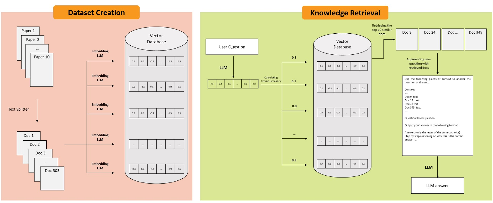
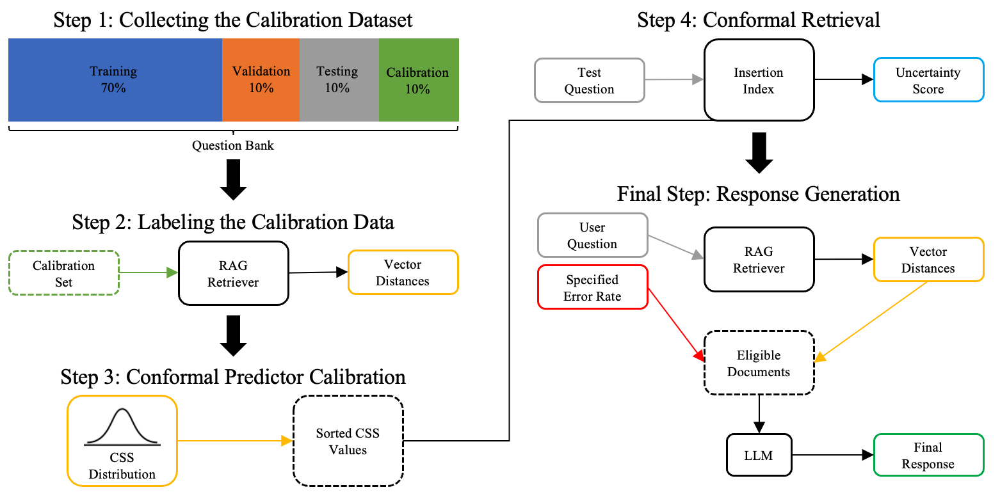

# CONFLARE：一种适应性强的大型语言模型检索系统

发布时间：2024年04月03日

`RAG` `信息检索`

> CONFLARE: CONFormal LArge language model REtrieval

# 摘要

> RAG框架赋予大型语言模型（LLM）检索知识库信息并融入生成响应的能力，有效减少了生成过程中的错误信息。但RAG无法确保在信息检索不准确时仍能提供有效响应，且面对矛盾信息时，其生成的响应可能仅代表其中一种可能性。因此，衡量检索过程中的不确定性对于提高RAG的可靠性极为关键。本报告提出了一种四步法框架，通过一致性预测来量化RAG框架中的检索不确定性。首先，我们构建一个可由知识库解答的问题校准集，通过比较问题与文档的嵌入来找出最相关的文档片段，并记录它们的相似度。设定一个特定的错误率（α）后，根据相似度分数确定一个阈值。在推理阶段，超过这个阈值的所有文档片段都会被检索出来，为LLM提供准确上下文，确保答案的准确率至少达到（1-α）的置信度。我们还提供了一个Python包，让用户能够仅依靠LLM，无需人工介入，就能实现我们所提出的整个工作流程。

> Retrieval-augmented generation (RAG) frameworks enable large language models (LLMs) to retrieve relevant information from a knowledge base and incorporate it into the context for generating responses. This mitigates hallucinations and allows for the updating of knowledge without retraining the LLM. However, RAG does not guarantee valid responses if retrieval fails to identify the necessary information as the context for response generation. Also, if there is contradictory content, the RAG response will likely reflect only one of the two possible responses. Therefore, quantifying uncertainty in the retrieval process is crucial for ensuring RAG trustworthiness. In this report, we introduce a four-step framework for applying conformal prediction to quantify retrieval uncertainty in RAG frameworks. First, a calibration set of questions answerable from the knowledge base is constructed. Each question's embedding is compared against document embeddings to identify the most relevant document chunks containing the answer and record their similarity scores. Given a user-specified error rate (α), these similarity scores are then analyzed to determine a similarity score cutoff threshold. During inference, all chunks with similarity exceeding this threshold are retrieved to provide context to the LLM, ensuring the true answer is captured in the context with a (1-α) confidence level. We provide a Python package that enables users to implement the entire workflow proposed in our work, only using LLMs and without human intervention.

[Arxiv](https://arxiv.org/abs/2404.04287)