# 本文探讨了如何通过激发忠诚度来调整大型语言模型的自信度，以提高其预测的准确性。

发布时间：2024年04月03日

`LLM理论` `人工智能` `模型评估`

> Calibrating the Confidence of Large Language Models by Eliciting Fidelity

# 摘要

> 经过RLHF等技术打磨的大型语言模型在确保有用性和无害性方面已达到良好同步。然而，调整后这些模型常常显得过于自信，自信表达与正确率并不相符。本文将模型的自信度细分为对问题的\textit{不确定性}及对生成答案的\textit{忠实度}。接着，我们提出了一种简便的方法来评估语言模型的自信度。通过对六个经RLHF训练的语言模型在四个多项选择问答数据集上的实验，证实了我们方法的良好校准效果。此外，我们还引入了两个创新指标IPR和CE来衡量模型的自信度校准，并围绕\textit{真正精准的自信度}展开了深入讨论。此方法建立了一个强大的基准线，我们期望本研究能为模型自信度的校准研究带来新的启示。

> Large language models optimized with techniques like RLHF have achieved good alignment in being helpful and harmless. However, post-alignment, these language models often exhibit overconfidence, where the expressed confidence does not accurately calibrate with their correctness rate. In this paper, we decompose the language model confidence into the \textit{Uncertainty} about the question and the \textit{Fidelity} to the answer generated by language models. Then, we propose a plug-and-play method to estimate the confidence of language models. Our method has shown good calibration performance by conducting experiments with 6 RLHF-LMs on four MCQA datasets. Moreover, we propose two novel metrics, IPR and CE, to evaluate the calibration of the model, and we have conducted a detailed discussion on \textit{Truly Well-Calibrated Confidence}. Our method could serve as a strong baseline, and we hope that this work will provide some insights into the model confidence calibration.

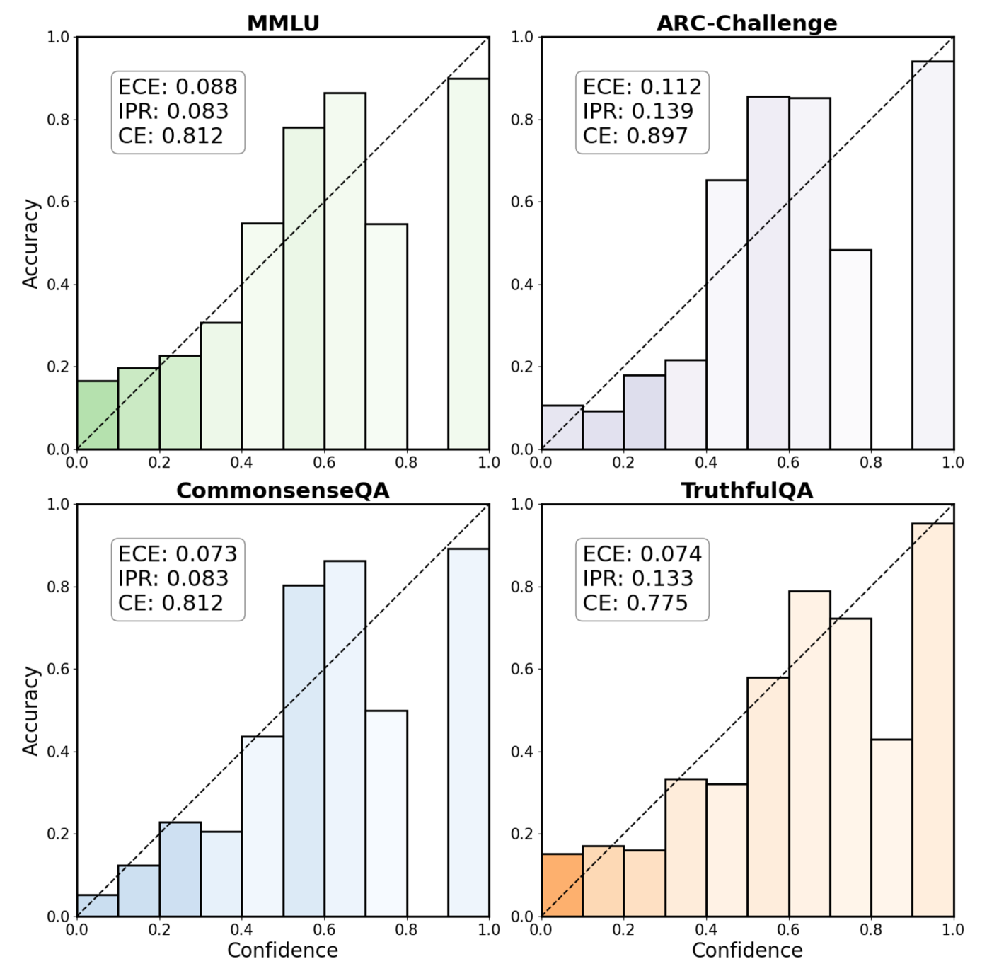

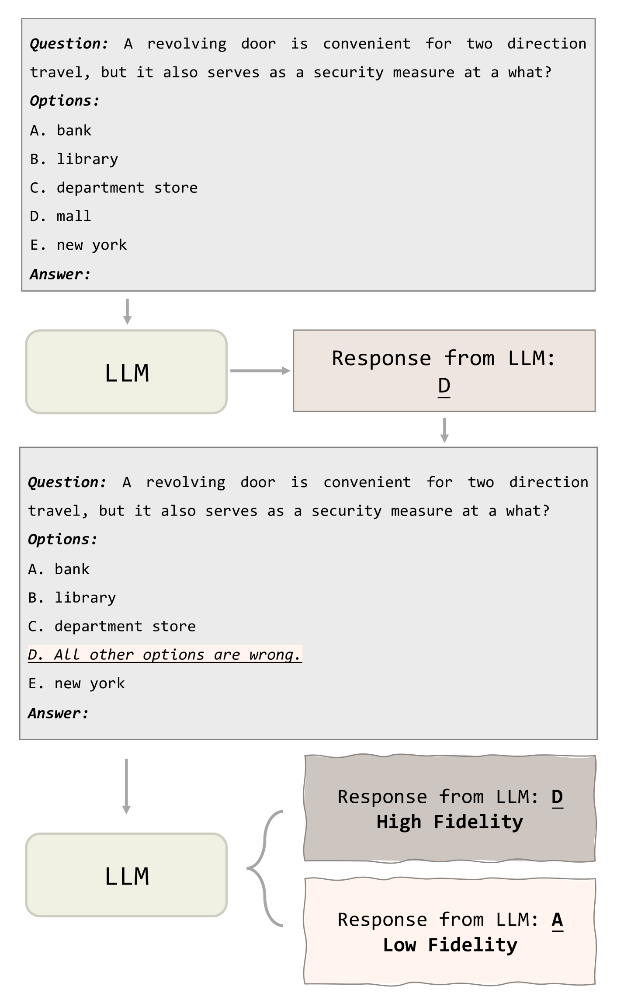

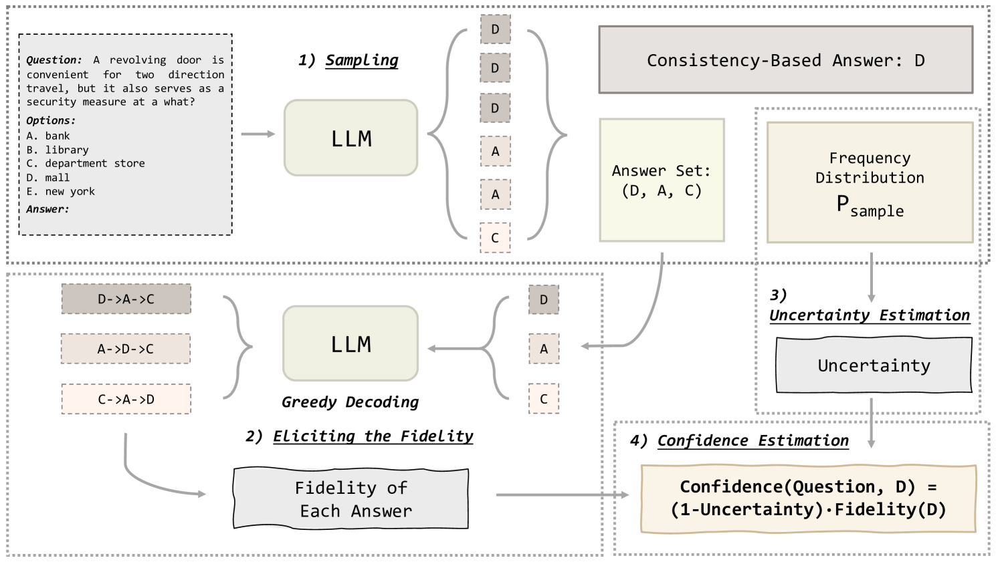

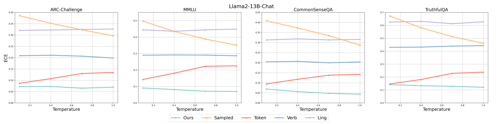

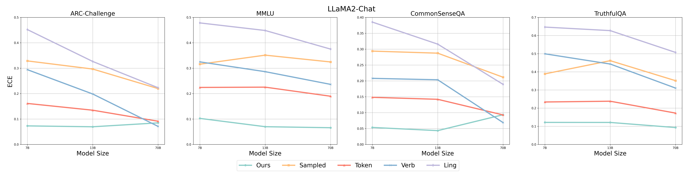

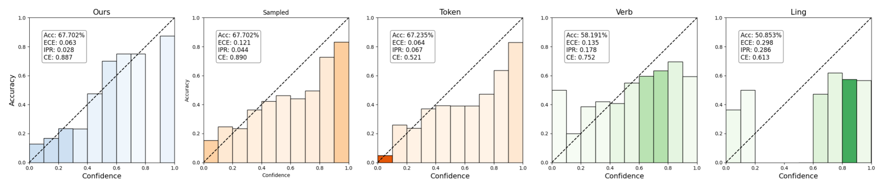

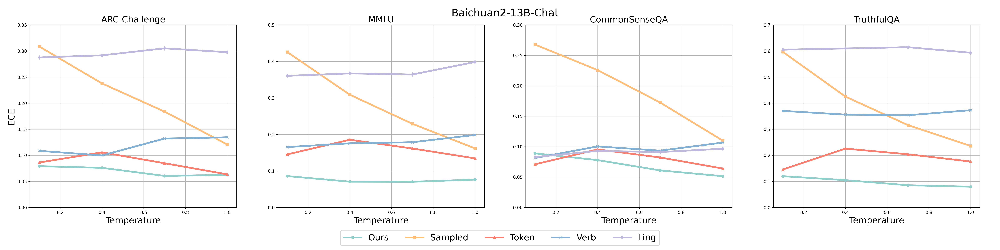

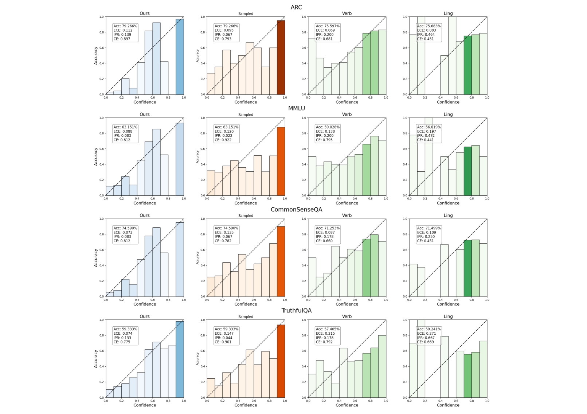

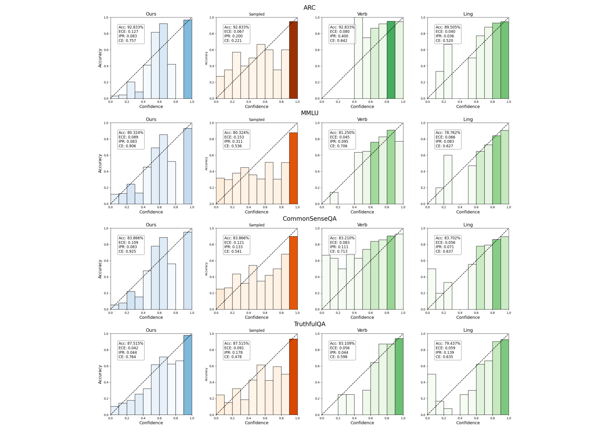

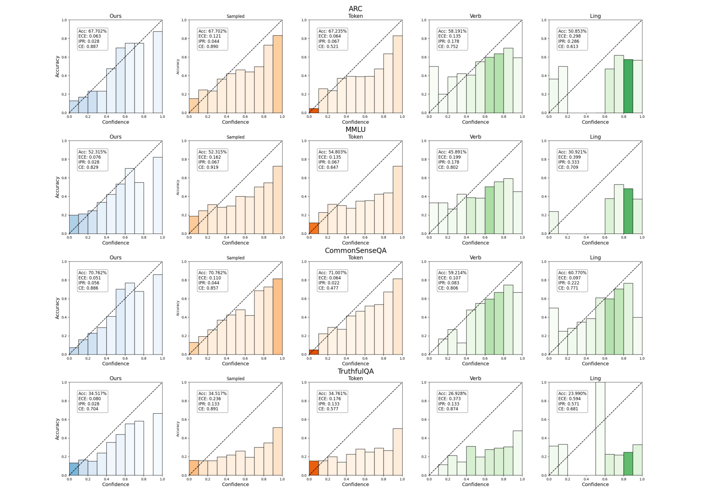

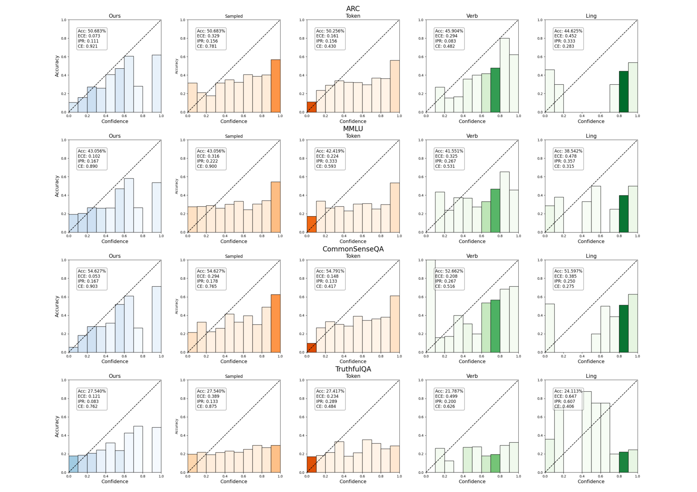

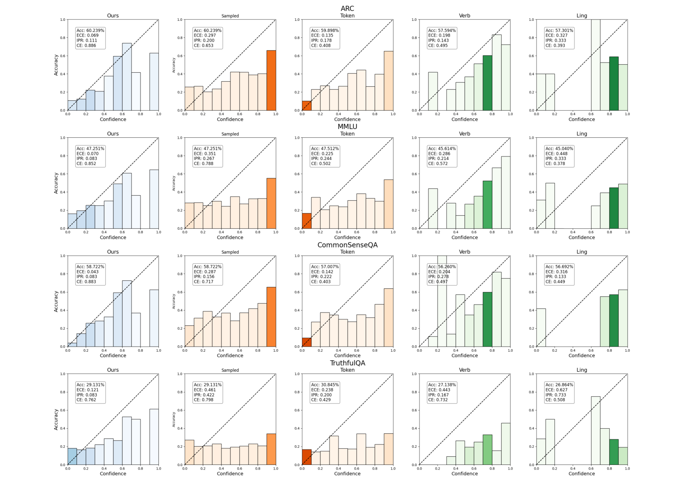

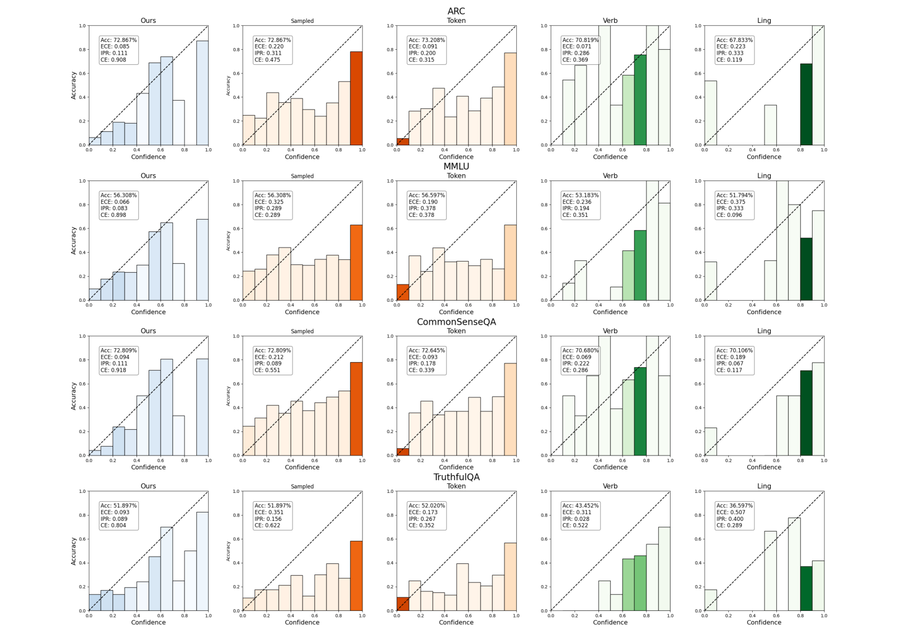

[Arxiv](https://arxiv.org/abs/2404.02655)