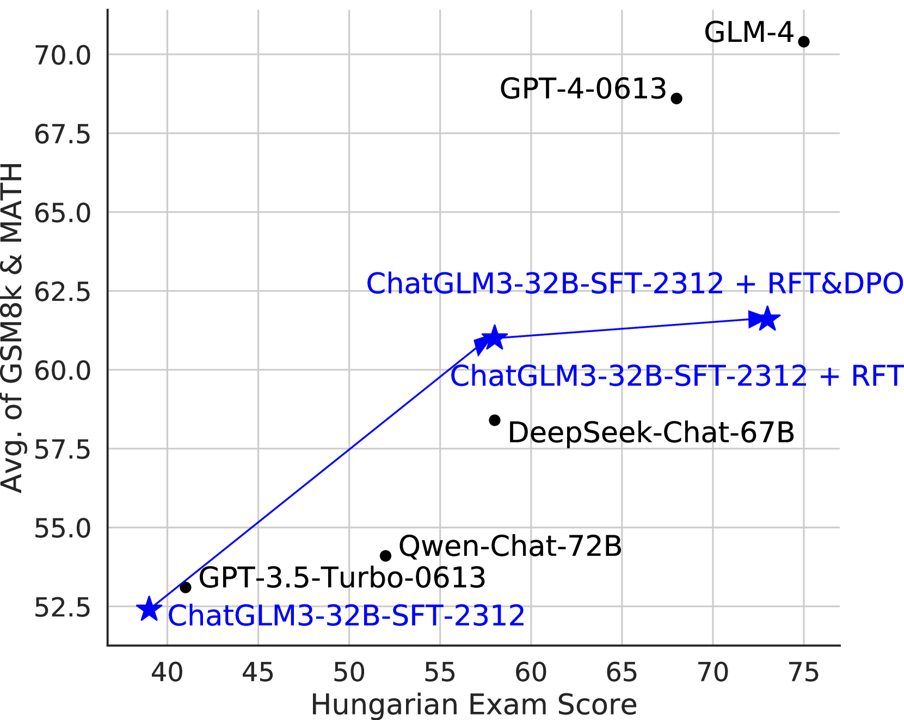

# ChatGLM-Math：运用自我批评机制，提升大型语言模型解决数学问题的能力

发布时间：2024年04月03日

`LLM应用` `数学问题解答`

> ChatGLM-Math: Improving Math Problem-Solving in Large Language Models with a Self-Critique Pipeline

# 摘要

> 大型语言模型（LLMs）在掌握人类语言方面表现出色，但在现实世界中需要解决数学问题的应用场景中仍显不足。尽管已有多种策略和数据集旨在提升LLMs的数学处理能力，但在实际应用中平衡和优化LLM的语言与数学能力仍是一大难题。本研究针对LLM对齐过程中的反馈学习阶段，提出了定制化的自我批评方法。我们首先从LLM中训练出一个通用的Math-Critique模型，用以生成反馈信号。接着，通过拒绝性微调和直接偏好优化技术，对LLM自身生成的数据进行收集。我们以ChatGLM3-32B为基础，对学术数据集以及新开发的高难度数据集MathUserEval进行了一系列实验。实验结果显示，我们的方法在显著提升LLM解决数学问题的能力的同时，也增强了其语言处理能力，表现优于规模是其两倍的LLM。目前，相关技术已应用于在线服务的LLM——ChatGLM\footnote{\url{https://chatglm.cn}}。同时，我们也发布了相关的评估数据集和脚本，可通过\url{https://github.com/THUDM/ChatGLM-Math}访问。

> Large language models (LLMs) have shown excellent mastering of human language, but still struggle in real-world applications that require mathematical problem-solving. While many strategies and datasets to enhance LLMs' mathematics are developed, it remains a challenge to simultaneously maintain and improve both language and mathematical capabilities in deployed LLM systems.In this work, we tailor the Self-Critique pipeline, which addresses the challenge in the feedback learning stage of LLM alignment. We first train a general Math-Critique model from the LLM itself to provide feedback signals. Then, we sequentially employ rejective fine-tuning and direct preference optimization over the LLM's own generations for data collection. Based on ChatGLM3-32B, we conduct a series of experiments on both academic and our newly created challenging dataset, MathUserEval. Results show that our pipeline significantly enhances the LLM's mathematical problem-solving while still improving its language ability, outperforming LLMs that could be two times larger. Related techniques have been deployed to ChatGLM\footnote{\url{https://chatglm.cn}}, an online serving LLM. Related evaluation dataset and scripts are released at \url{https://github.com/THUDM/ChatGLM-Math}.

[Arxiv](https://arxiv.org/abs/2404.02893)