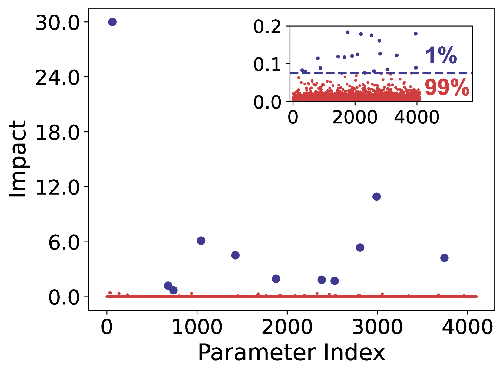
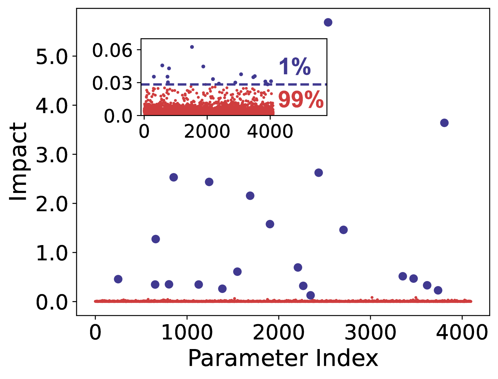
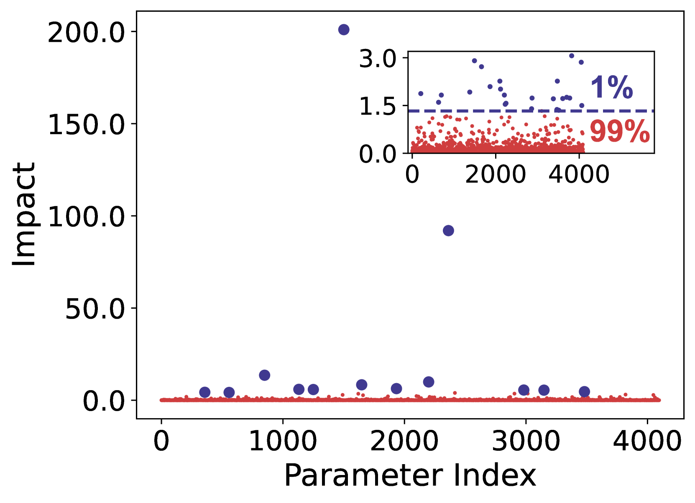
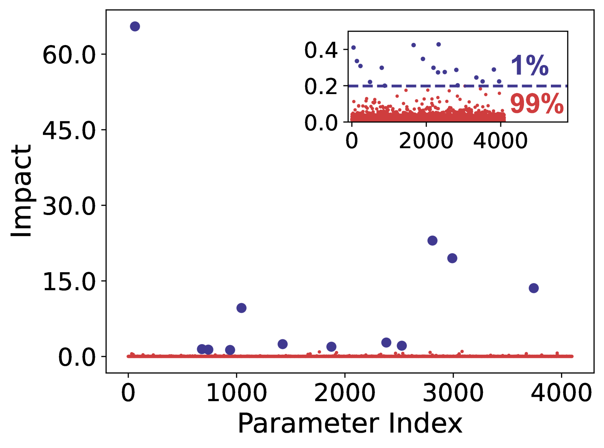
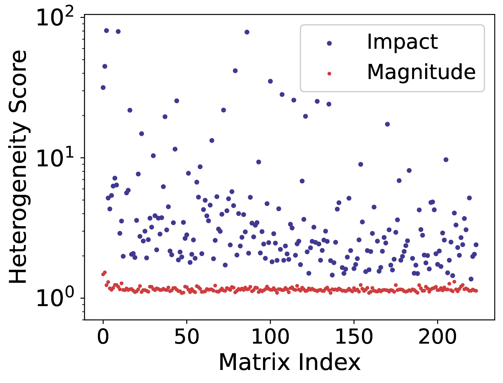
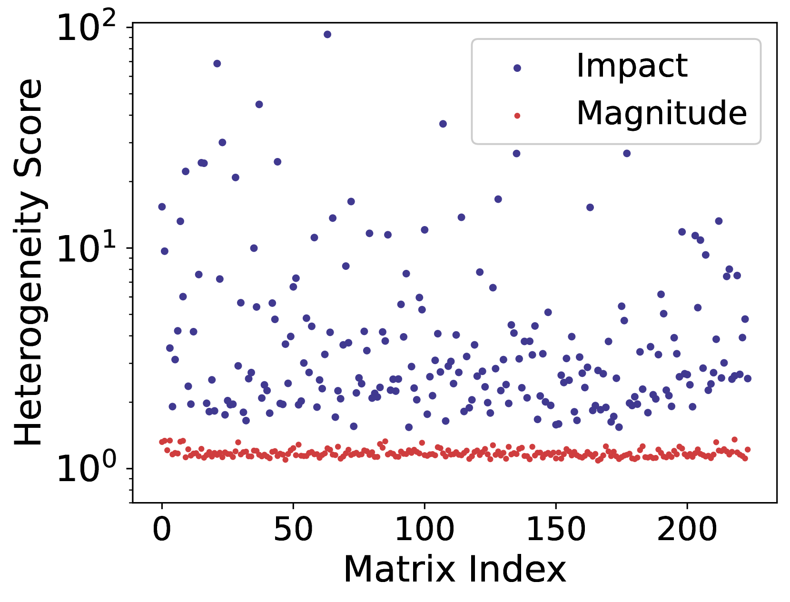
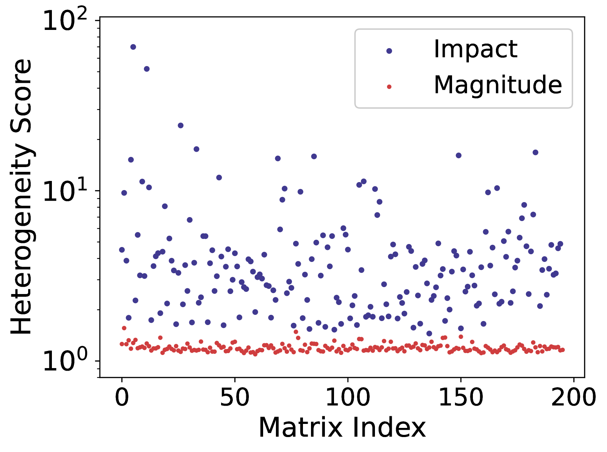
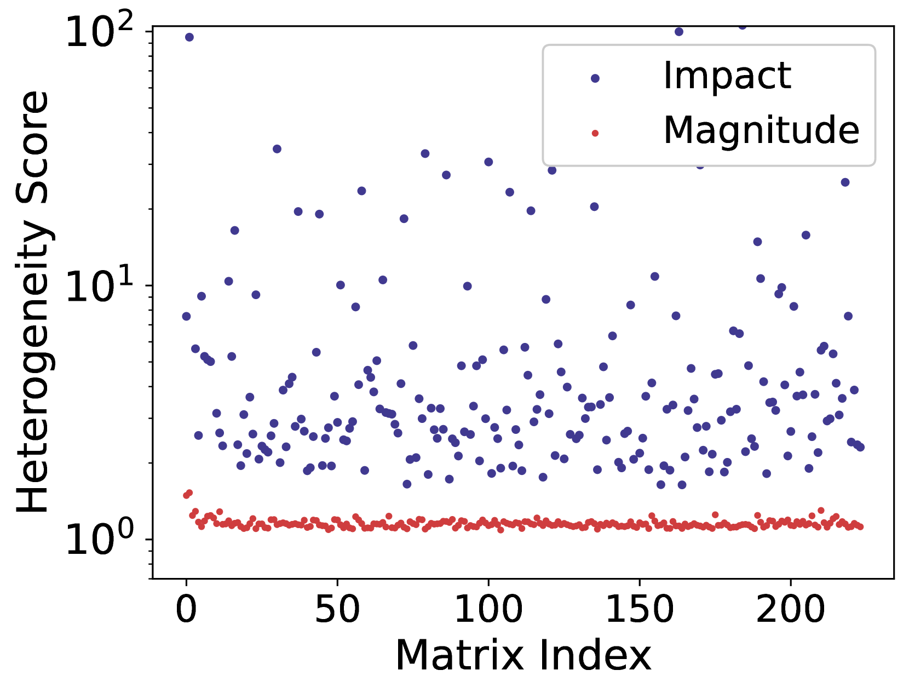
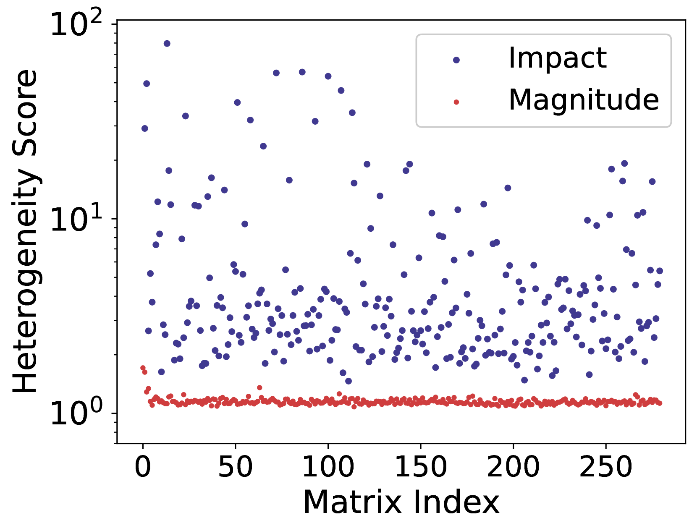
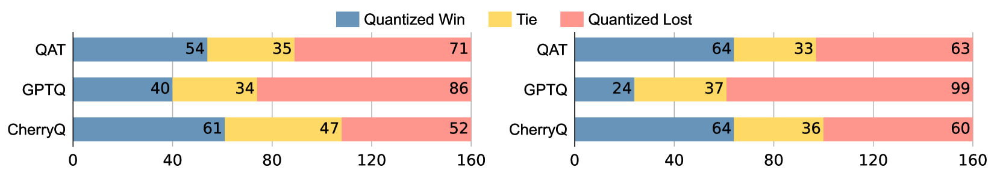

# 锦上添花：探究大型语言模型中的参数多样性与量化技术

发布时间：2024年04月03日

`LLM理论` `计算机科学` `大型语言模型`

> Cherry on Top: Parameter Heterogeneity and Quantization in Large Language Models

# 摘要

> 本研究深入探讨了大型语言模型中参数异质性的奥秘。我们发现，仅少数“樱桃”参数对模型性能起着举足轻重的作用，而其他大量参数的作用则微乎其微。这种现象在各种模型、规模和类型中普遍存在。基于这一发现，我们创新性地提出了CherryQ量化方法，它巧妙地优化了混合精度参数。CherryQ精准捕捉并保留了那些至关重要的樱桃参数，同时大胆地将其他参数量化至较低精度。一系列广泛的实验验证了CherryQ的卓越效果，其在困惑度和下游任务性能上均超越了传统量化技术。尤为引人注目的是，经3位量化的Vicuna-1.5模型竟能与16位模型相媲美。这一突破性成果展示了CherryQ在利用参数异质性的基础上，为大型语言模型的高效应用开辟了新天地。

> This paper reveals the phenomenon of parameter heterogeneity in large language models (LLMs). We find that a small subset of ``cherry'' parameters exhibit a disproportionately large influence on model performance, while the vast majority of parameters have minimal impact. This heterogeneity is found to be prevalent across different model families, scales, and types. Motivated by this observation, we propose CherryQ, a novel quantization method that unifies the optimization of mixed-precision parameters. CherryQ identifies and preserves the critical cherry parameters in high precision while aggressively quantizing the remaining parameters to low precision. Extensive experiments demonstrate the effectiveness of CherryQ. CherryQ outperforms existing quantization approaches in terms of perplexity and downstream task performance. Notably, our 3-bit quantized Vicuna-1.5 exhibits competitive performance compared to their 16-bit counterparts. These findings highlight the potential of CherryQ for enabling efficient deployment of LLMs by taking advantage of parameter heterogeneity.

[Arxiv](https://arxiv.org/abs/2404.02837)