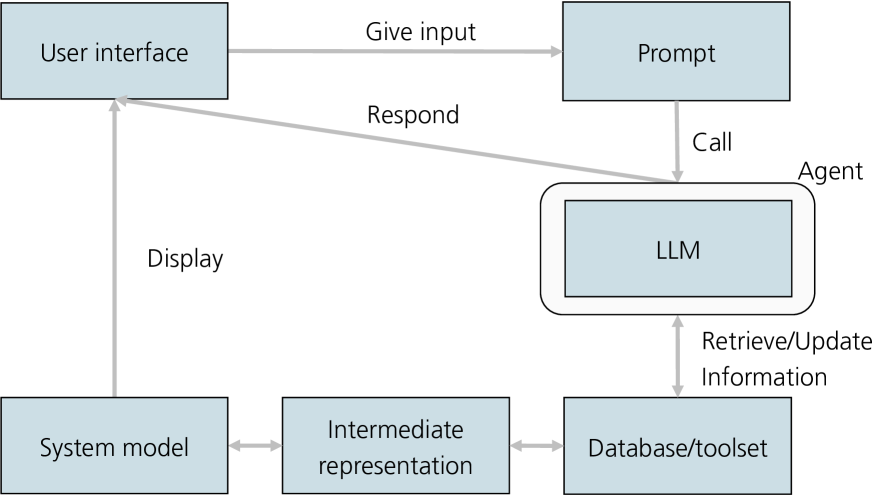
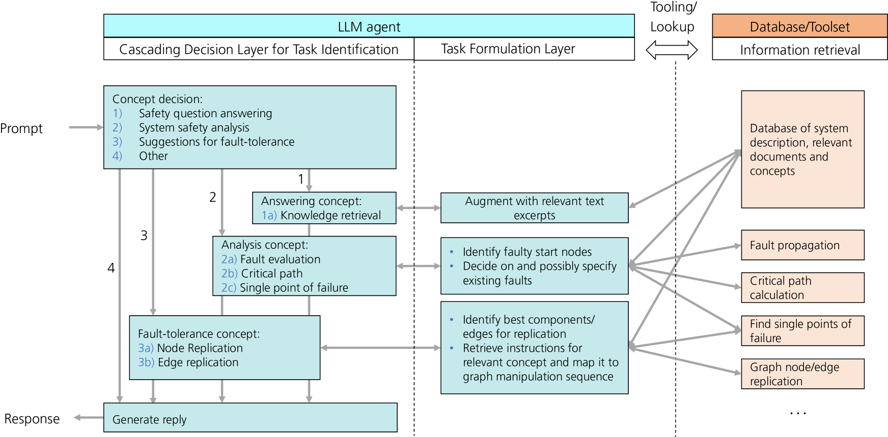
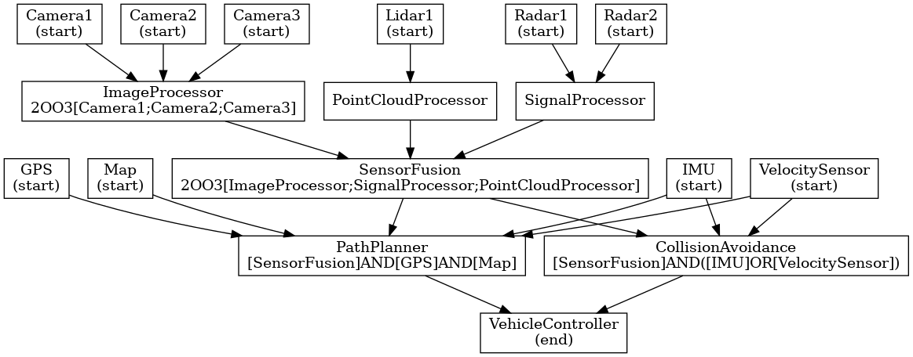

# 概念驱动的大型语言模型（LLM）代理助力人类与AI安全协同设计

发布时间：2024年04月03日

`Agent` `软件工程` `安全工程`

> Concept-Guided LLM Agents for Human-AI Safety Codesign

# 摘要

> 生成性AI在软件工程尤其是安全工程中的应用愈发关键，它确保软件不会对人造成伤害，这同时也对AI的质量提出了更高要求。仅依赖大型语言模型（LLM）的简单应用已不足以满足这些高标准。因此，迫切需要开发更先进、更精细的方法，以有效应对软件系统的复杂性和安全挑战。人类必须理解并负责监督生成性AI的建议，以保障系统的安全性。本研究提出了一种高效的混合策略，结合LLM进行安全分析与人机协同设计。我们设计了一款定制化的LLM代理，它结合了提示工程、启发式推理和增强检索生成技术，以解决与预定义安全概念相关的任务，并与系统模型图进行互动。这一过程通过一系列微决策引导，以保持信息的结构化。此外，我们还提出了一种图形化表述方法，作为系统模型的中间表示，以便更好地促进LLM与图形的交互。我们以简化的自动驾驶系统为例，展示了与安全分析相关的提示和响应对，以此来说明我们的方法。

> Generative AI is increasingly important in software engineering, including safety engineering, where its use ensures that software does not cause harm to people. This also leads to high quality requirements for generative AI. Therefore, the simplistic use of Large Language Models (LLMs) alone will not meet these quality demands. It is crucial to develop more advanced and sophisticated approaches that can effectively address the complexities and safety concerns of software systems. Ultimately, humans must understand and take responsibility for the suggestions provided by generative AI to ensure system safety. To this end, we present an efficient, hybrid strategy to leverage LLMs for safety analysis and Human-AI codesign. In particular, we develop a customized LLM agent that uses elements of prompt engineering, heuristic reasoning, and retrieval-augmented generation to solve tasks associated with predefined safety concepts, in interaction with a system model graph. The reasoning is guided by a cascade of micro-decisions that help preserve structured information. We further suggest a graph verbalization which acts as an intermediate representation of the system model to facilitate LLM-graph interactions. Selected pairs of prompts and responses relevant for safety analytics illustrate our method for the use case of a simplified automated driving system.

[Arxiv](https://arxiv.org/abs/2404.15317)