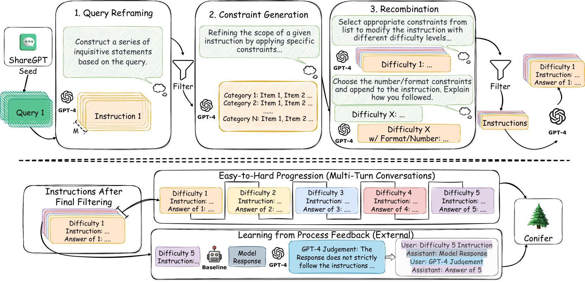

# Conifer：增强大型语言模型执行复杂指令的能力

发布时间：2024年04月03日

`LLM应用` `人工智能`

> Conifer: Improving Complex Constrained Instruction-Following Ability of Large Language Models

# 摘要

> 大型语言模型（LLMs）能否遵循指令对于现实世界的应用非常关键。面对复杂指令时，LLMs往往力不从心，这限制了它们在多项任务中的效能。为了解决这一问题，我们推出了Conifer——一种创新的指令调整数据集，专门设计来提升LLMs处理含有复杂限制的多层次指令的能力。我们运用GPT-4，并通过一系列由LLM驱动的精细化流程来打造这个数据集，确保其质量上乘。我们还设计了一种循序渐进的学习方案，重点在于从简单到复杂的过程和通过过程反馈进行学习。经过Conifer训练的模型在遵循指令方面取得了显著进步，尤其是在处理那些带有复杂限制的指令时。在多个遵循指令的性能基准测试中，我们的7B模型不仅超越了当前最先进的开源7B模型，而且在某些评价指标上，甚至超过了比它大十倍的模型。相关代码和Conifer数据集已在https://www.github.com/ConiferLM/Conifer上线提供。

> The ability of large language models (LLMs) to follow instructions is crucial to real-world applications. Despite recent advances, several studies have highlighted that LLMs struggle when faced with challenging instructions, especially those that include complex constraints, hindering their effectiveness in various tasks. To address this challenge, we introduce Conifer, a novel instruction tuning dataset, designed to enhance LLMs to follow multi-level instructions with complex constraints. Utilizing GPT-4, we curate the dataset by a series of LLM-driven refinement processes to ensure high quality. We also propose a progressive learning scheme that emphasizes an easy-to-hard progression, and learning from process feedback. Models trained with Conifer exhibit remarkable improvements in instruction-following abilities, especially for instructions with complex constraints. On several instruction-following benchmarks, our 7B model outperforms the state-of-the-art open-source 7B models, even exceeds the performance of models 10 times larger on certain metrics. All the code and Conifer dataset are available at https://www.github.com/ConiferLM/Conifer.

[Arxiv](https://arxiv.org/abs/2404.02823)