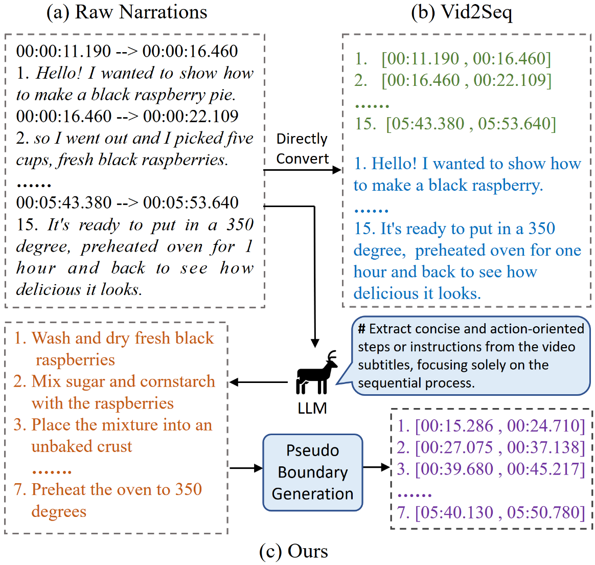
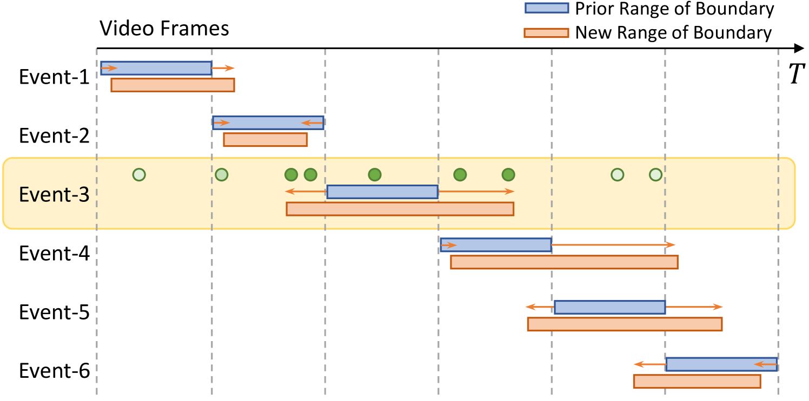
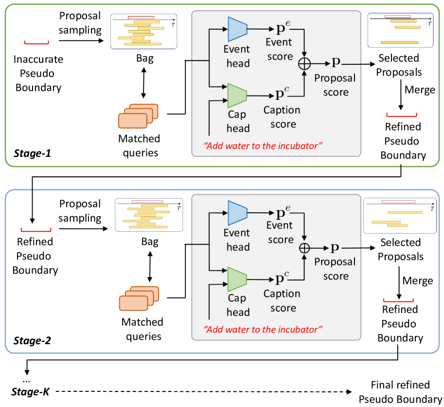
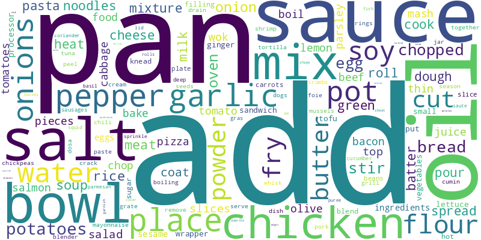
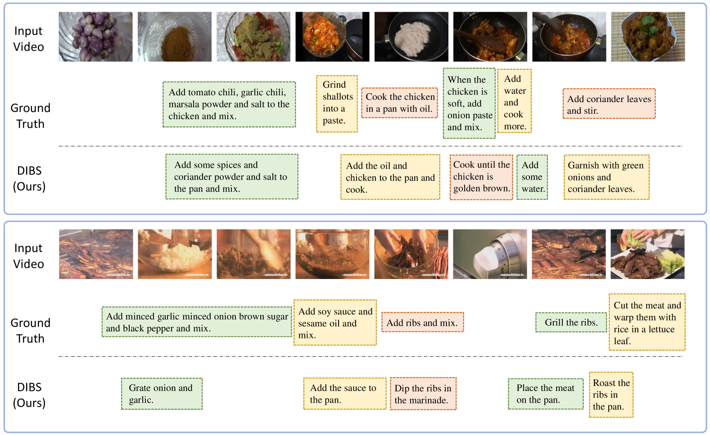
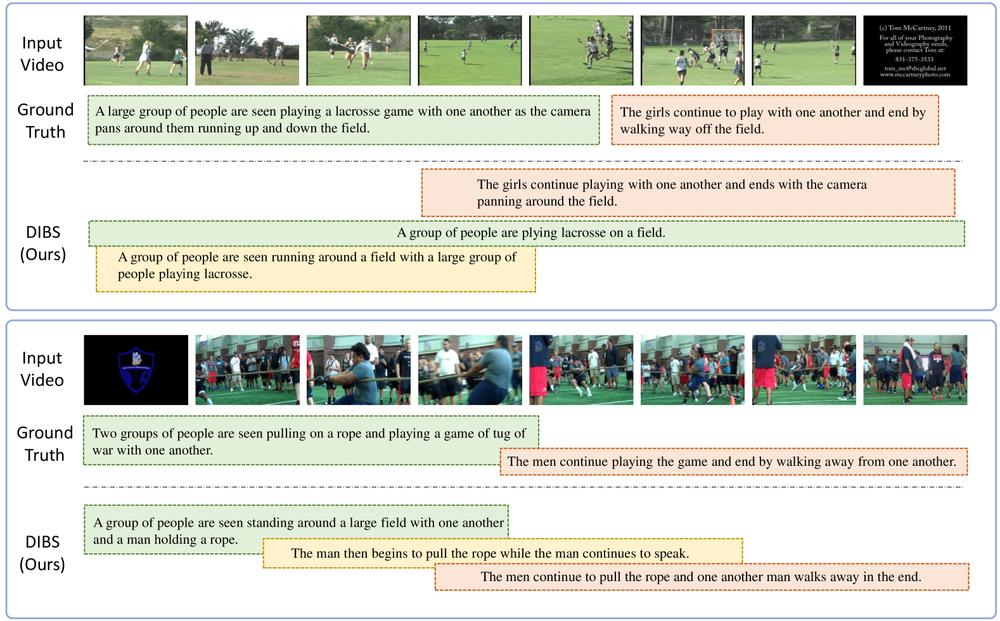

# DIBS 技术：借助伪边界扩展和实时优化，利用未标注视频提升密集视频字幕质量。

发布时间：2024年04月03日

`LLM应用` `视频处理` `自动字幕生成`

> DIBS: Enhancing Dense Video Captioning with Unlabeled Videos via Pseudo Boundary Enrichment and Online Refinement

# 摘要

> 我们推出了“边界深潜”（DIBS）这一创新预训练框架，专为提升密集视频字幕（DVC）生成质量而设计，专注于优化未标记视频中生成的事件字幕及其伪事件边界。借助各类大型语言模型（LLMs）的强大功能，我们孕育出一批针对DVC的高质量字幕候选，并在追求多样性、事件聚焦、时间序列和语义连贯性的多个精细目标指导下，对这些伪边界进行了优化。此外，我们还创新性地引入了一种在线边界精炼策略，该策略能在训练过程中逐步提升伪边界的质量。通过一系列全面的实验，我们验证了这些技术组件的有效性。利用如HowTo100M这样的大量未标记视频数据，我们在YouCook2和ActivityNet等标准DVC数据集上取得了突破性进展。在多数评价指标上，我们超越了先前的顶尖技术Vid2Seq，而我们用于预训练的未标记视频数据量仅为Vid2Seq的0.4%。

> We present Dive Into the BoundarieS (DIBS), a novel pretraining framework for dense video captioning (DVC), that elaborates on improving the quality of the generated event captions and their associated pseudo event boundaries from unlabeled videos. By leveraging the capabilities of diverse large language models (LLMs), we generate rich DVC-oriented caption candidates and optimize the corresponding pseudo boundaries under several meticulously designed objectives, considering diversity, event-centricity, temporal ordering, and coherence. Moreover, we further introduce a novel online boundary refinement strategy that iteratively improves the quality of pseudo boundaries during training. Comprehensive experiments have been conducted to examine the effectiveness of the proposed technique components. By leveraging a substantial amount of unlabeled video data, such as HowTo100M, we achieve a remarkable advancement on standard DVC datasets like YouCook2 and ActivityNet. We outperform the previous state-of-the-art Vid2Seq across a majority of metrics, achieving this with just 0.4% of the unlabeled video data used for pre-training by Vid2Seq.

[Arxiv](https://arxiv.org/abs/2404.02755)