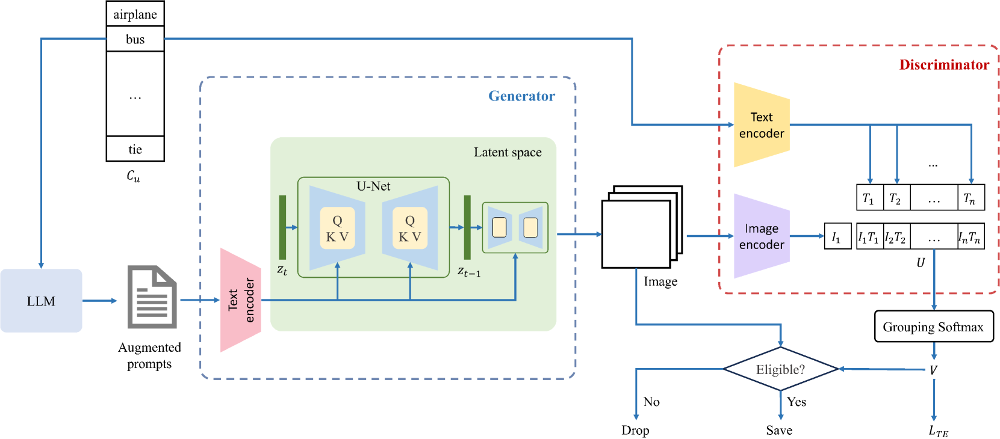
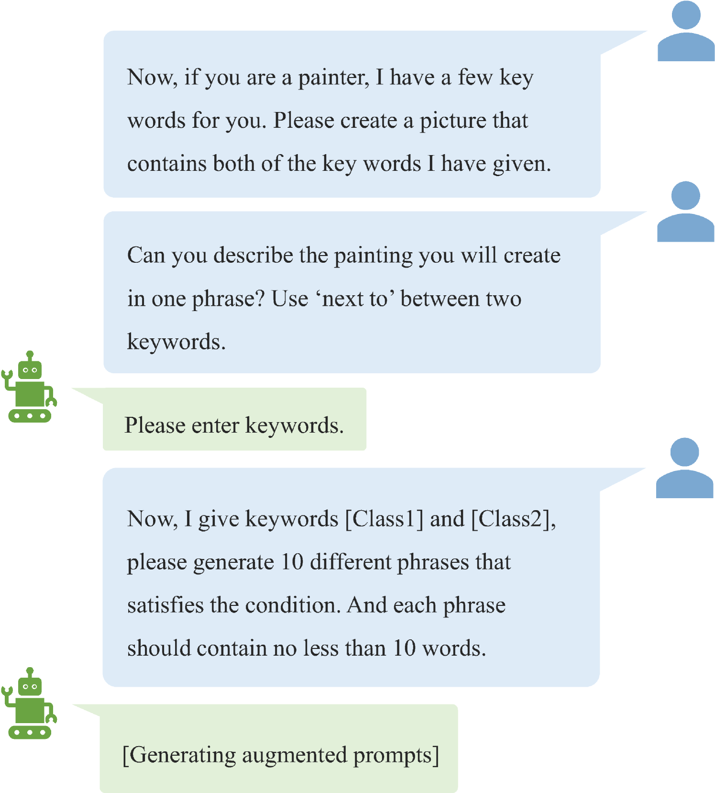
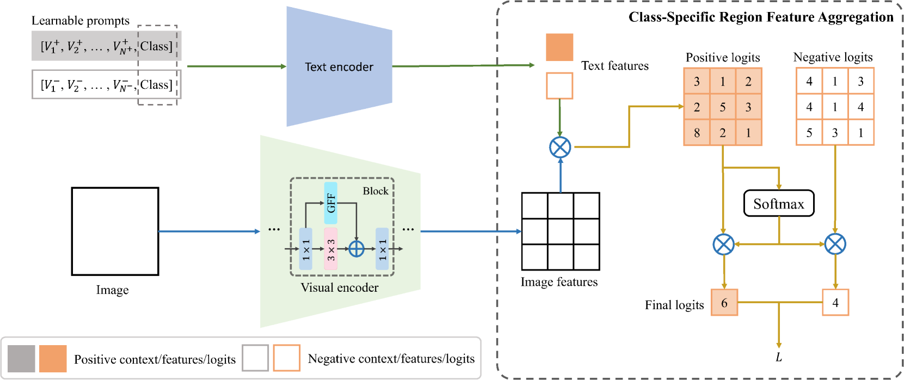
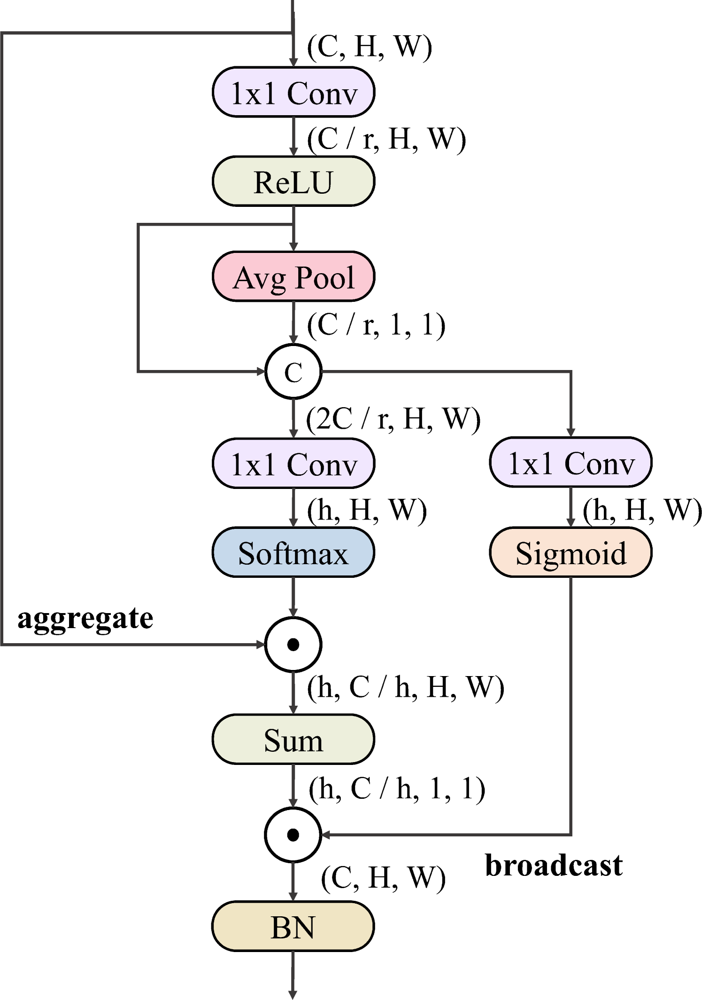
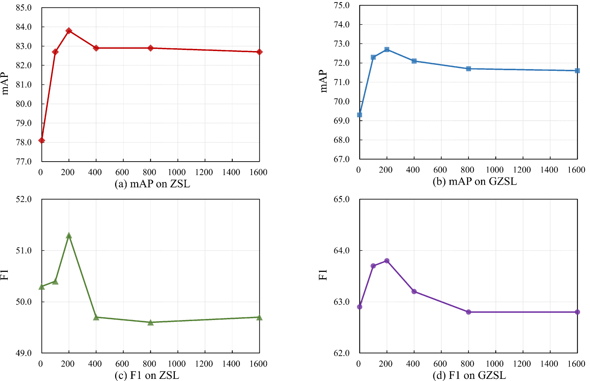
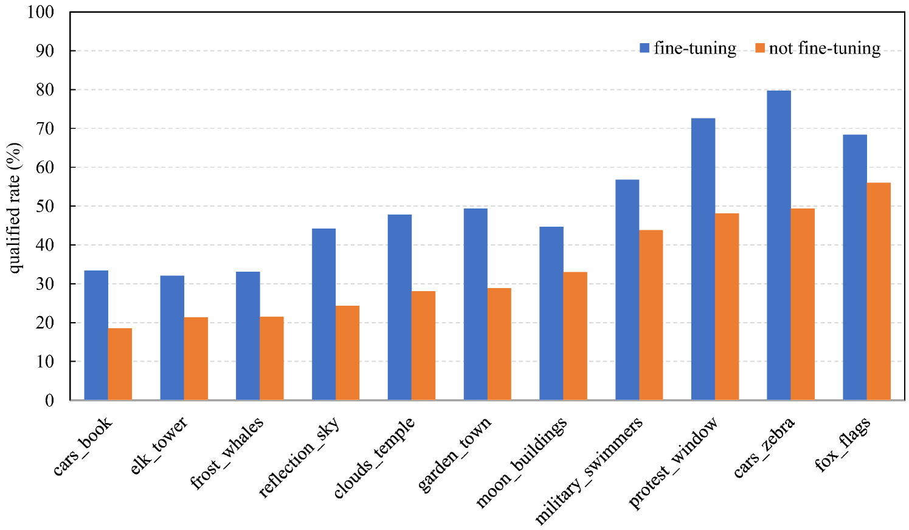

# 为零-shot多标签分类打造多样化且针对性的图像生成方法。

发布时间：2024年04月03日

`RAG` `多标签分类` `图像生成`

> Diverse and Tailored Image Generation for Zero-shot Multi-label Classification

# 摘要

> 近期，零样本多标签分类因其在无需人工注释的情况下预测未知标签的能力而备受瞩目。但现有方法常将已知类别作为未知类别的代理，效果并不理想。我们从文本到图像生成模型创造逼真图像的成功中汲取灵感，提出了一个创新方案：创造合成数据，专为未见标签的无代理训练量身定制训练集。我们的方法推出了一个新颖的图像生成框架，为未见类别生成多标签合成图像，用于训练分类器。通过使用预训练的大型语言模型生成多样化的提示，我们增加了生成图像的多样性。利用预训练的多模态CLIP模型作为鉴别器，我们确保生成图像能准确反映目标类别，并通过自动过滤掉不准确的图像，确保分类器的准确度。为了更精确、高效地生成多标签目标，我们引入了基于CLIP分数的判别性损失，用以微调扩散模型中的文本编码器。同时，为了在目标任务中增强视觉特征，同时保持原始特征的泛化性并避免因微调整个视觉编码器而引发的灾难性遗忘，我们提出了一个受变换器注意力机制启发的特征融合模块，以更有效地捕捉多个对象间的全局依赖。大量实验结果证明，我们的方法有效性显著，相较于现有顶尖方法有重大提升。

> Recently, zero-shot multi-label classification has garnered considerable attention for its capacity to operate predictions on unseen labels without human annotations. Nevertheless, prevailing approaches often use seen classes as imperfect proxies for unseen ones, resulting in suboptimal performance. Drawing inspiration from the success of text-to-image generation models in producing realistic images, we propose an innovative solution: generating synthetic data to construct a training set explicitly tailored for proxyless training on unseen labels. Our approach introduces a novel image generation framework that produces multi-label synthetic images of unseen classes for classifier training. To enhance diversity in the generated images, we leverage a pre-trained large language model to generate diverse prompts. Employing a pre-trained multi-modal CLIP model as a discriminator, we assess whether the generated images accurately represent the target classes. This enables automatic filtering of inaccurately generated images, preserving classifier accuracy. To refine text prompts for more precise and effective multi-label object generation, we introduce a CLIP score-based discriminative loss to fine-tune the text encoder in the diffusion model. Additionally, to enhance visual features on the target task while maintaining the generalization of original features and mitigating catastrophic forgetting resulting from fine-tuning the entire visual encoder, we propose a feature fusion module inspired by transformer attention mechanisms. This module aids in capturing global dependencies between multiple objects more effectively. Extensive experimental results validate the effectiveness of our approach, demonstrating significant improvements over state-of-the-art methods.

[Arxiv](https://arxiv.org/abs/2404.03144)