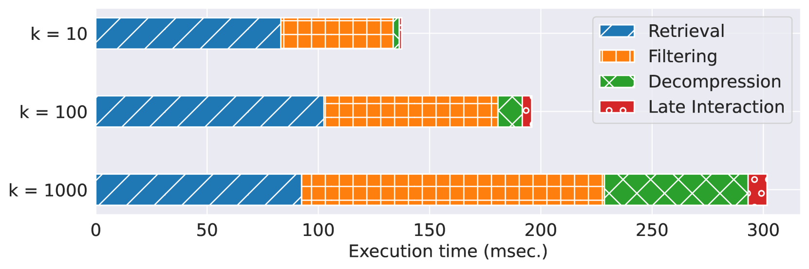
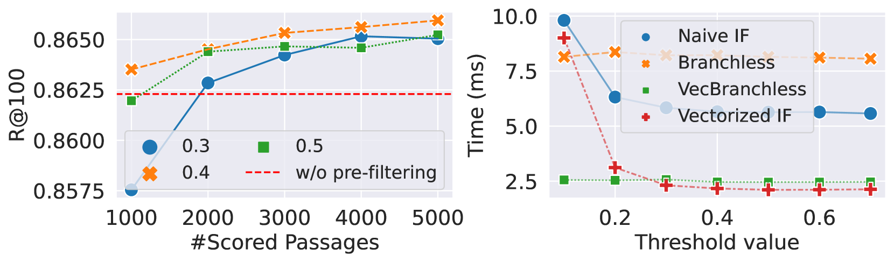
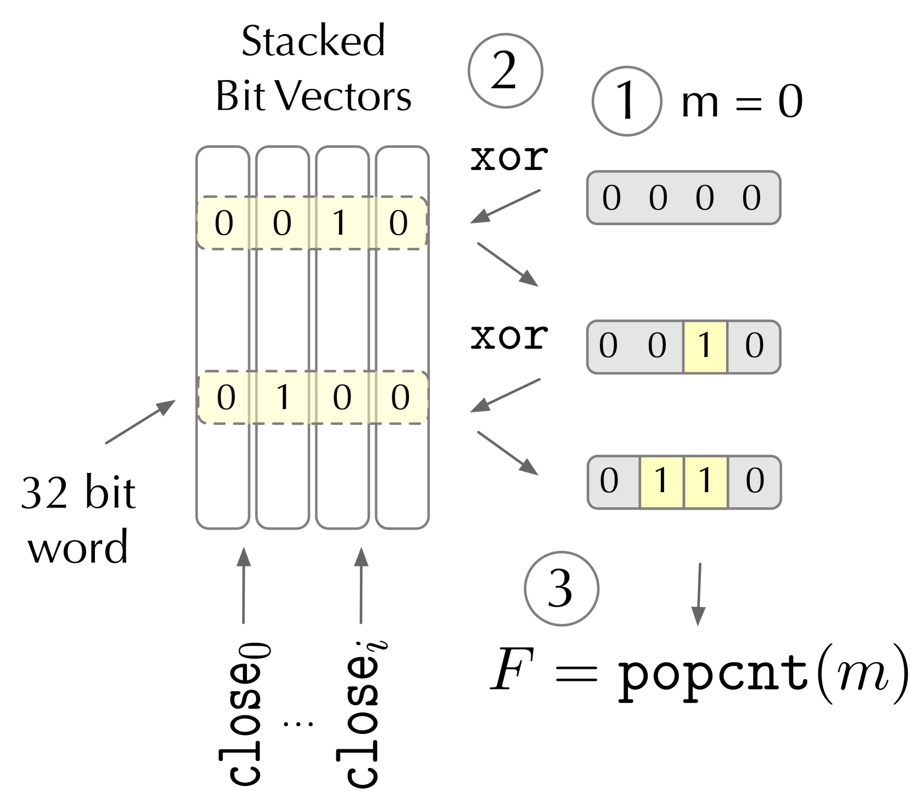
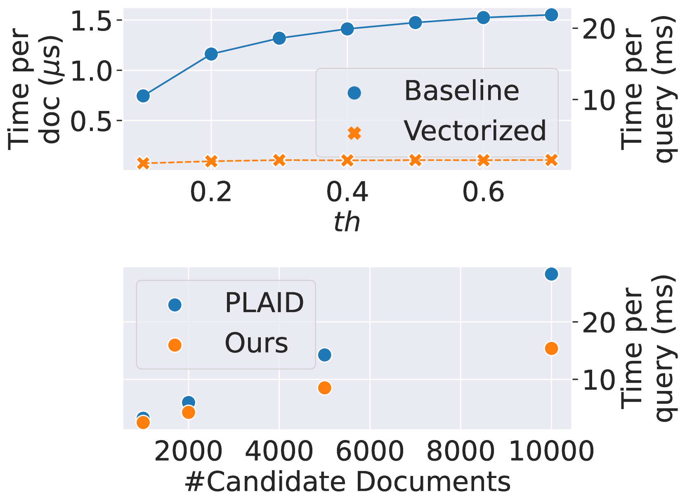
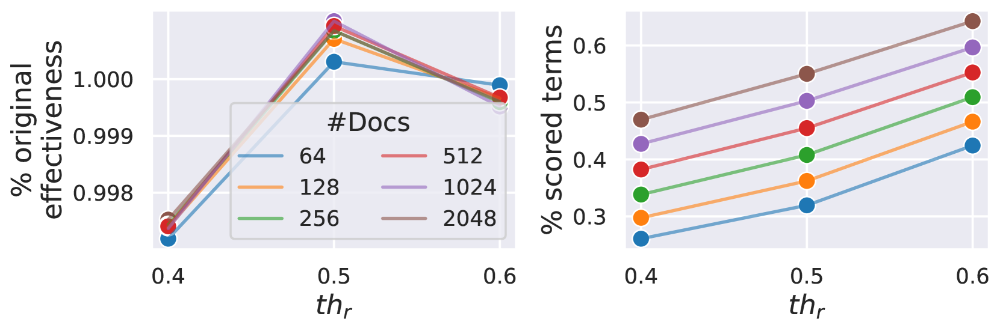

# 通过位向量实现的多向量密集检索，既高效又精准。

发布时间：2024年04月03日

`LLM应用` `信息检索` `密集检索`

> Efficient Multi-Vector Dense Retrieval Using Bit Vectors

# 摘要

> 通过使用预训练的大型语言模型，密集检索技术构建了查询和文本段落的高维特征表示，并通过高效的相似性度量来评估段落与查询的相关性。多向量表示虽然提高了效果，但也大幅增加了内存和查询延迟。PLAID通过引入质心基础的术语表示法，有效缓解了这一问题。它利用质心交互机制筛选掉无关文档，降低了后续排序的成本。本研究提出了“位向量高效多向量密集检索”（EMVB）框架，它首先通过优化的位向量对段落进行预过滤，然后通过SIMD指令在列级别计算质心交互，以降低延迟。此外，EMVB采用产品量化技术减少向量表示的内存占用，并实现快速的后期交互。我们还引入了一种按文档过滤术语的方法，进一步提升了处理效率。在MS MARCO和LoTTE的实验结果显示，EMVB在保持检索准确度不变的情况下，速度提升了2.8倍，内存占用减少了1.8倍。

> Dense retrieval techniques employ pre-trained large language models to build a high-dimensional representation of queries and passages. These representations compute the relevance of a passage w.r.t. to a query using efficient similarity measures. In this line, multi-vector representations show improved effectiveness at the expense of a one-order-of-magnitude increase in memory footprint and query latency by encoding queries and documents on a per-token level. Recently, PLAID has tackled these problems by introducing a centroid-based term representation to reduce the memory impact of multi-vector systems. By exploiting a centroid interaction mechanism, PLAID filters out non-relevant documents, thus reducing the cost of the successive ranking stages. This paper proposes ``Efficient Multi-Vector dense retrieval with Bit vectors'' (EMVB), a novel framework for efficient query processing in multi-vector dense retrieval. First, EMVB employs a highly efficient pre-filtering step of passages using optimized bit vectors. Second, the computation of the centroid interaction happens column-wise, exploiting SIMD instructions, thus reducing its latency. Third, EMVB leverages Product Quantization (PQ) to reduce the memory footprint of storing vector representations while jointly allowing for fast late interaction. Fourth, we introduce a per-document term filtering method that further improves the efficiency of the last step. Experiments on MS MARCO and LoTTE show that EMVB is up to 2.8x faster while reducing the memory footprint by 1.8x with no loss in retrieval accuracy compared to PLAID.

[Arxiv](https://arxiv.org/abs/2404.02805)