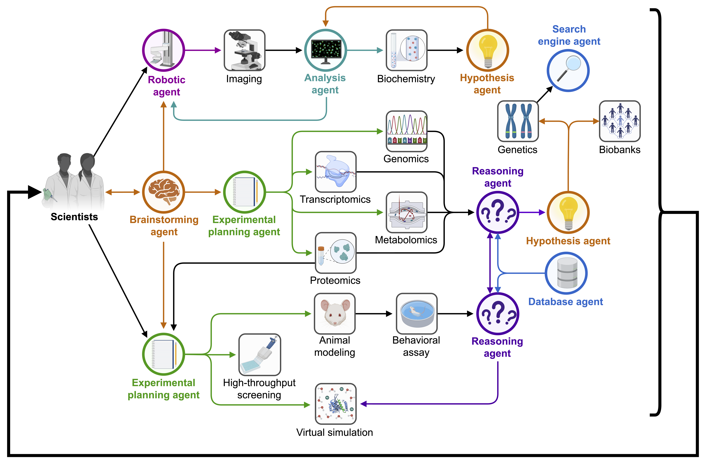
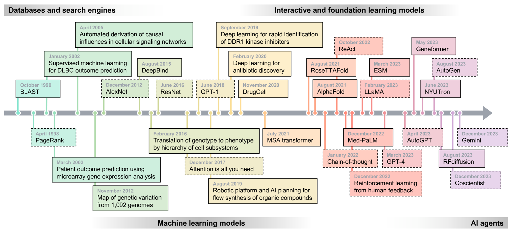
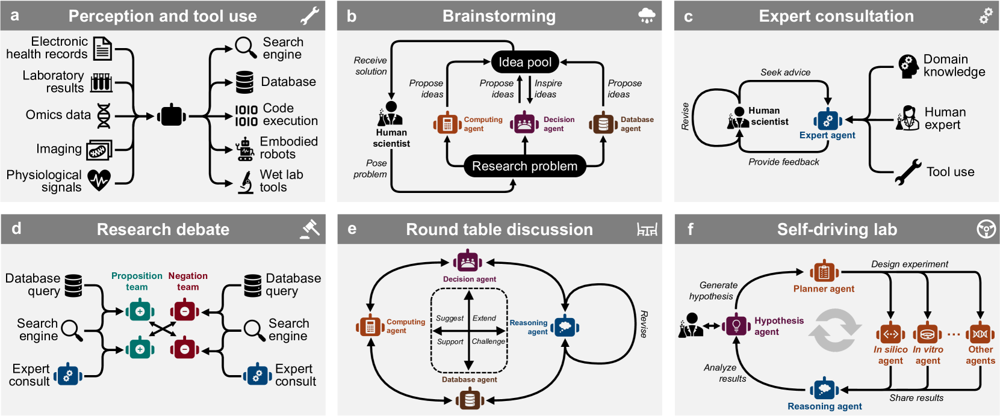
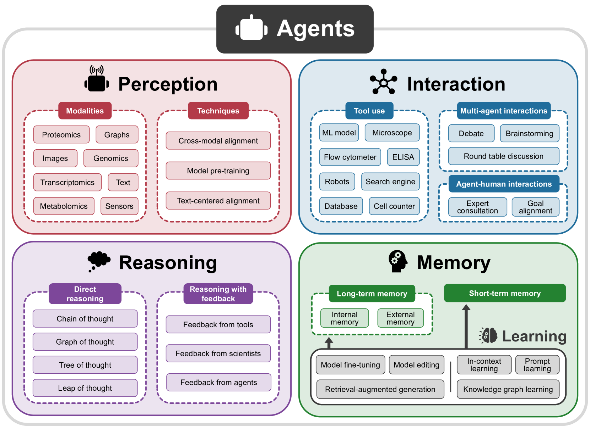
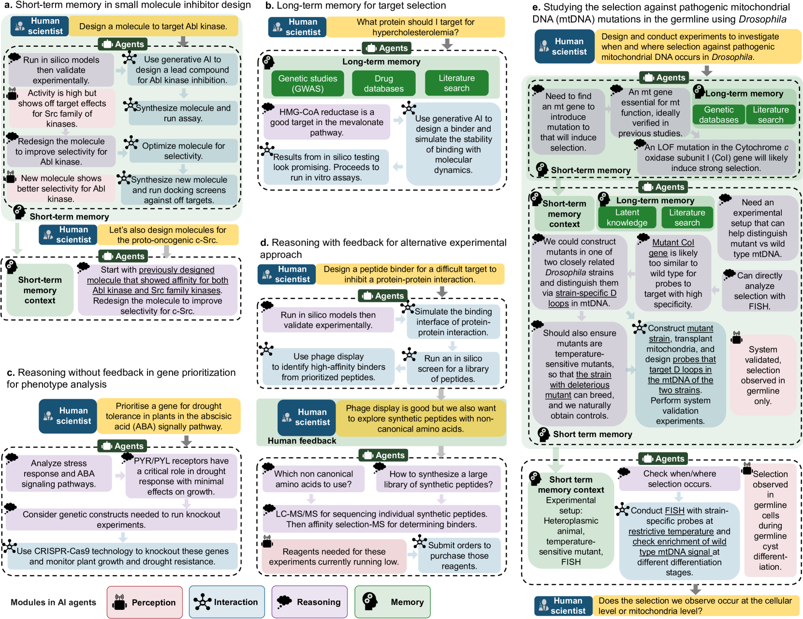
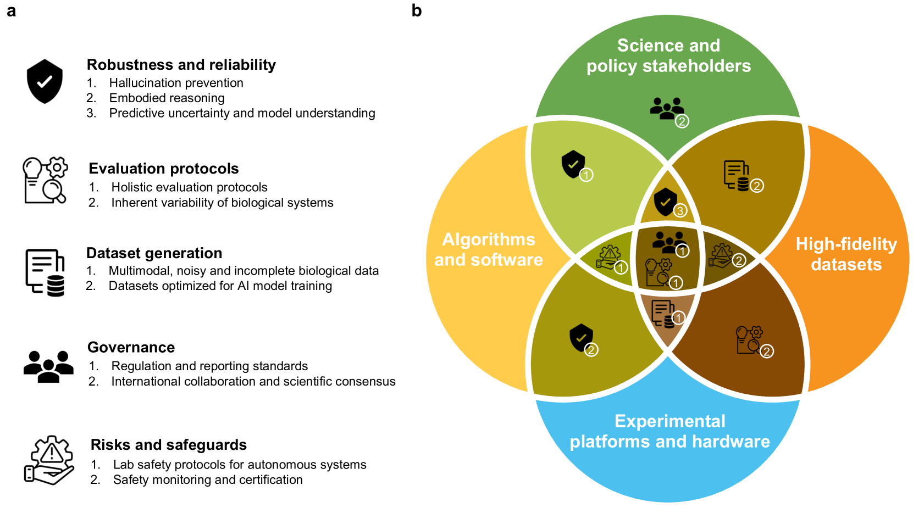

# 借助人工智能代理，推动生物医学研究的新发现

发布时间：2024年04月03日

`Agent` `生物医学研究` `人工智能`

> Empowering Biomedical Discovery with AI Agents

# 摘要

> 我们构想“AI科学家”为具备批判性学习和推理能力的系统，它们通过合作型代理，将机器学习技术与实验平台融合，助力生物医学研究。这些AI代理并非取代人类探索者，而是将人的智慧与AI处理大数据、探索假设空间、执行繁琐任务的能力相融合。它们擅长多样任务，如自我评估、规划科研流程。借助大型语言和生成模型，AI代理构建有序记忆，实现持续学习，并运用机器学习工具吸收科学知识与生物学法则。从混合细胞模拟到细胞电路设计，再到新疗法研发，AI代理的潜力无限。

> We envision 'AI scientists' as systems capable of skeptical learning and reasoning that empower biomedical research through collaborative agents that integrate machine learning tools with experimental platforms. Rather than taking humans out of the discovery process, biomedical AI agents combine human creativity and expertise with AI's ability to analyze large datasets, navigate hypothesis spaces, and execute repetitive tasks. AI agents are proficient in a variety of tasks, including self-assessment and planning of discovery workflows. These agents use large language models and generative models to feature structured memory for continual learning and use machine learning tools to incorporate scientific knowledge, biological principles, and theories. AI agents can impact areas ranging from hybrid cell simulation, programmable control of phenotypes, and the design of cellular circuits to the development of new therapies.

[Arxiv](https://arxiv.org/abs/2404.02831)