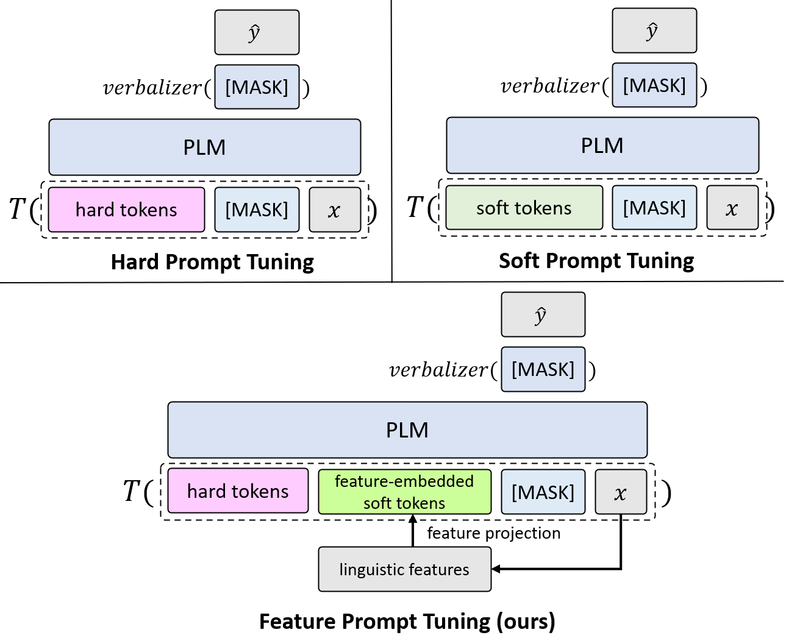
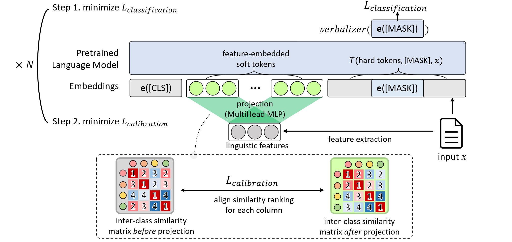
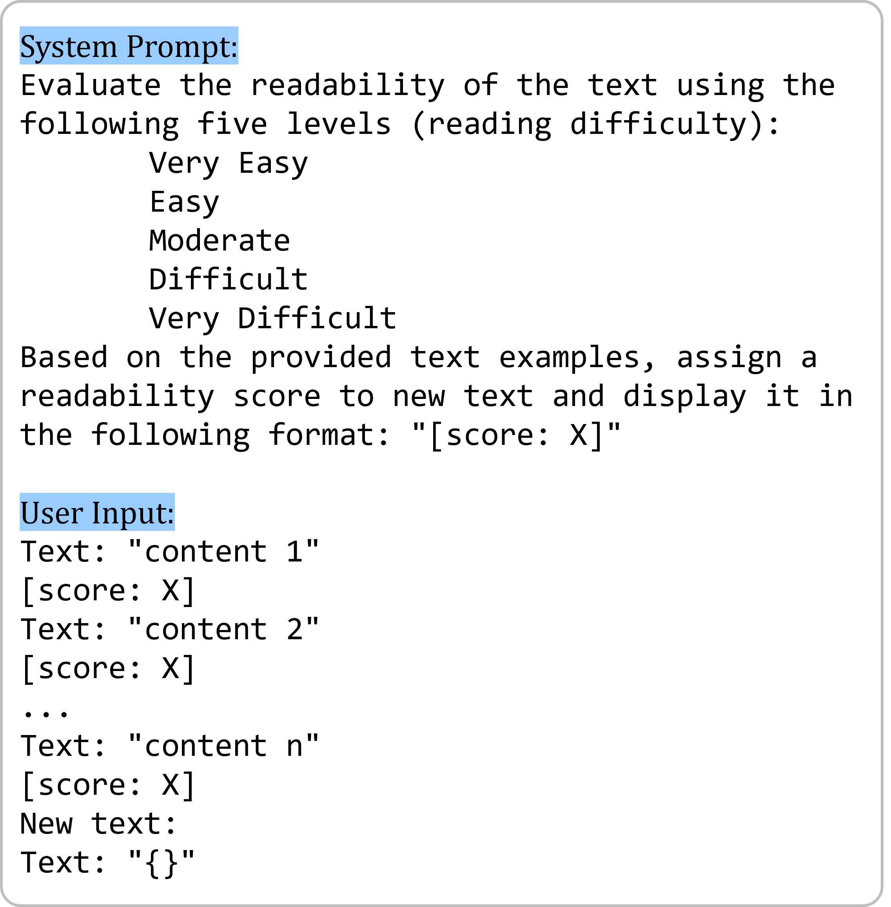
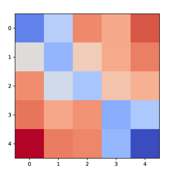
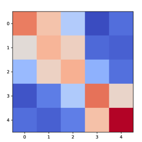
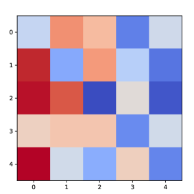
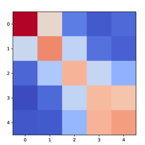
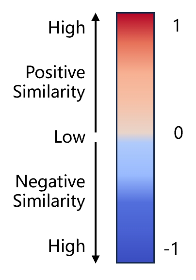

# FPT，即特征提示调整技术，旨在提升少样本情境下的文本可读性评估效果。

发布时间：2024年04月03日

`LLM应用` `语言模型` `文本分类`

> FPT: Feature Prompt Tuning for Few-shot Readability Assessment

# 摘要

> 在少量样本文本分类任务中，基于提示的方法已取得显著成果。但在可读性评估方面，传统方法缺少必要的语言知识。以往的研究也显示，在少量样本环境下，单纯依赖语言特征的表现并不稳定，有时甚至会影响模型效能。为应对这些挑战，我们引入了一种创新的基于提示的调整框架——特征提示调整（FPT），它融合了丰富的语言知识。我们通过提取文本的语言特征并将其嵌入可训练的柔性提示中，同时设计了一种新的损失函数来优化类别间的相似度排序。实验证明，FPT方法不仅在性能上大幅超越了以往的提示调整技术，也包括那些融合了语言特征的先进方法。此外，我们的模型在多数情况下的表现甚至超过了大型语言模型gpt-3.5-turbo-16k。这一新架构为提示调整开辟了新天地，展示了如何将语言特征轻松应用于与语言相关的任务中。

> Prompt-based methods have achieved promising results in most few-shot text classification tasks. However, for readability assessment tasks, traditional prompt methods lackcrucial linguistic knowledge, which has already been proven to be essential. Moreover, previous studies on utilizing linguistic features have shown non-robust performance in few-shot settings and may even impair model performance.To address these issues, we propose a novel prompt-based tuning framework that incorporates rich linguistic knowledge, called Feature Prompt Tuning (FPT). Specifically, we extract linguistic features from the text and embed them into trainable soft prompts. Further, we devise a new loss function to calibrate the similarity ranking order between categories. Experimental results demonstrate that our proposed method FTP not only exhibits a significant performance improvement over the prior best prompt-based tuning approaches, but also surpasses the previous leading methods that incorporate linguistic features. Also, our proposed model significantly outperforms the large language model gpt-3.5-turbo-16k in most cases. Our proposed method establishes a new architecture for prompt tuning that sheds light on how linguistic features can be easily adapted to linguistic-related tasks.

[Arxiv](https://arxiv.org/abs/2404.02772)