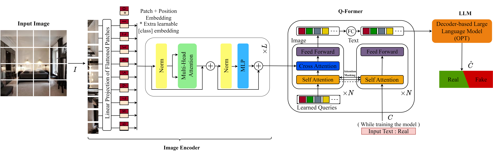
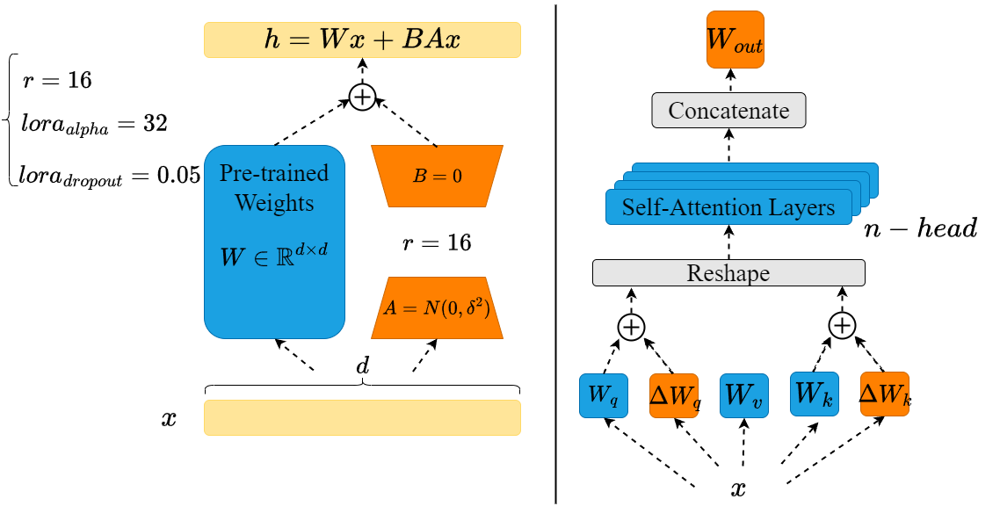

# 借助大型视觉语言模型的力量，我们可以有效检测合成图像。

发布时间：2024年04月03日

`LLM应用` `视觉-语言模型` `合成图像检测`

> Harnessing the Power of Large Vision Language Models for Synthetic Image Detection

# 摘要

> 近年来，能将文字变图像的模型问世，引发了巨大兴趣，它们能根据文字描述生成逼真的图像。然而，这也让人担忧这些图像可能被不当使用，比如制造假新闻和宣传等。本研究探索了利用先进的视觉-语言模型（VLMs）来识别合成图像的有效性，特别是针对调整当前顶尖的图像标题模型进行合成图像识别。借助大型VLMs的深入理解能力，我们旨在辨别由扩散模型生成的合成图像与真实图像。通过定制图像标题模型，本研究旨在应对合成图像在现实应用中可能被滥用的挑战。论文中的结果表明，VLMs在合成图像检测领域大有作为，性能超越了传统的图像检测技术。相关代码和模型已在 https://github.com/Mamadou-Keita/VLM-DETECT 上发布。

> In recent years, the emergence of models capable of generating images from text has attracted considerable interest, offering the possibility of creating realistic images from text descriptions. Yet these advances have also raised concerns about the potential misuse of these images, including the creation of misleading content such as fake news and propaganda. This study investigates the effectiveness of using advanced vision-language models (VLMs) for synthetic image identification. Specifically, the focus is on tuning state-of-the-art image captioning models for synthetic image detection. By harnessing the robust understanding capabilities of large VLMs, the aim is to distinguish authentic images from synthetic images produced by diffusion-based models. This study contributes to the advancement of synthetic image detection by exploiting the capabilities of visual language models such as BLIP-2 and ViTGPT2. By tailoring image captioning models, we address the challenges associated with the potential misuse of synthetic images in real-world applications. Results described in this paper highlight the promising role of VLMs in the field of synthetic image detection, outperforming conventional image-based detection techniques. Code and models can be found at https://github.com/Mamadou-Keita/VLM-DETECT.

[Arxiv](https://arxiv.org/abs/2404.02726)